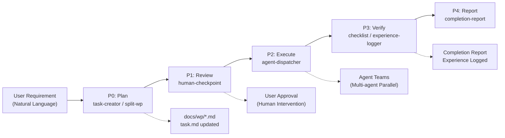

# Tackle Harness

> A plugin-based AI Agent workflow framework that provides task management, workflow orchestration, and role management for Claude Code

[](https://opensource.org/licenses/MIT)
[](https://github.com/ph419/tackle)

**[中文文档](https://github.com/ph419/tackle/blob/main/README.md)**

## Why Tackle Harness

You describe what you need; Tackle Harness manages the entire process:

- **Plan first, human approval required** — AI outputs implementation plans and work package breakdowns, then waits for your confirmation before writing any code. No more "AI went rogue and changed a bunch of things."
- **Complex requirements, parallel delivery** — Large requirements are automatically split into independent modules, with multiple agents working simultaneously. Frontend, backend, and database changes progress in parallel — no serial waiting.
- **Experience accumulation, gets better over time** — After each task, lessons learned are automatically extracted. Next time a similar issue arises, agents reference historical experience for better decisions.

### End-to-End Data Flow

User requirements pass through five stages from planning to delivery:



## Installation

Prerequisite: Node.js >= 18.0.0

**Recommended: Global Install**

```bash
npm install -g tackle-harness
```

After global install, use the `tackle-harness` command in any project without repeated installs.

**Alternative: Local Install**

```bash
npm install tackle-harness
```

Local install requires `npx tackle-harness` or adding to package.json scripts.

## Quick Start

```bash
# Navigate to your project directory
cd your-project

# One-command initialization (create config dirs + register hooks)
tackle-harness init

# Migrate from previous local install
tackle-harness migrate

# Manual config update (when .claude/settings.json changes)
tackle-harness build
```

> **Note**: With global install, skills and hooks are managed by npm globally. Your project only needs config files (`.claude/config/` and `.claude/settings.json`).

## Use Cases

- **New feature development** — Requirements analysis → work package split → parallel development → quality check
- **Batch bug fixes** — Dependency analysis → parallel fixes → auto verification
- **System refactoring** — Architecture analysis → batch execution → experience retention
- **Code review** — Quality check → doc sync → experience logging
- **Project wrap-up** — Progress summary → experience retention → completion report

> For full scenario flowcharts and step-by-step guides, see [Daily Workflow Best Practices](docs/design/daily-workflow-guide.md)

## Command Reference

| Command | Description |
|---------|-------------|
| `tackle-harness` | Default: runs build |
| `tackle-harness build` | Update .claude/settings.json, register global skills and hooks |
| `tackle-harness validate` | Validate plugin format |
| `tackle-harness validate-config` | Validate harness-config.yaml |
| `tackle-harness init` | First-time setup: create config dirs and register hooks |
| `tackle-harness migrate` | Migrate from local install: remove local skills/hooks dirs, update config |
| `tackle-harness interactive` | Interactive plugin management (alias: `i`) |
| `tackle-harness status` | Show build status and plugin statistics |
| `tackle-harness config` | Show/validate current configuration |
| `tackle-harness list` | List all registered plugins |
| `tackle-harness team-cleanup <name>` | Deterministically clean up residual Agent Teams directories (WP-179) |
| `tackle-harness version` | Show version information |
| `tackle-harness --root <path>` | Specify target project path (default: current directory) |

> **Local install note**: If using `npm install tackle-harness` (non-global), prefix commands with `npx`, e.g. `npx tackle-harness init`.

## Skills Reference

| Skill | Trigger | Function |
|-------|---------|----------|
| task-creator | "创建任务" / "create task" | Create a single task in the task list |
| batch-task-creator | "批量创建任务" / "batch create tasks" | Batch create multiple tasks |
| split-work-package | "拆分工作包" / "split work package" | Split requirements into executable work packages |
| progress-tracker | "记录进度" / "record progress" | Track and report work progress |
| team-cleanup | "清理团队" / "cleanup team" | Release residual team resources |
| human-checkpoint | "等待审核" / "wait for review" | Pause and request human confirmation |
| role-manager | "查看角色" / "view roles" | Manage project role definitions |
| checklist | "运行检查" / "run checklist" | Execute checklists |
| completion-report | "完成报告" / "completion report" | Generate completion report |
| experience-logger | "总结经验" / "log experience" | Record project lessons learned |
| watchdog-manager | "启动守护进程" / "start watchdog" | Start and manage background watchdog daemons |
| agent-dispatcher | "批量执行" / "dispatch agents" | Dispatch multiple sub-agents in parallel |
| workflow-orchestrator | "开始工作流" / "start workflow" | Orchestrate complete workflows |
| task-archive | "任务归档" / "archive tasks" | Archive completed work packages |
| tackle-sync | "配置tackle" / "sync" / "init" | Auto-detect project state and setup/update/migrate |
| agentic-loop | "自主循环" / "agentic loop" | Observe→Think→Act→Reflect→Decide autonomous loop (v0.3+) |
| tackle-plan | "生成计划" / "make plan" | Goal-driven plan generation, consumed by agentic-loop (v0.3+) |

## Workflow Overview

User requirements pass through 5 stages from planning to delivery:

```
Requirement → Plan(P0) → Review(P1) → Execute(P2) → Verify(P3) → Report(P4) → Delivery
```

| Stage | What Happens | Key Skills |
|-------|-------------|------------|
| **P0 Plan** | Parse requirements, split into work packages, write docs | task-creator, split-work-package |
| **P1 Review** | Pause for your plan approval (mandatory human intervention) | human-checkpoint |
| **P2 Execute** | Multi-agent parallel development, scheduled by dependencies | agent-dispatcher |
| **P3 Verify** | Code/test/doc quality verification, extract experience | checklist, experience-logger |
| **P4 Report** | Generate completion report, ask for next steps | completion-report |

> For the full data flow diagram and stage details, see [docs/ai_workflow.md](docs/design/ai_workflow.md)

### Agentic Loop (Autonomous Loop, v0.3+)

After P1 approval, `skill-agentic-loop` can take over P2↔P3 and enter an **autonomous loop** without per-round human intervention. The decision state machine `provider-loop-engine` advances via `Observe → Think → Act → Reflect → Decide` (continue / achieved / diverged / circuit-broken / timeout):

- State persists to state-store — survives context compaction, resumable from checkpoint
- Failures drive `retry` (carrying failingDrivers refine feedback) / `resplit` / `dispatch`, with tolerance for partial progress (improvements don't count toward divergence)
- Triple upper bounds: `max_iterations`, `max_round_time_ms`, `max_wall_time_ms` (all configurable)
- On timeout / divergence / circuit-break, `loop-report` emits a summary; `applyDirective` keeps a human-intervention channel open

## Plugin Architecture

Tackle Harness contains 4 plugin types, 26 plugins total:

| Type | Count | Purpose |
|------|-------|---------|
| Skill | 17 | Executable skills, directly callable by Claude Code |
| Provider | 5 | State store, loop decision engine, role registry, memory store, watchdog |
| Hook | 2 | Skill gate + session-start plan-mode rule injection |
| Validator | 2 | Document sync validation, work package validation |

> For plugin dependency graph and development guide, see [docs/plugin-development.md](docs/design/plugin-development.md)

## Build Output Structure

### Global Install Mode (Recommended)

After running `tackle-harness init`, the following is generated in your project:

```
your-project/
  .claude/
    config/
      harness-config.yaml            # Config file (optional)
    settings.json                    # Auto-registered hooks
```

Skills and hooks are loaded directly from the global npm installation — no `.claude/skills/` or `.claude/hooks/` directories are generated in your project.

### Local Install Mode (Alternative)

If using `npm install tackle-harness` (non-global), `tackle-harness build` generates:

```
your-project/
  .claude/
    skills/                          # 17 skills
      skill-task-creator/skill.md
      ...
    hooks/                           # 2 hooks
      hook-skill-gate/index.js
      hook-session-start/index.js
    settings.json                    # Auto-registered hooks
```

## FAQ

### Skills not working after installation?

**Global install mode**:
1. Verify global install: `npm list -g tackle-harness`
2. Run `tackle-harness init` to initialize the project
3. Check `.claude/settings.json` contains tackle-harness hooks

**Local install mode**:
1. Verify you ran `npx tackle-harness build` in the project root
2. Check `.claude/skills/` contains skill folders

### Can multiple projects share an installation?

After global install, all projects share the same skills and hooks. Each project only needs its own config files (`.claude/config/` and `.claude/settings.json`).

### How to migrate from a previous version?

If previously using local install, migrate to global install:

```bash
# 1. Install globally
npm install -g tackle-harness

# 2. Navigate to project directory
cd your-project

# 3. Run migration command
tackle-harness migrate
```

The migration command will:
- Remove local `.claude/skills/` and `.claude/hooks/` directories
- Update `.claude/settings.json` to point to global paths
- Preserve your config files (`harness-config.yaml`)

### Windows path issues?

Global install supports Windows paths (e.g. `D:\path\to\project`) — forward or backslashes both work:

```bash
tackle-harness build --root D:/path/to/project
tackle-harness build --root D:\path\to\project
```

### How to uninstall?

```bash
# Uninstall global install
npm uninstall -g tackle-harness

# Uninstall local install
npm uninstall tackle-harness
```

Config files remain in `.claude/` — delete manually if needed.

### What are the hooks in settings.json?

`tackle-harness build` automatically injects three hooks into `.claude/settings.json`:

- **SessionStart** — On session startup, scans plan-mode skills and injects priority rules into system-reminder
- **PreToolUse(Edit|Write)** — Blocks file edits under certain states
- **PostToolUse(Skill)** — Updates state after skill calls

These hooks point to the global install path or `node_modules/tackle-harness/` scripts. Existing settings.json content is preserved; only tackle-harness hooks are appended.

### How to use interactive mode?

```bash
tackle-harness interactive
# or use alias
tackle-harness i
```

Interactive mode provides a visual plugin management interface:
- View status of all registered plugins
- Enable/disable plugins
- View plugin dependencies
- Run plugin validation

> In local install mode, use `npx tackle-harness interactive`.

### CI/CD Integration

Using Tackle Harness in CI environments:

```yaml
# Method 1: Global install (recommended)
- name: Setup Tackle Harness
  run: |
    npm install -g tackle-harness
    tackle-harness init --root $GITHUB_WORKSPACE

# Method 2: Local install
- name: Setup Tackle Harness
  run: |
    npm install tackle-harness
    npx tackle-harness init --root $GITHUB_WORKSPACE
```

The project includes GitHub Actions workflows that automatically run tests on PRs and pushes.

## Documentation

- [Daily Workflow Best Practices](docs/design/daily-workflow-guide.md) - Scenario-based usage guide and Skill reference
- [Best Practices](docs/design/best-practices.md) - Plugin development and project best practices
- [Installation Guide](docs/design/installation.md) - Detailed installation and configuration instructions
- [Configuration Reference](docs/design/config-reference.md) - Complete configuration file documentation
- [Plugin Development](docs/design/plugin-development.md) - Plugin architecture and development guide
- [Plugin Package Convention](docs/design/plugin-package-convention.md) - Plugin directory structure and naming conventions
- [Migration Guide](docs/design/migration-guide.md) - Version upgrade and migration instructions
- [API Reference](docs/design/api-reference.md) - Runtime module API documentation
- [Workflow Details](docs/design/ai_workflow.md) - Full workflow data flow and stage descriptions

## Example Projects

See the [examples/](https://github.com/ph419/tackle/tree/main/examples/) directory for complete example projects:
- **[minimal](https://github.com/ph419/tackle/tree/main/examples/minimal/)** — Minimal example project showing basic integration and configuration

## Continuous Integration

The project uses GitHub Actions for CI/CD:
- **CI Workflow** — Runs test matrix on Ubuntu/Windows/macOS × Node.js 18/20, with line coverage threshold check
- **Publish Workflow** — Tag-triggered npm publishing

See [.github/workflows/](https://github.com/ph419/tackle/tree/main/.github/workflows/) for details

## Contributing

Contributions welcome! We accept bug reports, feature suggestions, code submissions, and documentation improvements. See [Contributing Guide](https://github.com/ph419/tackle/blob/main/CONTRIBUTING.md).

Quick start: Fork → Create branch → Make changes → Submit PR. Follow [Conventional Commits](https://www.conventionalcommits.org/) format.

## License

MIT License - See [LICENSE](https://github.com/ph419/tackle/blob/main/LICENSE) file

## Acknowledgments

This project draws on excellent designs from the following open-source projects:
- DeerFlow - Memory extraction and plugin architecture
