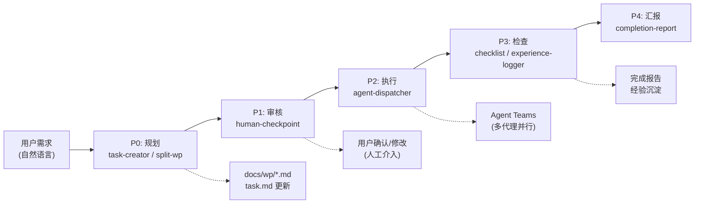

# Tackle Harness

> 基于插件的 AI Agent 工作流框架，为 Claude Code 提供任务管理、工作流编排、角色管理等能力

[](https://opensource.org/licenses/MIT)
[](https://github.com/ph419/tackle)

**[English](https://github.com/ph419/tackle/blob/main/README.en.md)**

## 为什么选择 Tackle Harness

你告诉 AI 需求，Tackle Harness 帮你管好整个流程：

- **方案先行，人工把关** — AI 先输出实施方案和工作包拆分，等你确认后才动手写代码。不会出现「AI 自作主张改了一堆东西」的情况。
- **复杂需求，并行交付** — 大需求自动拆成多个独立模块，调度多个 Agent 同时工作。前后端、数据库变更同步推进，不用串行等待。
- **经验沉淀，越用越好** — 每次任务完成后自动提炼经验教训。下次遇到类似问题时，Agent 会参考历史经验做出更好的决策。


### 端到端数据流

用户需求经五个阶段完成从规划到交付的完整生命周期：



## 安装

前提: Node.js >= 18.0.0

**推荐方式：全局安装**

```bash
npm install -g tackle-harness
```

全局安装后可在任意项目使用 `tackle-harness` 命令，无需重复安装。

**备选方式：本地安装**

```bash
npm install tackle-harness
```

本地安装需要使用 `npx tackle-harness` 或添加到 package.json scripts。

## 快速开始

```bash
# 进入你的项目目录
cd your-project

# 一键初始化（创建配置目录 + 注册钩子）
tackle-harness init

# 迁移旧项目（如之前使用过本地安装）
tackle-harness migrate

# 手动更新配置（当 .claude/settings.json 变更时）
tackle-harness build
```

> **注意**：全局安装模式下，技能和钩子由 npm 全局管理，直接从全局安装目录加载。项目目录下**不会生成** `.claude/skills/` 或 `.claude/hooks/`，只需保留配置文件（`.claude/config/` 和 `.claude/settings.json`）即可。

> **本地工作产物不入库**：`task.md`（本地主索引）与 `docs/wp/*.md`（工作包定义）属于使用者的本地工作流产物，已通过 `.gitignore` 排除版本控制（见 `.gitignore:9-11`）。clone 本仓库后，`task.md` 不会随仓库下发 —— 这些文件由 `tackle-harness` 在你自己的项目里按需生成，或从归档（`docs/archive/`）恢复。框架本身（`plugins/`、`bin/`、`test/`）正常入库，不受影响。

## 使用场景

- **新功能开发** — 需求分析 → 拆分工作包 → 并行开发 → 质量检查
- **Bug 批量修复** — 依赖分析 → 并行修复 → 自动验证
- **系统重构** — 架构分析 → 分批执行 → 经验沉淀
- **代码审查** — 质量检查 → 文档同步 → 经验记录
- **项目收尾** — 进度汇总 → 经验沉淀 → 完成报告

> 完整的场景流程图和操作步骤请参阅 [日常工作流最佳实践](docs/design/daily-workflow-guide.md)

## 命令一览

| 命令 | 说明 |
|------|------|
| `tackle-harness` | 默认执行 build |
| `tackle-harness build` | 更新 .claude/settings.json，注册全局技能和钩子 |
| `tackle-harness validate` | 验证插件格式是否正确 |
| `tackle-harness validate-config` | 验证 harness-config.yaml |
| `tackle-harness init` | 首次安装：创建配置目录并注册钩子 |
| `tackle-harness migrate` | 迁移旧项目：删除本地 skills/hooks 目录，更新配置 |
| `tackle-harness interactive` | 交互式插件管理（别名：`i`） |
| `tackle-harness status` | 显示构建状态和插件统计信息 |
| `tackle-harness config` | 显示/验证当前配置 |
| `tackle-harness list` | 列出所有已注册的插件 |
| `tackle-harness team-cleanup <name>` | 确定性清理残留的 Agent Teams 团队目录（WP-179） |
| `tackle-harness loop <plan> [--executor=local\|default] [--settings=<path>] [--loop-id=X] [--max-iters=N]` | 以 Node 进程驱动 Agentic Loop（v0.3.4+；v0.3.10 起单一 default executor + 自动模型探测） |
| `tackle-harness loop-server <start\|status\|list\|abort>` | 全局 loop 协调守护进程：聚合多 loop 视图、按 provider 管额度池、全局熔断（v0.3.6+） |
| `tackle-harness version` | 显示版本信息 |
| `tackle-harness --root <path>` | 指定目标项目路径（默认为当前目录） |

> **本地安装备注**：如果使用 `npm install tackle-harness`（非全局安装），请在命令前加 `npx`，例如 `npx tackle-harness init`。

## 技能清单

| 技能 | 触发方式 | 功能 |
|------|----------|------|
| task-creator | "创建任务" / "create task" | 创建单个任务到任务列表 |
| batch-task-creator | "批量创建任务" / "batch create tasks" | 批量创建多个任务 |
| split-work-package | "拆分工作包" / "split work package" | 将需求拆分为可执行的工作包 |
| progress-tracker | "记录进度" / "record progress" | 追踪和汇报工作进度 |
| team-cleanup | "清理团队" / "cleanup team" | 释放残留的团队资源 |
| human-checkpoint | "等待审核" / "wait for review" | 暂停并请求人工确认 |
| role-manager | "查看角色" / "view roles" | 管理项目角色定义 |
| checklist | "运行检查" / "run checklist" | 执行检查清单 |
| completion-report | "完成报告" / "completion report" | 生成完成报告 |
| experience-logger | "总结经验" / "log experience" | 记录项目经验教训 |
| watchdog-manager | "启动守护进程" / "start watchdog" | 启动和管理后台守护进程 |
| task-archive | "任务归档" / "archive tasks" | 归档已完成工作包 |
| tackle-sync | "配置tackle" / "sync" / "初始化" | 自动检测项目状态，执行初始化/更新/迁移 |
| agent-dispatcher | "批量执行" / "dispatch agents" | 调度多个子代理并行工作 |
| workflow-orchestrator | "开始工作流" / "start workflow" | 编排完整工作流 |
| agentic-loop | "自主循环" / "agentic loop" | Observe→Think→Act→Reflect→Decide 自主闭环执行（v0.3+） |
| tackle-plan | "生成计划" / "make plan" | 目标驱动计划生成，输出供 agentic-loop 读取（v0.3+） |

## 工作流概览

用户需求经过 5 个阶段完成从规划到交付：

```
需求 → 规划(P0) → 审核(P1) → 执行(P2) → 检查(P3) → 汇报(P4) → 交付
```

| 阶段 | 做什么 | 关键技能 |
|------|--------|----------|
| **P0 规划** | 解析需求，拆分为工作包，写入文档 | task-creator, split-work-package |
| **P1 审核** | 暂停等待你确认方案（强制人工介入） | human-checkpoint |
| **P2 执行** | 多 Agent 并行开发，按依赖调度 | agent-dispatcher |
| **P3 检查** | 代码/测试/文档质量验证，提炼经验 | checklist, experience-logger |
| **P4 汇报** | 生成完成报告，询问下一步 | completion-report |

> 完整的数据流图和阶段细节请参阅 [docs/ai_workflow.md](docs/design/ai_workflow.md)

### Agentic Loop（自主闭环，v0.3+）

P1 审核通过后，可由 `skill-agentic-loop` 接管 P2↔P3 进入**自主闭环**，无需每轮人工介入。决策状态机 `provider-loop-engine` 按 `Observe(环境感知) → Think(决策) → Act(执行) → Reflect(评分+发散检测) → Decide(继续/达成/发散/熔断/触顶)` 循环推进：

- 状态持久化到 state-store，防上下文压缩、支持断点恢复
- 失败项驱动 `retry`（携带 failingDrivers refine 反馈）/ `resplit` / `dispatch`，含「部分改进不计入发散」的发散宽容
- 三重上限保护：`max_iterations`、`max_round_time_ms`、`max_wall_time_ms`，均可配置
- 触顶 / 发散 / 熔断时由 `loop-report` 出总结报告，保留 `applyDirective` 人介入通道

#### Node 进程级 Driver 与 provider 解耦（v0.3.4+）

v0.3.4 起 Agentic Loop 的循环载体可从「Claude 会话内伪代码」升级为 **Node 进程级 driver**（`tackle loop`）。v0.3.10 起进一步把"真实 Anthropic / 智谱 GLM"两类 executor 合并为**单一 `default` executor**——provider 不再焊死成 executor 名,而是由 `provider-resolver` 探测 `--settings` 文件（或环境变量）里的模型名自动判定,按需启用对应特性（目前仅智谱 GLM 的 5h 额度感知 + 高峰系数）：

```bash
# 用 mock executor 冒烟（不调真模型，免费验证收敛）
tackle-harness loop test/fixtures/todo-cli-smoke.md --executor=local

# 真实驱动 Claude Code 逐轮写代码（默认走 claude 账号；claude 是 default 的别名）
tackle-harness loop docs/plan/my-plan.md --executor=default

# 按需切换 provider/套餐档位：--settings 透传 claude CLI 原生 flag
#   智谱 GLM（探测到 glm 模型 → 自动启用 5h 额度感知 + 高峰 3x/2x 系数）
tackle-harness loop docs/plan/my-plan.md --executor=default \
  --settings=~/.claude/settings-glm-5.2[1m]max.json
#   小米 MiMo（探测到 mimo 模型 → 纯透传，无额度约束）
tackle-harness loop docs/plan/my-plan.md --executor=default \
  --settings=~/.claude/mimo-v2.5-pro.json
#   靠环境变量切换（探测 ANTHROPIC_MODEL → 匹配 provider）
ANTHROPIC_MODEL=glm-5.2 tackle-harness loop docs/plan/my-plan.md --executor=default

# 多 loop 并行：物理隔离 state 目录
tackle-harness loop planA.md --loop-id=A --executor=default &
tackle-harness loop planB.md --loop-id=B --executor=default &
```

- **单一 executor + 自动探测**：`--executor=local|default`（`claude` 为 `default` 别名）。`provider-resolver` 按优先级 `--settings 文件 model → env.ANTHROPIC_DEFAULT_*_MODEL → 环境变量 ANTHROPIC_MODEL` 探测生效模型，匹配 `harness-config.yaml` 的 `loop.providers` 规则，自动启用对应特性（智谱 GLM → 5h 额度感知 + 高峰系数；mimo/deepseek → 纯透传）。**BREAKING（v0.3.10）**：`--executor=glm` 已删除，改用 `--executor=default --settings=<glm-profile.json>`
- **配置可切换**：`--settings=<path>` 透传 claude CLI 原生 flag，把预先放好的多套 settings JSON（不同 provider / 不同套餐档位）喂给 claude；匹配规则与额度参数外置在 `harness-config.yaml` 的 `loop.providers` 段（无配置时用内置默认：glm/mimo/deepseek），可用 `HARNESS_LOOP__*` 环境变量覆盖
- **多 loop 并行**：`--loop-id=X` 建立 per-loop 隔离目录，物理规避单 state 文件多进程并发写丢数据
- **全局协调**：`tackle loop-server` 守护进程聚合多 loop 全局视图、按 provider 分桶统筹额度池、任一熔断触发全局回退

#### 从 0.3.8 迁移到 0.3.10（GLM 用户必读）

智谱 GLM 从「独立 executor」改为「单一 default executor + 自动探测」，迁移分 4 步：

1. **改 executor 名**：`--executor=glm` → `--executor=default --settings=<glm-profile.json>`（`--executor=glm` 现抛 `UNKNOWN_EXECUTOR`）
2. **端点+认证改由 settings 文件携带**：原 glm executor 依赖 `ZHIPU_API_KEY` 环境变量注入（spawn 前硬编码补 `ANTHROPIC_BASE_URL`/`ANTHROPIC_AUTH_TOKEN`）。0.3.10 起 executor **不再注入任何环境变量**，端点与认证全权交给 settings 文件
3. **生成/放置 settings 文件**：在 `~/.claude/` 下放一份指向智谱 anthropic 兼容端点的 settings JSON（如 `settings-glm-5.2[1m]max.json`），内含 `model`（provider-resolver 据此匹配 glm 规则）+ `env` 段携带端点与认证。一份文件即一套套餐档位，用 `--settings=` 按需切换（也可并存 mimo/deepseek 等其它 provider 的 settings）
4. **`--executor=claude` 仍可用**：保留为 `default` 别名（向后兼容 v0.3.4~0.3.8 脚本），但推荐显式写 `--executor=default`

> 完整设计见 [`docs/design/agentic-loop-design.md`](docs/design/agentic-loop-design.md) §11。

## 插件架构

Tackle Harness 包含四类插件，共 26 个：

| 类型 | 数量 | 作用 |
|------|------|------|
| Skill | 17 | 可执行技能，Claude Code 直接调用 |
| Provider | 5 | 状态存储、loop 决策引擎、角色注册、记忆存储、守护进程 |
| Hook | 2 | 技能门控 + 会话启动时注入 plan-mode 规则 |
| Validator | 2 | 文档同步验证、工作包验证 |

> 插件依赖关系和开发指南请参阅 [docs/plugin-development.md](docs/design/plugin-development.md)

## 构建后的项目结构

### 全局安装模式（推荐）

执行 `tackle-harness init` 后，你的项目中会生成以下内容：

```
your-project/
  .claude/
    config/
      harness-config.yaml            # 配置文件（可选）
    settings.json                    # 自动注册的 hooks
```

技能和钩子由全局安装管理，不需要本地的 `skills/` 和 `hooks/` 目录。

### 本地安装模式（备选）

如果使用 `npm install tackle-harness`（非全局安装），执行 `tackle-harness build` 后会生成：

```
your-project/
  .claude/
    skills/                          # 17 个技能
      skill-task-creator/skill.md
      ...
    hooks/                           # 2 个 hook
      hook-skill-gate/index.js
      hook-session-start/index.js
    settings.json                    # 自动注册的 hooks
```

## 常见问题

### 安装后技能没有生效？

**全局安装模式**：
1. 确认已全局安装：`npm list -g tackle-harness`
2. 执行 `tackle-harness init` 初始化项目
3. 检查 `.claude/settings.json` 是否包含 tackle-harness 的 hooks

**本地安装模式**：
1. 确认在项目根目录执行了 `npx tackle-harness build`
2. 检查 `.claude/skills/` 目录下是否有技能文件夹

### 多个项目能否共用？

全局安装后，所有项目共用同一套技能和钩子。每个项目只需要自己的配置文件（`.claude/config/` 和 `.claude/settings.json`）。

### 如何从旧版本迁移？

如果之前使用本地安装模式，迁移到全局安装：

```bash
# 1. 全局安装
npm install -g tackle-harness

# 2. 进入项目目录
cd your-project

# 3. 执行迁移命令
tackle-harness migrate
```

迁移命令会：
- 删除本地的 `.claude/skills/` 和 `.claude/hooks/` 目录
- 更新 `.claude/settings.json` 指向全局路径
- 保留你的配置文件（`harness-config.yaml`）

### Windows 路径问题？

全局安装支持 Windows 路径（如 `D:\path\to\project`），使用正斜杠或反斜杠均可：

```bash
tackle-harness build --root D:/path/to/project
tackle-harness build --root D:\path\to\project
```

### 如何卸载？

```bash
# 卸载全局安装
npm uninstall -g tackle-harness

# 卸载本地安装
npm uninstall tackle-harness
```

配置文件会保留在 `.claude/` 目录中，如需清理请手动删除。

### settings.json 中的 hooks 是什么？

`tackle-harness build` 会自动向 `.claude/settings.json` 注入三个 hook：

- **SessionStart** — 会话启动时扫描 plan-mode 技能，将优先级规则注入 system-reminder，确保任务创建类技能强制进入 Plan 模式
- **PreToolUse(Edit|Write)** — 在特定状态下阻止文件编辑
- **PostToolUse(Skill)** — 技能调用后更新状态

这些 hook 指向全局安装路径或 `node_modules/tackle-harness/` 中的脚本。已有的 settings.json 内容会被保留，仅追加 tackle-harness 相关的 hooks。

### 如何使用交互式模式？

```bash
tackle-harness interactive
# 或使用别名
tackle-harness i
```

交互式模式提供可视化的插件管理界面，支持：
- 查看所有已注册插件的状态
- 启用/停用插件
- 查看插件依赖关系
- 执行插件验证

> 本地安装模式下请使用 `npx tackle-harness interactive`。

### CI/CD 如何集成？

在 CI 环境中使用 Tackle Harness：

```yaml
# 方式 1：全局安装（推荐）
- name: Setup Tackle Harness
  run: |
    npm install -g tackle-harness
    tackle-harness init --root $GITHUB_WORKSPACE

# 方式 2：本地安装
- name: Setup Tackle Harness
  run: |
    npm install tackle-harness
    npx tackle-harness init --root $GITHUB_WORKSPACE
```

项目已配置 GitHub Actions 工作流，提交 PR 或推送代码会自动运行测试。

## 文档

- [日常工作流最佳实践](docs/design/daily-workflow-guide.md) - 按场景的使用手册和 Skill 速查
- [最佳实践](docs/design/best-practices.md) - 插件开发与项目最佳实践
- [安装指南](docs/design/installation.md) - 详细的安装和配置说明
- [配置参考](docs/design/config-reference.md) - 完整的配置文件说明
- [插件开发](docs/design/plugin-development.md) - 插件架构和开发指南
- [插件包约定](docs/design/plugin-package-convention.md) - 插件目录结构和命名规范
- [迁移指南](docs/design/migration-guide.md) - 版本升级和迁移说明
- [API 参考](docs/design/api-reference.md) - 运行时模块 API 文档
- [工作流详解](docs/design/ai_workflow.md) - 完整的工作流数据流和阶段说明

## 示例项目

查看 [examples/](https://github.com/ph419/tackle/tree/main/examples/) 目录获取完整的示例项目：
- **[minimal](https://github.com/ph419/tackle/tree/main/examples/minimal/)** — 最小示例项目，展示基本集成方式和配置

## 持续集成

项目使用 GitHub Actions 进行 CI/CD：
- **CI 工作流** — 在 Ubuntu/Windows/macOS 三平台 × Node.js 18/20 上运行测试矩阵，并检查行覆盖率阈值
- **发布工作流** — Tag 触发自动发布到 npm

详见 [.github/workflows/](https://github.com/ph419/tackle/tree/main/.github/workflows/)

## 贡献

欢迎贡献！我们接受 Bug 报告、功能建议、代码提交和文档改进。详见 [贡献指南](https://github.com/ph419/tackle/blob/main/CONTRIBUTING.md)。

快速上手：Fork → 创建分支 → 修改 → 提交 PR。Commit 遵循 [Conventional Commits](https://www.conventionalcommits.org/) 格式。

## 许可证

MIT License - 详见 [LICENSE](https://github.com/ph419/tackle/blob/main/LICENSE) 文件

## 致谢

本项目借鉴了以下开源项目的优秀设计：
- DeerFlow - 记忆提取和插件架构
