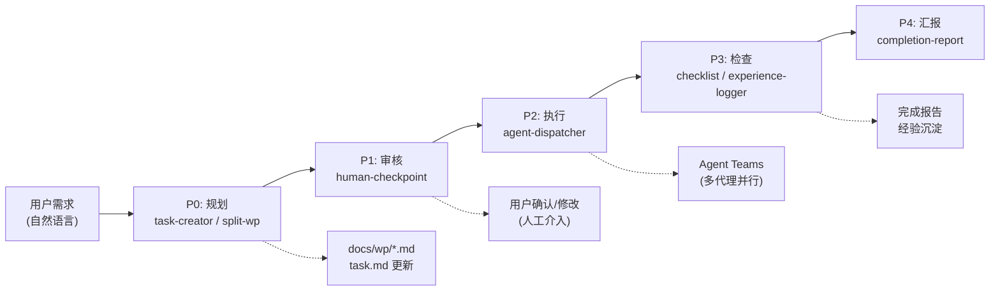

# Tackle Harness

> 基于插件的 AI Agent 工作流框架，为 Claude Code 提供任务管理、工作流编排、角色管理等能力

[](https://opensource.org/licenses/MIT)
[](https://github.com/ph419/tackle)

**[English](README.en.md)**

## 为什么选择 Tackle Harness

你告诉 AI 需求，Tackle Harness 帮你管好整个流程：

- **方案先行，人工把关** — AI 先输出实施方案和工作包拆分，等你确认后才动手写代码。不会出现「AI 自作主张改了一堆东西」的情况。
- **复杂需求，并行交付** — 大需求自动拆成多个独立模块，调度多个 Agent 同时工作。前后端、数据库变更同步推进，不用串行等待。
- **经验沉淀，越用越好** — 每次任务完成后自动提炼经验教训。下次遇到类似问题时，Agent 会参考历史经验做出更好的决策。


### 端到端数据流

用户需求经五个阶段完成从规划到交付的完整生命周期：



## 安装

```bash
npm install tackle-harness
```

## 快速开始

```bash
# 进入你的项目目录
cd your-project

# 一键初始化（构建技能 + 注册钩子 + 创建配置目录）
npx tackle-harness init

# 或者分步执行
npx tackle-harness build      # 构建技能到 .claude/skills/，合并 hooks 到 settings.json
npx tackle-harness validate   # 验证插件完整性
```

## 使用场景

- **新功能开发** — 需求分析 → 拆分工作包 → 并行开发 → 质量检查
- **Bug 批量修复** — 依赖分析 → 并行修复 → 自动验证
- **系统重构** — 架构分析 → 分批执行 → 经验沉淀
- **代码审查** — 质量检查 → 文档同步 → 经验记录
- **项目收尾** — 进度汇总 → 经验沉淀 → 完成报告

> 完整的场景流程图和操作步骤请参阅 [日常工作流最佳实践](docs/daily-workflow-guide.md)

## 命令一览

| 命令 | 说明 |
|------|------|
| `npx tackle-harness` | 默认执行 build |
| `npx tackle-harness build` | 构建所有技能，更新 .claude/settings.json |
| `npx tackle-harness validate` | 验证插件格式是否正确 |
| `npx tackle-harness validate-config` | 验证 harness-config.yaml |
| `npx tackle-harness init` | 首次安装：build + 创建 .claude/ 目录 |
| `npx tackle-harness interactive` | 交互式插件管理（别名：`i`） |
| `npx tackle-harness status` | 显示构建状态和插件统计信息 |
| `npx tackle-harness config` | 显示/验证当前配置 |
| `npx tackle-harness list` | 列出所有已注册的插件 |
| `npx tackle-harness version` | 显示版本信息 |
| `npx tackle-harness help` | 显示帮助信息 |
| `npx tackle-harness --root <path>` | 指定目标项目路径（默认为当前目录） |
| `npx tackle-harness --help` | 查看帮助信息 |
| `npx tackle-harness --version, -v` | 显示版本信息 |

## 技能清单

| 技能 | 触发方式 | 功能 |
|------|----------|------|
| task-creator | "创建任务" / "create task" | 创建单个任务到任务列表 |
| batch-task-creator | "批量创建任务" / "batch create tasks" | 批量创建多个任务 |
| split-work-package | "拆分工作包" / "split work package" | 将需求拆分为可执行的工作包 |
| progress-tracker | "记录进度" / "record progress" | 追踪和汇报工作进度 |
| team-cleanup | "清理团队" / "cleanup team" | 释放残留的团队资源 |
| human-checkpoint | "等待审核" / "wait for review" | 暂停并请求人工确认 |
| role-manager | "查看角色" / "view roles" | 管理项目角色定义 |
| checklist | "运行检查" / "run checklist" | 执行检查清单 |
| completion-report | "完成报告" / "completion report" | 生成完成报告 |
| experience-logger | "总结经验" / "log experience" | 记录项目经验教训 |
| watchdog-manager | "启动守护进程" / "start watchdog" | 启动和管理后台守护进程 |
| agent-dispatcher | "批量执行" / "dispatch agents" | 调度多个子代理并行工作 |
| workflow-orchestrator | "开始工作流" / "start workflow" | 编排完整工作流 |

## 工作流概览

用户需求经过 5 个阶段完成从规划到交付：

```
需求 → 规划(P0) → 审核(P1) → 执行(P2) → 检查(P3) → 汇报(P4) → 交付
```

| 阶段 | 做什么 | 关键技能 |
|------|--------|----------|
| **P0 规划** | 解析需求，拆分为工作包，写入文档 | task-creator, split-work-package |
| **P1 审核** | 暂停等待你确认方案（强制人工介入） | human-checkpoint |
| **P2 执行** | 多 Agent 并行开发，按依赖调度 | agent-dispatcher |
| **P3 检查** | 代码/测试/文档质量验证，提炼经验 | checklist, experience-logger |
| **P4 汇报** | 生成完成报告，询问下一步 | completion-report |

> 完整的数据流图和阶段细节请参阅 [docs/ai_workflow.md](docs/ai_workflow.md)

## 插件架构

Tackle Harness 包含四类插件，共 21 个：

| 类型 | 数量 | 作用 |
|------|------|------|
| Skill | 13 | 可执行技能，Claude Code 直接调用 |
| Provider | 4 | 状态存储、角色注册、记忆存储、守护进程 |
| Hook | 2 | 技能门控 + 会话启动时注入 plan-mode 规则 |
| Validator | 2 | 文档同步验证、工作包验证 |

> 插件依赖关系和开发指南请参阅 [docs/plugin-development.md](docs/plugin-development.md)

## 构建后的项目结构

执行 `tackle-harness build` 后，你的项目中会生成以下内容：

```
your-project/
  .claude/
    skills/                          # 13 个技能
      skill-task-creator/skill.md
      skill-batch-task-creator/skill.md
      skill-split-work-package/skill.md
      skill-progress-tracker/skill.md
      skill-team-cleanup/skill.md
      skill-human-checkpoint/skill.md
      skill-role-manager/skill.md
      skill-checklist/skill.md
      skill-completion-report/skill.md
      skill-experience-logger/skill.md
      skill-watchdog-manager/skill.md
      skill-agent-dispatcher/skill.md
      skill-workflow-orchestrator/skill.md
    hooks/                           # 2 个 hook
      hook-skill-gate/index.js
      hook-session-start/index.js
    settings.json                    # 自动注册的 hooks
```

## 常见问题

### 安装后技能没有生效？

确保在项目根目录执行了 `npx tackle-harness build`，并且 `.claude/skills/` 目录下有 13 个技能文件夹。

### 多个项目能否共用？

每个项目独立安装、独立构建。不同项目可以安装不同版本。

### 全局安装

```bash
npm install -g tackle-harness
tackle-harness build
```

全局安装后直接使用 `tackle-harness` 命令，无需 `npx`。

### 如何卸载？

```bash
npm uninstall tackle-harness
```

技能文件会保留在 `.claude/skills/` 中，如需清理请手动删除。

### settings.json 中的 hooks 是什么？

`tackle-harness build` 会自动向 `.claude/settings.json` 注入三个 hook：
- `SessionStart` — 会话启动时扫描 plan-mode 技能，将优先级规则注入 system-reminder，确保任务创建类技能强制进入 Plan 模式
- `PreToolUse(Edit|Write)` — 在特定状态下阻止文件编辑
- `PostToolUse(Skill)` — 技能调用后更新状态

这些 hook 指向 `node_modules/tackle-harness/` 中的脚本，不会影响你项目中的其他配置。已有的 settings.json 内容会被保留，仅追加 tackle-harness 相关的 hooks。

### 如何使用交互式模式？

```bash
npx tackle-harness interactive
# 或使用别名
npx tackle-harness i
```

交互式模式提供可视化的插件管理界面，支持：
- 查看所有已注册插件的状态
- 启用/停用插件
- 查看插件依赖关系
- 执行插件验证

### CI/CD 如何集成？

在 CI 环境中使用 Tackle Harness：

```yaml
- name: Setup Tackle Harness
  run: |
    npm install tackle-harness
    npx tackle-harness build --root $GITHUB_WORKSPACE
```

项目已配置 GitHub Actions 工作流，提交 PR 或推送代码会自动运行测试。

## 文档

- [日常工作流最佳实践](docs/daily-workflow-guide.md) - 按场景的使用手册和 Skill 速查
- [配置参考](docs/config-reference.md) - 完整的配置文件说明
- [插件开发](docs/plugin-development.md) - 插件架构和开发指南
- [工作流详解](docs/ai_workflow.md) - 完整的工作流数据流和阶段说明

## 示例项目

查看 [examples/](examples/) 目录获取完整的示例项目：
- **[minimal](examples/minimal/)** — 最小示例项目，展示基本集成方式和配置

## 持续集成

项目使用 GitHub Actions 进行 CI/CD：
- **CI 工作流** — 在 Node.js 18 和 20 上运行测试矩阵
- **发布工作流** — Tag 触发自动发布到 npm

详见 [.github/workflows/](.github/workflows/)

## 贡献

欢迎贡献！我们接受 Bug 报告、功能建议、代码提交和文档改进。详见 [贡献指南](CONTRIBUTING.md)。

快速上手：Fork → 创建分支 → 修改 → 提交 PR。Commit 遵循 [Conventional Commits](https://www.conventionalcommits.org/) 格式。

## 许可证

MIT License - 详见 [LICENSE](LICENSE) 文件

## 致谢

本项目借鉴了以下开源项目的优秀设计：
- DeerFlow - 记忆提取和插件架构
