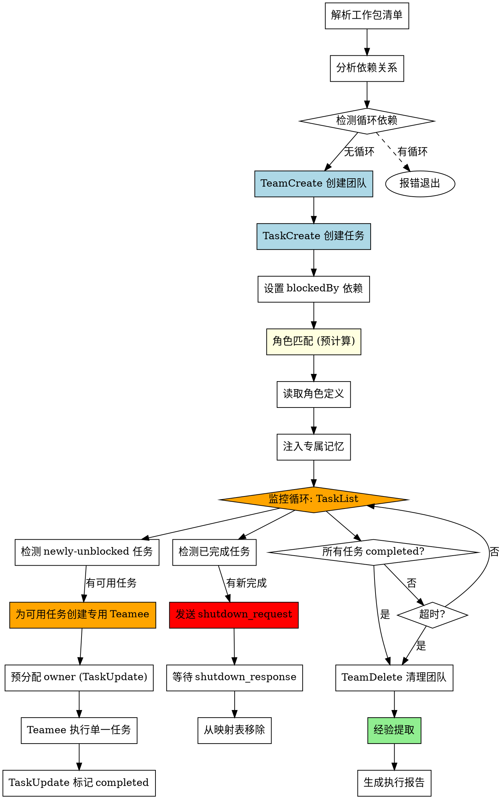

# Agent Dispatcher (Agent Teams 版)

基于 **Claude Code Agent Teams** 机制的子代理批量任务调度技能，支持角色赋能和记忆注入。

## When to Use

**触发词**:
- "批量执行" / "并行执行"
- "调度子代理" / "派发任务"
- "执行工作包 WP-XXX, WP-YYY"
- "开始批量任务"

## Quick Reference

| 场景 | 执行方式 |
|------|----------|
| 无依赖的多个工作包 | 并行执行 (每 WP 一个专用 Teamee) |
| 有依赖链的工作包 | blockedBy 阻塞 + 依赖解除后按需创建 Teamee |
| 混合依赖 | 监控循环动态创建 + 即时销毁 |

---

## Architecture

```
┌─────────────────────────────────────────────────────────────┐
│                      Team Lead (主 Agent)                    │
│                                                             │
│  1. 解析工作包 → 分析依赖                                     │
│  2. TeamCreate 创建团队                                      │
│  3. TaskCreate 创建任务 + 设置 blockedBy                      │
│  4. 角色匹配 → 预计算每个 WP 的角色和记忆                      │
│  5. 监控循环:                                                │
│     - 检测 newly-unblocked 任务 → 按需创建专用 Teamee (1:1)  │
│     - 检测已完成的任务 → 即时销毁对应 Teamee                   │
│     - 维护映射表 {task_id → teamee_name}                     │
│  6. 全部完成后 TeamDelete                                     │
│  7. 经验提取 + completion-report                              │
└─────────────────────────────────────────────────────────────┘
                              │
        ┌─────────────────────┼─────────────────────┐
        ▼                     ▼                     ▼
  ┌──────────┐          ┌──────────┐          ┌──────────┐
  │ Teamee A │          │ Teamee B │          │ Teamee C │
  │ WP-037   │          │ WP-038   │          │ WP-039   │
  │ (或四位如 │          │ WP-1038  │          │ WP-1039  │)
  │ 专用绑定  │          │ 专用绑定  │          │ 专用绑定  │
  └────┬─────┘          └────┬─────┘          └────┬─────┘
       │ 已完成              │ 执行中               │ blockedBy #2
       │ 即时销毁            │                     │ 等待创建
       ▼                     ▼                     ▼
              ┌───────────────────────────────┐
              │     共享 Task List            │
              │  Task #1: WP-037 (completed)  │
              │  Task #2: WP-038 (in_progress)│
              │  Task #3: WP-039 (blockedBy #2)│
              └───────────────────────────────┘
```

---

## Flow



---

## Step-by-Step Implementation

### Step 1: 解析工作包 + 分析依赖

```
1. 读取 task.md 获取下一个可用 WP 编号
2. 提取待执行工作包的依赖关系
3. 构建依赖图，检测循环依赖
4. 确定执行顺序（拓扑排序）
```

### Step 2: 创建团队

```
TeamCreate:
  team_name: "batch-{YYYYMMDD}-{work-package-ids}"
  description: "批量执行 {WP-XXX, WP-YYY}"
```

**命名规范**：
- 单工作包: `batch-20260314-WP073` / `batch-20260314-WP1073`
- 批量工作包: `batch-20260314-WP073-075` / `batch-20260314-WP1073-1075`

### Step 3: 创建任务 + 设置依赖

```
# 为每个工作包创建 Task

TaskCreate:
  subject: "WP-037: 凝视区域形状升级"
  description: |
    ## 📖 必读：工作包文档

    **执行前请先阅读工作包文档获取完整上下文：**
    - 文档路径: `docs/wp/WP-037.md`
    - 包含: 问题分析、实施计划、关键文件、验收标准

    ---

    {工作包简要描述}
  status: pending

# 设置依赖关系
TaskUpdate:
  taskId: "{依赖任务的 ID}"
  addBlockedBy: ["{被依赖任务的 ID}"]
```

**⚠️ 重要**: description 必须包含工作包文档路径，让 Subagent 知道从哪里获取完整上下文！

### Step 4-5: 角色匹配 + 记忆准备

**📖 在执行此步骤前，读取角色与记忆参考文档：**
```
Read("plugins/core/skill-agent-dispatcher/roles-reference.md")
```

该文档包含：
- **Step 4**: 角色匹配算法（关键词/任务类型/模块标签加权评分）
- **Step 5**: 预计算角色和记忆的完整流程
- **角色赋能系统**: 核心角色表、领域角色表、角色文件位置
- **记忆注入机制**: 经验提取逻辑、动态数量、回退机制
- **经验沉淀闭环**: 执行完成后的经验提取流程

### Step 6: 初始创建 Teamee（首次可用任务）

<HARD-GATE>
Step 5 完成后，立即检查有哪些任务的 blockedBy 已满足。
为每个 initially-unblocked 的任务创建专用 Teamee。
不可跳过此步骤！
</HARD-GATE>

**⚠️ 重要**: 必须使用 `general-purpose` subagent_type！

不要使用 `Explore` 或其他只读 agent 类型，因为它们没有 SendMessage 工具，
无法响应 shutdown_request，会导致即时销毁流程失败。

```
# 初始化映射表
teamee_map = {}  # {task_id: teamee_name}

# 检查哪些任务在初始时就没有阻塞
tasks = TaskList()
for task in tasks:
    if task.status == "pending" and is_unblocked(task):
        # 从预计算结果获取角色信息
        assignment = wp_assignments[task.id]

        # 生成唯一的 Teamee 名称（包含 task_id 和 role）
        teamee_name = f"{assignment.role_id}-t{task.id}"

        # 预分配 owner
        TaskUpdate(taskId=task.id, owner=teamee_name)

        # 创建专用 Teamee
        Agent(
            name=teamee_name,
            team_name="{team_name}",
            subagent_type="general-purpose",  # 必须使用 general-purpose
            prompt=build_single_task_prompt(
                teamee_name=teamee_name,
                task_id=task.id,
                role_prompt=assignment.role_prompt,
                memories=assignment.memories,
                wp_doc_path=assignment.wp_doc_path
            )
        )

        # 记录映射关系
        teamee_map[task.id] = teamee_name

# ---- 1:1 映射验证 ----
all_tasks_verify = TaskList()
unblocked_verify = [t for t in all_tasks_verify if t.status == "pending" and is_unblocked(t)]
if len(teamee_map) != len(unblocked_verify):
    print(f"⚠️ 验证失败: 有 {len(unblocked_verify)} 个已解除阻塞的 WP 但只创建了 {len(teamee_map)} 个 Teamee")
    print("❌ 这可能意味着某些 WP 被错误合并。请检查以上步骤是否严格遵循 1:1 映射规则。")
else:
    print(f"✅ 1:1 映射验证通过: {len(teamee_map)} 个 Teamee 对应 {len(unblocked_verify)} 个已解除阻塞的 WP")
```

**为什么不能用 Explore agent**:
- Explore agent 的工具集: `All tools except Agent, ExitPlanMode, Edit, Write, NotebookEdit`
- 没有 Agent 工具 = 没有 SendMessage
- 无法发送 `shutdown_response` = 即时销毁失败 = 资源泄漏

### Step 6.5: 监控循环 (🔴 关键步骤 — 动态创建 + 即时销毁)

<HARD-GATE>
Lead Agent 必须进入监控循环，不可跳过！
此循环负责:
1. 检测 newly-unblocked 任务 → 按需创建专用 Teamee
2. 检测已完成任务 → 即时销毁对应 Teamee
3. 判断全部完成 → 退出循环
这是保证资源及时释放和依赖正确解析的核心机制。
</HARD-GATE>

```
# Lead Agent 监控循环
loop_interval = 30  # 秒
max_wait_time = 7200  # 2 小时
shutdown_timeout = 15  # 等待 Teamee shutdown 响应的超时

# 初始化守护进程相关状态
loop_iteration = 0
processed_action_ids = []  # 跟踪已处理的守护进程指令

start_time = now()
while (now() - start_time) < max_wait_time:
    loop_iteration += 1
    # ---- Phase A: 获取任务状态 ----
    tasks = TaskList()

    # ---- Phase A.1: 写入守护进程心跳 (DISP-001) ----
    # 每轮监控循环迭代写入心跳文件，供外部守护进程监控
    heartbeat_data = {
        "session_id": "{team_name}",
        "pid": get_process_pid(),  # 通过 Bash `echo $$` 或 process.pid 获取
        "team_name": "{team_name}",
        "loop_iteration": loop_iteration,
        "total_tasks": len(tasks),
        "completed_tasks": count(t.status == "completed" for t in tasks),
        "in_progress_tasks": count(t.status == "in_progress" for t in tasks),
        "pending_tasks": count(t.status == "pending" for t in tasks),
        "last_update": now_iso8601(),
        "status": "monitoring"  # monitoring / shutting_down / completed
    }
    Write(file_path=".claude-daemon/heartbeat.json", content=json_dumps(heartbeat_data))

    # ---- Phase B: 即时销毁已完成的 Teamee ----
    for task in tasks:
        if task.status == "completed" and task.id in teamee_map:
            teamee_name = teamee_map[task.id]
            print(f"任务 {task.id} 已完成，即时销毁 Teamee: {teamee_name}")

            # B1. 发送 shutdown_request
            SendMessage(to=teamee_name, message={
                "type": "shutdown_request",
                "reason": f"任务 {task.id} 已完成，释放资源",
                "request_id": f"shutdown-{task.id}-{timestamp()}"
            })

            # B3. 从映射表移除
            del teamee_map[task.id]
            print(f"Teamee {teamee_name} 已销毁并从映射表移除")

            # B4. 更新任务状态文件 (DISP-002)
            # Teamee 完成后更新对应的 task-{id}.json 文件
            update_task_file(task.id, status="completed")

    # ---- Phase C: 按需创建 Teamee 处理 newly-unblocked 任务 ----
    # C0. 读取并发配置，计算当前时段的并发上限
    concurrency_config = get_config("agent_dispatcher.concurrency")
    max_concurrent = get_max_concurrent(concurrency_config, now())
    active_count = len(teamee_map)

    for task in tasks:
        if task.status == "pending" and task.owner == "" and is_unblocked(task):
            # C0.1 并发检查：活跃 Teamee 数已达上限，跳过创建
            if active_count >= max_concurrent:
                log(f"并发上限 {max_concurrent} 已达，任务 {task.id} 保持 pending")
                continue

            # C1. 检查是否已有映射（防止重复创建）
            if task.id in teamee_map:
                continue

            # C2. 从预计算结果获取角色信息
            assignment = wp_assignments[task.id]
            teamee_name = f"{assignment.role_id}-t{task.id}"

            # C3. 预分配 owner
            TaskUpdate(taskId=task.id, owner=teamee_name)

            # C4. 创建专用 Teamee
            Agent(
                name=teamee_name,
                team_name="{team_name}",
                subagent_type="general-purpose",
                prompt=build_single_task_prompt(
                    teamee_name=teamee_name,
                    task_id=task.id,
                    role_prompt=assignment.role_prompt,
                    memories=assignment.memories,
                    wp_doc_path=assignment.wp_doc_path
                )
            )

            # C5. 记录映射关系
            teamee_map[task.id] = teamee_name
            active_count += 1
            print(f"为任务 {task.id} 创建专用 Teamee: {teamee_name}")

            # C6. 创建任务状态文件 (DISP-002)
            # Teamee 创建后初始化对应的 task-{id}.json 文件
            create_task_file(
                task_id=task.id,
                wp_id=assignment.wp_id,
                teamee_name=teamee_name,
                status="in_progress",
                complexity_score=assignment.complexity_score
            )

    # ---- Phase D.1: 读取守护进程指令 (DISP-003) ----
    # 在判断退出条件前，读取守护进程下发的指令
    daemon_actions_path = ".claude-daemon/daemon-actions.json"
    if file_exists(daemon_actions_path):
        actions_data = Read(file_path=daemon_actions_path)
        actions = json_loads(actions_data).get("actions", [])

        for action in actions:
            # 检查指令是否已被处理
            if action.get("id") in processed_action_ids:
                continue

            target_task_id = action.get("target_task")
            action_type = action.get("action")
            strategy = action.get("strategy", "full_restart")
            reason = action.get("reason", "")

            if action_type == "restart":
                # 重启指令: shutdown 旧 Teamee → 创建新 Teamee
                if target_task_id in teamee_map:
                    old_teamee = teamee_map[target_task_id]

                    # D1a. Shutdown 旧 Teamee
                    SendMessage(to=old_teamee, message={
                        "type": "shutdown_request",
                        "reason": f"守护进程指令: {reason}",
                        "request_id": f"daemon-restart-{target_task_id}-{timestamp()}"
                    })
                    del teamee_map[target_task_id]

                    # D1b. 根据策略创建新 Teamee
                    assignment = wp_assignments[target_task_id]
                    new_teamee_name = f"{assignment.role_id}-t{target_task_id}-retry"

                    if strategy == "checkpoint_resume":
                        # 复杂任务: 注入已完成文件上下文
                        context = action.get("context", {})
                        prompt = build_resume_prompt(
                            teamee_name=new_teamee_name,
                            task_id=target_task_id,
                            role_prompt=assignment.role_prompt,
                            completed_files=context.get("completed_files", []),
                            remaining=context.get("remaining", [])
                        )
                    else:  # full_restart
                        # 简单任务: 从头执行
                        prompt = build_single_task_prompt(
                            teamee_name=new_teamee_name,
                            task_id=target_task_id,
                            role_prompt=assignment.role_prompt,
                            memories=assignment.memories,
                            wp_doc_path=assignment.wp_doc_path
                        )

                    # D1c. 创建新 Teamee
                    Agent(
                        name=new_teamee_name,
                        team_name="{team_name}",
                        subagent_type="general-purpose",
                        prompt=prompt
                    )
                    teamee_map[target_task_id] = new_teamee_name

                    # D1d. 更新重试计数
                    update_task_file(target_task_id, increment_retry=True)

                # 标记指令已处理
                processed_action_ids.append(action.get("id"))

            elif action_type == "abort":
                # 中止单个任务
                if target_task_id in teamee_map:
                    teamee_name = teamee_map[target_task_id]
                    SendMessage(to=teamee_name, message={
                        "type": "shutdown_request",
                        "reason": f"守护进程中止指令: {reason}",
                        "request_id": f"daemon-abort-{target_task_id}-{timestamp()}"
                    })
                    del teamee_map[target_task_id]
                    update_task_file(target_task_id, status="failed")
                processed_action_ids.append(action.get("id"))

            elif action_type == "pause":
                # 暂停创建新 Teamee（已有 Teamee 继续运行）
                global_pause_flag = True
                processed_action_ids.append(action.get("id"))

            elif action_type == "abort_all":
                # 全局中止: shutdown 所有 Teamee，终止监控循环
                for task_id, teamee_name in teamee_map.items():
                    SendMessage(to=teamee_name, message={
                        "type": "shutdown_request",
                        "reason": "守护进程全局中止指令",
                        "request_id": f"daemon-abort-all-{task_id}-{timestamp()}"
                    })
                teamee_map.clear()
                print("收到 abort_all 指令，终止监控循环")
                processed_action_ids.append(action.get("id"))
                break  # 跳出监控循环

        # D1e. 回写已处理的 iteration
        if actions:
            Write(file_path=daemon_actions_path, content=json_dumps({
                "actions": [a for a in actions if a.get("id") not in processed_action_ids],
                "last_processed_iteration": loop_iteration
            }))

    # ---- Phase D: 判断退出条件 ----
    completed = count(status == "completed")
    total = len(tasks)

    if completed == total:
        # 写入最终心跳 (DISP-001): 状态为 completed
        heartbeat_data["status"] = "completed"
        Write(file_path=".claude-daemon/heartbeat.json", content=json_dumps(heartbeat_data))
        print("所有任务完成，退出监控循环")
        break

    # Phase D2: 异常检测
    in_progress = count(status == "in_progress")
    pending = count(status == "pending")
    if pending > 0 and in_progress == 0 and len(teamee_map) == 0:
        print("异常: 有待处理任务但无活跃 Teamee 且无映射")
        break

    sleep(loop_interval)

# 超时处理
if (now() - start_time) >= max_wait_time:
    # 写入最终心跳 (DISP-001): 状态为 shutting_down
    heartbeat_data["status"] = "shutting_down"
    Write(file_path=".claude-daemon/heartbeat.json", content=json_dumps(heartbeat_data))
    print("监控超时，强制执行清理")
    for task_id, teamee_name in teamee_map.items():
        SendMessage(to=teamee_name, message={
            "type": "shutdown_request",
            "reason": "监控超时，强制清理",
            "request_id": f"force-shutdown-{task_id}-{timestamp()}"
        })
```

**辅助函数 — 判断任务是否已解除阻塞**:
```
def is_unblocked(task):
    """检查任务的所有 blockedBy 依赖是否都已满足"""
    if not task.blockedBy:
        return True
    all_tasks = TaskList()
    for blocker_id in task.blockedBy:
        blocker = find_by_id(all_tasks, blocker_id)
        if blocker.status != "completed":
            return False
    return True
```

**辅助函数 — 并发控制**（Phase C 使用）:
```
def get_max_concurrent(config, current_time):
    """根据当前时间匹配 schedule，返回对应并发上限"""
    if not config or not config.get("schedules"):
        return config.get("default_max", 6) if config else 6

    current_hhmm = current_time.strftime("%H:%M")
    for schedule in config["schedules"]:
        start = schedule["time_range"]["start"]
        end = schedule["time_range"]["end"]
        if is_time_in_range(current_hhmm, start, end):
            return schedule["max_concurrent"]

    return config.get("default_max", 6)

def is_time_in_range(current, start, end):
    """判断当前时间是否在范围内，支持跨午夜"""
    if start <= end:
        return start <= current < end
    else:  # 跨午夜，如 22:00-06:00
        return current >= start or current < end
```

**监控循环关键特性**:
- **Phase B (即时销毁)** 在 Phase C (创建) 之前执行，确保资源先释放再分配
- 每次循环都检查 `teamee_map` 防止重复创建/重复销毁
- 异常检测同时检查 `teamee_map` 是否为空，避免误判

---

### Step 6.6: 守护进程辅助函数 (DISP-001/002/003)

以下辅助函数用于守护进程集成，在监控循环中被调用：

#### get_process_pid()
获取当前进程 PID，用于心跳写入。

```
def get_process_pid():
    """获取当前进程 PID"""
    # 方法 1: 通过 Bash 工具
    result = Bash(command="echo $$")
    return int(result.strip())

    # 方法 2: 通过环境变量 (如果可用)
    # return int(os.getenv("PID", "unknown"))
```

#### now_iso8601()
获取当前时间的 ISO 8601 格式字符串。

```
def now_iso8601():
    """返回当前时间的 ISO 8601 格式字符串"""
    from datetime import datetime, timezone
    return datetime.now(timezone.utc).strftime("%Y-%m-%dT%H:%M:%S.%fZ")
```

#### create_task_file()
创建任务状态文件，用于守护进程监控单个任务进度。

```
def create_task_file(task_id, wp_id, teamee_name, status, complexity_score):
    """创建或初始化任务状态文件"""
    task_data = {
        "task_id": str(task_id),
        "wp_id": wp_id,
        "teamee_name": teamee_name,
        "status": status,
        "complexity_score": complexity_score,
        "progress_markers": [
            {
                "time": now_iso8601(),
                "action": "started",
                "detail": f"Teamee {teamee_name} 开始执行"
            }
        ],
        "retry_count": 0,
        "max_retries": 3,
        "retry_history": [],
        "started_at": now_iso8601(),
        "last_update": now_iso8601()
    }
    Write(
        file_path=f".claude-daemon/tasks/task-{task_id}.json",
        content=json_dumps(task_data, indent=2)
    )
```

#### update_task_file()
更新任务状态文件，支持状态更新、追加进度标记、递增重试计数。

```
def update_task_file(task_id, status=None, increment_retry=False, append_marker=None):
    """更新任务状态文件"""
    task_path = f".claude-daemon/tasks/task-{task_id}.json"
    existing_data = Read(file_path=task_path)
    task_data = json_loads(existing_data)

    # 更新状态
    if status:
        task_data["status"] = status

    # 递增重试计数
    if increment_retry:
        task_data["retry_count"] += 1
        task_data["retry_history"].append({
            "time": now_iso8601(),
            "iteration": loop_iteration
        })

    # 追加进度标记
    if append_marker:
        task_data["progress_markers"].append({
            "time": now_iso8601(),
            "action": append_marker.get("action", "update"),
            "detail": append_marker.get("detail", "")
        })

    task_data["last_update"] = now_iso8601()
    Write(file_path=task_path, content=json_dumps(task_data, indent=2))
```

#### build_resume_prompt()
为复杂任务的 checkpoint_resume 重启策略构建 prompt，注入已完成文件上下文。

```
def build_resume_prompt(teamee_name, task_id, role_prompt, completed_files, remaining):
    """为 checkpoint_resume 重启策略构建 prompt"""
    return f'''你是 {teamee_name}，是一名 {role_prompt}。

## 任务重启 (Checkpoint Resume)

你正在重新执行任务 #{task_id}。之前的执行已完成部分工作，你将从断点继续。

### 已完成的文件
{chr(10).join(f"- {f}" for f in completed_files)}

### 待完成的工作
{chr(10).join(f"- {r}" for r in remaining)}

请阅读已完成文件的最新状态，然后继续执行剩余工作。
不要重复已完成的工作，直接从断点继续。
'''
```

**进度标记追加时机**:
1. Teamee 发送消息时 (通过 SendMessage 监听)
2. 检测到文件变更时 (通过 Git 状态或文件系统监听)
3. 任务状态变更时 (完成/失败/重试)

### Step 7: 清理团队

**📖 在执行此步骤前，读取清理参考文档：**
```
Read("plugins/core/skill-agent-dispatcher/cleanup-reference.md")
```

该文档包含：
- **权限要求**: Bash 工具权限配置建议
- **Step 7a-7h**: 完整清理流程（安全检查 → shutdown → TeamDelete → 验证）
- **Error Handling**: 循环依赖、Teamee 失败、超时等错误处理
- **Cleanup Guarantee**: 清理保障矩阵

---

## Teamee Prompt 模板

**📖 在创建 Teamee 时（Step 6 / Step 6.5），读取 Prompt 模板参考文档：**
```
Read("plugins/core/skill-agent-dispatcher/roles-reference.md")
```

`roles-reference.md` 底部包含完整的 Teamee Prompt 模板，用于 `build_single_task_prompt()` 构建。
模板要点：1:1 任务绑定、工作包文档优先阅读、完成后等待 shutdown_request、状态同步必须执行。

---

## 共享上下文机制

### 自动共享 (无需干预)

| 资源 | 共享方式 |
|------|----------|
| `CLAUDE.md` | 所有 Teamee 自动加载 |
| Skills | 继承 Lead 的 skills |
| MCP Servers | 共享相同的 MCP 配置 |
| 项目代码 | 共享同一工作目录 |

### 主动共享 (通过 SendMessage)

| 消息类型 | 用途 |
|----------|------|
| `message` | Lead ↔ Teamee 点对点通信 |
| `shutdown_request` | Lead 请求 Teamee 关闭 |

---

## Dependency Analysis

### 依赖图构建

1. **读取工作包清单** - 获取所有待执行工作包
2. **解析依赖声明** - 提取 `依赖: WP-XXX` 信息
3. **构建有向图** - 节点=工作包，边=依赖关系
4. **拓扑排序** - 确定执行顺序
5. **检测循环依赖** - 如有循环则报错

### 循环依赖检测

```
❌ 检测到循环依赖: WP-037 → WP-038 → WP-039 → WP-037
（四位编号示例: WP-1037 → WP-1038 → WP-1039 → WP-1037）
请手动解除依赖关系后重试。
```

### 依赖分析输出规范

**⚠️ 依赖分析的输出必须且只能包含以下信息：**

1. 每个 WP 的 `blockedBy` 依赖关系（来自 WP 文档声明）
2. 拓扑排序后的执行批次（哪些可以并行、哪些必须串行）
3. 循环依赖检测结果

**禁止输出的内容：**
- ❌ 各 WP 修改的文件列表或文件重叠分析
- ❌ "WP-XXX~YYY 修改同一文件" 之类的陈述
- ❌ 基于文件重叠的调度建议

**原因**: 文件冲突评估不属于 dispatcher 职责。如果 WP 之间需要串行，应在 WP 创建阶段通过 blockedBy 声明。

---

## File Conflict Policy

### 核心规则：1:1 映射不受文件冲突影响

| 规则 | 说明 |
|------|------|
| **绝对禁止** | 不得因多个 WP 修改同一文件而合并为单 agent |
| **绝对禁止** | 不得自行添加基于文件重叠的 blockedBy 依赖 |
| **唯一依据** | blockedBy 只来自 WP 文档中声明的依赖关系 |

### 正确处理方式

场景：WP-023, WP-024, WP-025 都修改 file.java，且都依赖 WP-022

- ❌ 错误：将 WP-023~025 合并到一个 agent 顺序执行
- ✅ 正确：WP 创建阶段没有互相依赖 → 并行执行，每 WP 一个 Teamee
- ✅ 正确：如果需要串行 → 回到 WP 创建阶段添加 blockedBy（WP-024 blockedBy WP-023）

### Forbidden Thoughts（文件冲突相关）

| Thought | Reality |
|---------|---------|
| "它们修改同一文件，应该合并" | ❌ 1:1 规则是绝对的，禁止合并 |
| "并行编辑同一文件会冲突" | ❌ 这不是 dispatcher 应该关心的问题 |
| "我应该为它们添加隐式依赖" | ❌ blockedBy 只来自 WP 文档声明 |
| "出于安全考虑，应该串行执行" | ❌ 安全性由 WP 设计者负责，不由 dispatcher 覆盖 |

---

## Execution Report

批量执行完成后生成汇总报告，存放到 `docs/reports/` 目录。

### 报告命名规范

```
docs/reports/{YYYY-MM-DD}_{工作包列表}_execution_report.md
```

### 报告内容模板

```markdown
# 批量执行报告

## 基本信息
- 团队名称: batch-20260314-WP073-075
- 执行日期: 2026-03-14
- 工作包: WP-073, WP-074, WP-075

## 执行总览

| Task ID | 工作包 | 角色 | 状态 | 依赖 | 说明 |
|---------|--------|------|------|------|------|
| #1 | WP-073 | godot-scene-expert | ✅ 完成 | - | - |
| #2 | WP-074 | godot-script-expert | ✅ 完成 | #1 | - |
| #3 | WP-075 | combat-ai-expert | ✅ 完成 | #2 | - |

## 详细结果
(每个 WP 的执行者、子任务完成情况、文件变更)

## 📁 文件变更汇总
新增: X 个 / 修改: Y 个 / 测试: Z 个

## 💡 新增经验
(如有新经验，已写入角色专属库)

---
报告生成时间: {timestamp}
```

---

## 拆分工作包执行支持

当工作包有子工作包时，agent-dispatcher 会自动识别并按依赖调度。

### 执行流程

```
1. 读取父工作包文档 (docs/wp/WP-XXX.md)
2. 检测拆分模式 (simple/standard/fine-grained)
3. 解析子工作包列表 + 依赖关系
4. 创建 Task List 任务 + 设置 blockedBy
5. 角色匹配 → 分配角色
6. 按依赖顺序调度执行
7. 验证关卡: verify 失败 → 停止后续; verify 通过 → 继续
```

### 拆分模式处理

| 模式 | 处理方式 |
|------|----------|
| **simple** | 不拆分，直接作为单个任务调度 |
| **standard** | 4 个子任务: impl → test → verify → review（依赖链） |
| **fine-grained** | 按模块拆分多个 impl，每个独立 test，最后统一 verify + review |

---

## Integration with Other Skills

| Skill | 集成点 |
|-------|--------|
| `role-manager` | 查看角色、手动匹配 |
| `human-checkpoint` | 批量执行前确认执行计划 |
| `completion-report` | 批量执行后生成报告 |
| `checklist` | 每个工作包完成后检查 |
| `experience-logger` | 批量执行后记录经验 |
| `task-creator` | 支持拆分工作包创建 |
| `batch-task-creator` | 支持批量拆分 |

---

## Important

1. **TeamCreate 是必须的** - 没有团队就没有共享 Task List
2. **blockedBy 自动阻塞** - 依赖机制由 Task List 自动处理
3. **Lead 按需分配 (1:1)** - 每个 WP 由 Lead 创建专用 Teamee 并预分配，禁止一个 Teamee 处理多个 WP
4. **即时销毁** - Teamee 完成任务后立即销毁释放资源，不等到全部完成
5. **角色匹配提升质量** - 专业角色比通用代理更高效
6. **记忆注入避免踩坑** - 从历史经验中学习
7. **经验沉淀形成闭环** - 每次执行都让角色更聪明
8. **🔴 TeamDelete 是强制的** - 无论成功/失败/超时，都必须执行清理！
9. **🔴 监控循环不可跳过** - Lead 必须进入 Step 6.5 监控循环，负责动态创建和即时销毁
10. **🔴 文件冲突不得触发合并** - 即使多个 WP 修改同一文件，也必须每 WP 一个 Teamee。blockedBy 依赖只以 WP 文档声明为准，禁止自行添加隐式依赖
