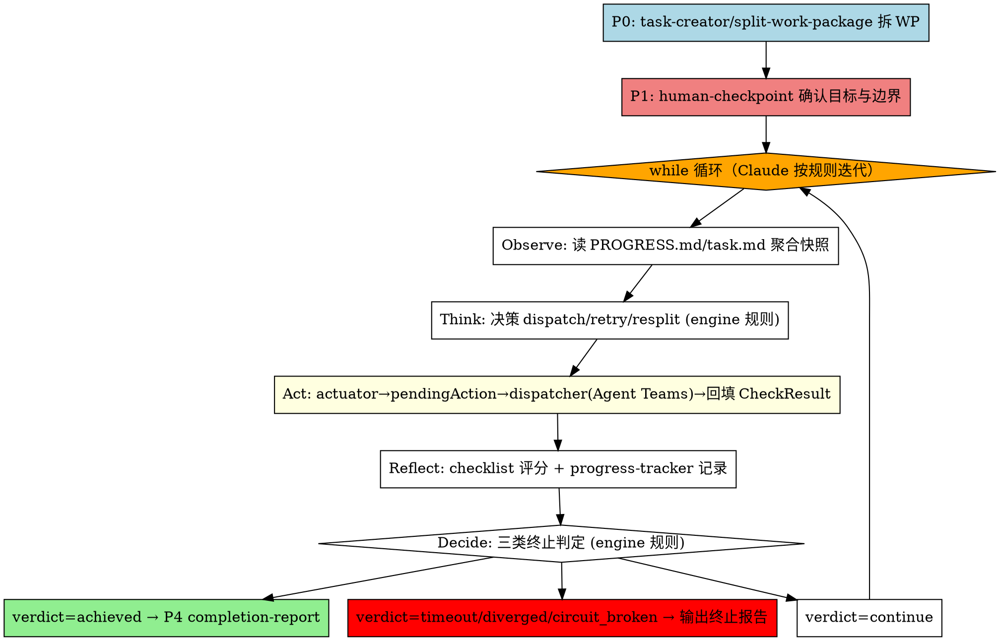

# Agentic Loop (半自主目标驱动执行循环 · Agent Teams 多 agent 版)

基于 **provider-loop-engine** 决策契约的目标驱动自主循环 Skill。把现有"线性 + 人驱动"的 P2→P3 升级为"目标驱动 + 自主闭环 + 人监督"：含 checklist 失败项的任务能自主 P2→P3→P2 重试至达成，或触顶/发散/熔断时安全回退到 P1 人介入。

> **🔴 本 skill 的两条不可违反红线**（用户实测暴露的两大问题，本版强制修复）：
> 1. **入口必须先规划**：触发即进 Plan 模式，**按三级优先级解析计划路径**（参数路径 > `.claude/plan.md` > `docs/plan/` 扫描），经 `plan-reader` 拆为 WP 集合；无可用计划时回退用 `skill-task-creator`/`skill-split-work-package` 从原始需求拆 WP，或提示用户用 `/skill-tackle-plan` 生成计划到 `docs/plan/`（Step 0）。**没有拆好的 WP，loop 不启动**——禁止跳过规划直接写代码。
> 2. **Act 必须多 agent**：loop 永不自己写代码。每轮 Act 一律委托 `skill-agent-dispatcher`，用 **Agent Teams + subagent**（`TeamCreate` + `Agent(subagent_type='general-purpose')` 1:1 spawn Teamee）执行选定 WP。**单 agent 手写 = 违规**。

> **设计依据**: `docs/reports/agentic-loop-design.md`（循环体 §4 / 安全边界 §7 / 持久化 §8 / 实现指引 §10）
> **决策契约**: `plugins/core/provider-loop-engine/index.js`（`_think` / `_decide` / `_fallbackEval` 的判定规则——observe/think/reflect/decide 的语义、终止优先级、proximity/发散计算）

---

## 运行时执行模型（执行者必读）

**Claude 是 loop 的执行者。** 本 skill 把 `provider-loop-engine` 的决策逻辑翻译成你可照做的行为指令：

| 层 | 谁执行 | 说明 |
|----|--------|------|
| **Observe / Think / Reflect / Decide** | Claude 按 engine 规则判定 | engine（JS provider）定义了判定规则（终止优先级、proximity 公式、发散检测），你在运行时**复现这些规则**做决策。engine 本身是决策契约 + 单元测试资产，**会话内无法直接调用其 JS API**（无通道），不要试图 `context.getProvider()` 跑它。 |
| **Act** | **Claude 委托 `skill-agent-dispatcher` 多 agent 执行** | 这是本 skill 唯一的执行出口。用 Agent Teams + subagent 执行 WP，**绝不自己写代码**。engine 侧经 `loop-actuator` 注入后，act() 把 decision 序列化为 `loop.{id}.pendingAction` + 注入 failingDrivers，Claude 读 pendingAction → 调 dispatcher → 回填 `loop.{id}.lastChecklist`（见 Step 4.0）。 |
| **持久化** | Claude 用 `skill-progress-tracker`（PROGRESS.md）+ task.md | 记录每轮 verdict/proximity/进度，防上下文压缩丢失。 |

> 简言之：**决策靠规则（来自 engine），执行靠团队（来自 dispatcher），记录靠 progress-tracker。** loop 自身既不调 JS engine，也不自己动手写代码。

---

## When to Use

**触发词**:
- "自主循环" / "agentic loop" / "目标驱动执行"
- "自动重试失败项" / "P2P3 自闭环"
- "这个任务自动跑到达成为止"

**适用场景**（满足任一即适合用 loop 而非线性 dispatcher）:
- **已生成计划，需自主执行**（首要场景）：用户已在 brainstorming/plan 阶段产出 `.claude/plan.md`，希望 loop 读取计划、拆 WP、用 Agent Teams 自闭环跑到 checklist 全过——这正是 Step 0 路径 A 的入口
- **目标驱动**：用户给的是"目标"（一批 WP 全部 checklist 通过），不是固定任务集，需要动态决定下一步
- **需 P2↔P3 自主重试**：预期会有 checklist 失败项，希望失败后自动回到 P2 refine，而不是等人修复
- **长程收敛任务**：多轮迭代才能达成，且每轮可量化接近度（proximity）

**不适用**（用现有线性流程即可，强用 loop 反而绕路）:
- 用户明确只要"一次性把某个小改动做完"、不要自闭环、不要 checklist → 直接 `skill-agent-dispatcher`
- 需要 P0 重新规划的任务 → loop 不越界 P0（见安全边界）

> **重要**：loop 的输入前提是**已拆好的 WP 集合**（`goal.wpIds`）。两条来源——优先读 `.claude/plan.md`（plan-reader），无则 Step 0 用 task-creator/split-work-package 从原始需求拆。**WP 数量不构成退化为线性 dispatcher 的理由**：拆出 1 个 WP 也走完整 Agent Teams 闭环（见 Step 0 红线约束）。唯一不启动的情形是 plan-reader 解析不出任何 WP 或计划存在循环依赖——此时提示用户提供/修正计划，而非"退化"。

---

## 核心定位：loop 是决策层 + 规划入口，Act 委托 dispatcher 多 agent

> 🔴 **不可违反的安全边界**（design.md §7.1、§9.1 风险表）

| 角色 | 职责 | 实现 |
|------|------|------|
| **loop（本 skill）** | 决策层：P0 拆 WP（优先读 `.claude/plan.md` 经 plan-reader，回退 task-creator/split-work-package）→ P1 确认 → Observe→Think→Act→Reflect→Decide → 出口分流 | Claude 按本 skill 指令执行 |
| **agent-dispatcher** | **Act 执行单元**：Agent Teams + subagent 实际执行 WP / retry / resplit | 每轮 Act 委托它，**loop 不直接 `Agent()` spawn Teamee，更不自己写代码** |

**loop 永远不绕过 dispatcher 直接执行**。loop 的 `Act` 通过委托 dispatcher 用 Agent Teams 执行 Think 选定的 WP，执行结果再由 checklist 重验。dispatcher 是"任务调度循环"，loop 是"目标驱动循环"——前者是后者 Act 层的执行单元。**单 agent 手写代码是本 skill 明令禁止的退化行为。**

---

## 集成映射（loop 五层 ↔ 现有 skill）

| loop 层 | 职责 | 集成对象 | 说明 |
|---------|------|---------|------|
| **P0 规划** | 拆 WP 集合（loop 输入前提） | **优先 `plan-reader`（读 `.claude/plan.md`）**；无计划时回退 `skill-task-creator` / `skill-split-work-package` | Step 0，触发即进 Plan 模式 |
| **入口（P1）** | 人确认目标与安全边界 | `skill-human-checkpoint` | Step 1，loop 启动前必须经 P1 确认 |
| **Observe** | 聚合环境快照 | `skill-progress-tracker`（PROGRESS.md）+ task.md | Claude 读取未完成 WP / 上轮 checklist 结果 / 进度 |
| **Think** | 决策下一步（复现 engine `_think` 规则） | 本 skill 内置规则 | dispatch / retry / resplit / noop |
| **Act** | **执行 WP + 重验 checklist（多 agent）** | `skill-agent-dispatcher`（Agent Teams + subagent） | Step 4，委托 dispatcher，**loop 不写代码** |
| **Reflect** | 收敛/发散/接近度评分（复现 engine `_decide`/evaluator 规则） | `skill-checklist`（机器可读 JSON）+ 本 skill 规则 | checklist 输出 CheckResult，按规则算 proximity |
| **Decide** | 三类终止判定（复现 engine `_decide` 规则） | 本 skill 规则 | 熔断 > 发散 > 上限 > 达成 > 继续 |
| **出口（P4）** | 达成后汇报 | `skill-completion-report` | 仅 achieved verdict 触发 |

---

## Flow



---

## Step-by-Step Implementation

### Step 0: P0 规划（Plan 模式内拆 WP）🔴 不可跳过

本 skill 标注 `plan_mode_required: true`，触发即进 Plan 模式。**在 Plan 模式内完成 WP 拆解，不得直接写代码**。

Step 0 有**两条入口路径，按优先级取其一**：

#### 路径 A（优先）：读取已有计划文件拆 WP

用户典型的预期流程是"先生成计划，再由 loop 按计划拆 WP 自主执行"。入口按**三级优先级**解析出 `planFilePath`（`plan-reader.parsePlanToGoal({planFilePath})` 已支持自定义路径，无需改 runtime 代码）：

##### 路径解析（三级优先级，取首个命中）

| 优先级 | 来源 | 说明 |
|--------|------|------|
| **1（最高）** | 调用方传入路径参数 | 用户触发时附带，如 `/skill-agentic-loop docs/plan/xxx.md` 或 `plan=docs/plan/xxx.md`。Claude 解析该参数作为 `planFilePath` 传给 `plan-reader` |
| **2** | `.claude/plan.md` 存在 | 向后兼容（现有行为）：若项目根下存在 `.claude/plan.md`，用它 |
| **3（新增回退）** | 扫描 `docs/plan/*.md` 最新 | 取 `docs/plan/` 下最近修改的一个 `.md` 文件作为 `planFilePath`（`skill-tackle-plan` 的产物落点） |

> 解析出 `planFilePath` 后**统一交给 `plan-reader`**；三级优先级只决定读哪个文件，不影响解析逻辑。三级都未命中 → 视为"无可用计划"，按下方异常处理 `plan-not-found` 提示（或走路径 B 回退）。

1. **读取计划**：按上述三级优先级解析出 `planFilePath`（默认 `.claude/plan.md`），用 `plan-reader`（`plugins/runtime/plan-reader.js`）的解析规则将其转为 loop 输入。
   - **解析规则**（plan-reader 的纯文本策略，会话内 Claude 按同一规则复现读取；代码驱动 runner 则直接调用 `parsePlanToGoal()`）：
     - `##` / `###` section、`Step N:` 行 → 每个可执行 section 映射为一个 WP（标题含显式 `WP-NNN` 则沿用该编号，否则按 task.md 最大编号 +1 派生）
     - `- [ ]` / `- [x]` 任务项 → 该 WP 的 checklist（每项带稳定 id，供跨轮 Reflect 评分）
     - 「依赖 / depends on / 先完成 / requires / after」语义 → dependencyGraph
   - **产出结构**（`parsePlanToGoal()` 返回值）：
     ```
     {
       goal: { wpIds: ['WP-...'], checklistSpec, successCriteria },
       workPackages: [{ wpId, title, checklist:[{id,category,item}], dependencies }],
       dependencyGraph: { nodes, edges, order, hasCycle, cycle },
       error: null | 'plan-not-found' | 'plan-empty' | 'plan-no-sections' | ...
     }
     ```
2. **直接采用为 loop 输入**：把 `goal.wpIds` + `workPackages[*].checklist` + `dependencyGraph` 作为 loop 输入，**不重新做 P0 拆解**（计划已是用户认可的目标分解）。
3. **异常处理**（plan-reader 的容错契约）：
   - `goal.wpIds` 为空（计划缺失 / 为空 / 解析不出任何可执行 section）→ **不启动 loop**，提示用户"未读到可执行计划：请先用 `/skill-tackle-plan` 生成计划到 `docs/plan/`（再用 `/skill-agentic-loop docs/plan/xxx.md` 传入），或手动写 `.claude/plan.md`，或改用线性 `skill-agent-dispatcher` 直接执行"。提示语指向"提供/生成计划 / 改用 dispatcher"，**不得**说"loop 无收益 / 退化"。
   - `dependencyGraph.hasCycle === true`（plan-reader 检测到循环依赖，会抛 `PLAN_CYCLIC_DEPENDENCY`）→ 捕获，提示用户"计划存在循环依赖（cycle：...），请修正 plan.md 的依赖声明后再启动 loop"。
4. 进入 Step 1。

#### 路径 B（回退）：无 plan.md 时从原始需求 P0 拆解

仅当**不存在 `.claude/plan.md`**（或用户明确给出原始需求且尚未生成计划）时走此路径，保持向后兼容：

1. **分析目标**：把用户的原始需求理解为"目标"（如"做个赛博风电商前端能本地跑"），而非"立即动手的任务"。
2. **拆 WP**：调用 `skill-task-creator` / `skill-split-work-package`，把目标拆成一组可执行、有明确验收 checklist 的工作包（WP-XXX）。每个 WP 必须有：
   - 明确的交付物 + 验收 checklist（可量化"通过/失败"）
   - 依赖关系（供 dispatcher 排序）
3. 进入 Step 1。

#### 共同产出（两条路径都满足）

```
# Step 0 产出（写入 task.md / Plan）：
# - goal.wpIds: [WP-101, WP-102, WP-103, ...]
# - 每个 WP 的验收 checklist（供 Reflect 评分）
# - 达成判定: 全部 WP checklist 全过 AND proximity >= 0.9 AND 无 pending/failed WP
# - 依赖图（供 dispatcher blockedBy 排序）
# - 标注入口来源: plan-reader（路径 A）或 task-creator/split-work-package（路径 B）
```

> 没有 Step 0 产出的 WP 集合，**禁止进入后续步骤**。这是修复"没规划阶段直接开写"的硬性闸门。
>
> 🔴 **关于 WP 数量与退化（强制约束，根因修复）**：loop **一律执行**，**不因 WP 数量退化**。即使 Step 0 拆完只有 1 个 WP，也走完整 Agent Teams 闭环——loop 不做"单 WP 即建议改用线性 dispatcher"的判断。唯一允许的"不启动"情形是 **plan-reader 解析不出任何 WP（`goal.wpIds` 为空）** 或 **循环依赖**，二者均提示用户提供/修正计划，而非"退化"。这条约束修复了 cboot 会话根因：旧版 Step 0 第 4 点让 Claude 在"单 WP、无失败预期"时合法退化、跳过整个 loop。

### Step 1: 前置确认（P1 human-checkpoint）

loop 是半自主的，**入口必须经 P1 人确认**。调用 `skill-human-checkpoint`，向用户确认：

1. **目标定义**：Step 0 产出的 `goal.wpIds` + 达成判定（checklist 全过 + proximity ≥ `proximity_goal` 默认 0.9）
2. **安全边界**：loop 仅 P2↔P3 自主；触顶/发散/熔断时**直接输出终止报告**（不再强制回 P1，见 Step 5）
3. **上限（全部可配置）**：用户/调用方可在触发或确认时指定，未指定用默认值：
   - `max_iterations`：默认 **6**（轮次上限；用户可改，如 `max_iterations=10`）
   - `max_round_time_ms`：默认 **600000**（单轮最长时间，10 分钟）
   - `max_wall_time_ms`：默认 **3600000**（总墙钟上限，1 小时）
   - `divergence_threshold`：默认 **3**（连续 N 轮 proximity 无进展即判发散）
   - `proximity_goal`：默认 **0.9**（达成判定阈值）

**阈值的两种传入方式（均会覆盖默认值，写入 Step 2 的 loop 记录）**：

- **方式 A：触发 skill 时随参数传入**——在触发 `/skill-agentic-loop` 时附参数，如 `/skill-agentic-loop max_iterations=10 max_round_time_ms=900000`。Claude 解析后作为该 loop 的上限。
- **方式 B：P1 确认时由用户指定**——在 human-checkpoint 确认清单里附「是否调整阈值」选项，用户可在确认目标的同时覆盖任一阈值；用户不改则沿用方式 A 的值或默认值。

```
# 调用 human-checkpoint，附审核清单：
# - 目标 WP 集合: [WP-101, WP-102, ...]（Step 0 产出）
# - 达成判定: checklist 全过 AND proximity >= proximity_goal(默认0.9) AND 无 pending/failed WP
# - 自主范围: 仅 P2↔P3，不越界 P0 重新规划
# - 上限（可配置，未指定取默认）: max_iterations=6 / max_round_time_ms=600000 / max_wall_time_ms=3600000 / divergence_threshold=3 / proximity_goal=0.9
# - 出口: achieved→P4(completion-report) / timeout|diverged|circuit_broken→直接输出终止报告（见 Step 5，不强制回 P1）
# - 「是否调整阈值」选项：用户可在此时覆盖 max_iterations / max_round_time_ms / max_wall_time_ms / divergence_threshold
# 用户确认后进入 Step 2；用户修改目标则回到 Step 0 调整 WP。
```

### Step 2: 初始化 loop 记录（goal + loopId）

记录 loop 运行的目标与边界（供持久化与恢复）。生成一个 `loopId`（如 `loop-20260613-电商前端-{rand}`），写入 PROGRESS.md / task.md：

```
# loop 运行记录（写入 PROGRESS.md）：
# loopId: loop-20260613-cybershop-a1b2c3
# goal: { wpIds: [WP-101, WP-102, WP-103], successCriteria: all_pass_and_proximity>=0.9 }
# 上限（可配置，此处写确认后的生效值，默认见 Step 1）: max_iterations=6, max_round_time_ms=600000, max_wall_time_ms=3600000, divergence_threshold=3, proximity_goal=0.9
# iteration: 0
# history: []   （每轮追加 verdict/proximity）
```

> design 把状态放在 `state-store` key `loop.{loopId}`（engine 测试用）。运行时由 Claude 通过 PROGRESS.md 维护等效信息（progress-tracker），防上下文压缩。

### Step 3: 主循环（Claude 按规则迭代，按 verdict 分流）

这是 loop 的核心。**Claude 循环执行 Observe→Think→Act→Reflect→Decide 一轮，按 verdict 分流**。判定规则严格复现 `provider-loop-engine` 的 `_think` / `_decide` / evaluator 语义（见下方各步规则框）。

```
safetyMaxRounds = 50   # 外层保险（内部已有 max_iterations/max_wall_time 双重硬上限）
rounds = 0
finalVerdict = null

while rounds < safetyMaxRounds:
    rounds += 1
    iteration += 1

    # ---- Observe（Step 3a）----
    snapshot = observe()            # 读 PROGRESS.md/task.md：pending/completed/failed WP + 上轮 checklist

    # ---- Think（Step 3b，复现 engine _think）----
    decision = think(snapshot)      # dispatch | retry | resplit | noop

    # ---- Act（Step 4，委托 dispatcher 多 agent）----
    checklistResult = act(decision) # 🔴 委托 skill-agent-dispatcher 用 Agent Teams 执行

    # ---- Reflect（Step 3c，复现 engine evaluator）----
    evalResult = reflect(snapshot, checklistResult)   # proximity / converged / diverged

    # ---- Decide（Step 3d，复现 engine _decide）----
    verdict = decide(evalResult, snapshot)   # continue | achieved | timeout | diverged | circuit_broken

    # 记录本轮到 history（progress-tracker）
    record(iteration, verdict, evalResult.proximity)

    输出: "[loop {loopId}] iter {iteration} verdict={verdict} proximity={evalResult.proximity}"

    if verdict == 'continue':
        continue
    finalVerdict = verdict
    break

# 按 verdict 分流（见 Step 5 / Step 6）
```

#### Step 3a: Observe 规则
读取当前快照（来源：`skill-progress-tracker` 的 PROGRESS.md + task.md）：
- `workPackages`：goal.wpIds 中 `pending`（未完成）/ `completed`（已通过 checklist）/ `failed`（上轮 checklist 失败待重试）/ `blocked`（依赖未满足）
- `lastChecklist`：上轮 Act 产出的 CheckResult（来自 skill-checklist 机器可读 block）
- 进度趋势：最近 N 轮 proximity 序列（发散检测用）

> **`failed` 的来源口径**（对齐 engine `_think` retry 分支 + loop-snapshot `buildWorkPackages`，WP-176-2）：
> `workPackages.failed` 不是凭空写出，而是由 `lastChecklist.failedItems` 聚合——把每条失败项的 `wpId` 去重后得到待重试的 WP 列表（排除已 `completed`、限定 `goal.wpIds` 范围）。这样 `_think` 的 `wp.failed.length > 0` 才能真实命中 retry（修复偏差1：原先 failed 写死空数组 → retry 永远走不到）。运行时 Claude 聚合时同理：从上轮 CheckResult.failedItems 取 wpId 集合作为 `failed`。

#### Step 3b: Think 规则（复现 engine `_think`，`provider-loop-engine/index.js:621-688`）
优先级：**失败项重试 > 待执行调度 > 被阻塞 noop**
1. 若有 `failed` WP（`wp.failed` 非空，见 Step 3a 来源口径）→ `retry`：
   - `targetWp = wp.failed[0]`（首个失败 WP）
   - `strategy`：该 WP 有 checkpoint → `checkpoint_resume`，否则 `full_restart`
   - **`failingDrivers`**：携带 Reflect 回填的失败项明细（优先 `state.failingDrivers`，回退最近一次 `state.lastEval.failingDrivers`，二者均空降级为 `[]`），供 Step 4.2 下发给承接重做的 Teamee 作为 refine 反馈
2. 若 `failed` 为空但上轮 `lastChecklist.passed === false` → `resplit`（`targetWp = lastChecklist.wpId`，`strategy='resplit'`，不越界 P0 全局规划）
3. 若有 `pending` WP（且在 goal.wpIds 范围内，越界保护）→ `dispatch`（`targetWp` 为 goal 范围内首个 pending，`strategy='full_restart'`）
4. 全部被阻塞 → `noop`（持续 noop 由发散/上限兜底）

> **retry vs resplit 分流对齐**（修复偏差1 + engine/运行时落差）：engine `_think` 的真实数据流是 `wp.failed.length > 0` 命中 retry、`failed` 空但 `lastChecklist.passed===false` 命中 resplit。运行时 Claude 复现时严格按此优先级——先看 `failed`（来自 failedItems 聚合），再看 `lastChecklist.passed`，二者顺序不可换，否则会像旧版 engine 那样把真实 retry 误判成 resplit。

#### Step 3c: Reflect 规则（复现 `reflection-evaluator`）
- `proximity = 1 - (failed / total)`（来自上轮 CheckResult.summary；钳到 [0,1]）；无 checklist 时降级按 WP 完成度 `completed/total`
- `converged`：本轮 proximity 严格 > 上一轮
- `divergenceStreak`：从 history 末尾数连续多少轮 proximity 不增（含回退）
- `diverged`：`divergenceStreak >= divergence_threshold`（默认 3）；已达成态（proximity≥goal 且 allPassed）不算发散
- `failingDrivers`：由 `CheckResult.failedItems` 归一化产出，每项结构 `{wpId, category, item, reason}`（`reflection-evaluator` 辅助函数聚合，WP-176-1）

> **`failingDrivers` refine 通道（完整流转，修复偏差2）**——engine 路径与运行时复现必须打通同一条链路：
> 1. **产出**：Reflect 把 `lastChecklist.failedItems` 归一化为 `failingDrivers`（写入 `EvalResult.failingDrivers`）。
> 2. **回填 state**（engine `reflect` 阶段，`provider-loop-engine/index.js:413-414`）：`state.failingDrivers = evalResult.failingDrivers || []`、`state.divergenceStreak = evalResult.divergenceStreak`。运行时 Claude 等效地把它记到本轮 PROGRESS.md / state 记录里，供下轮读取。
> 3. **下轮 Think 消费**（Step 3b）：retry decision 携带 `decision.failingDrivers`（优先 `state.failingDrivers`，回退 `state.lastEval.failingDrivers`）。
> 4. **进入 Step 4.2**：把 `decision.failingDrivers` 映射进 `dispatchTarget.failingDrivers`。
> 5. **dispatcher → 重做 Teamee**（WP-176-6）：dispatcher restart 创建新 Teamee 时把 `failingDrivers` 注入 prompt，Teamee 据此优先修复这些失败项。
>
> 缺第 2 步（回填）或第 4 步（进 dispatcher 参数）都会让链路断裂——这正是偏差1/偏差2 的根因：数据算出来了但没流到重做者手里。

#### Step 3d: Decide 规则（复现 engine `_decide`，`provider-loop-engine/index.js:699-751`）
优先级 **熔断 > 发散 > 上限 > 达成 > 继续**：
1. **熔断**：watchdog/守护异常（terminated / 持续 degraded）→ `circuit_broken`（运行时若 dispatcher 监控报告守护异常即触发）
2. **发散**：`divergenceStreak >= divergence_threshold` → `diverged`
3. **上限**：`iteration >= max_iterations`、墙钟超 `max_wall_time_ms`、或单轮时长超 `max_round_time_ms` → `timeout`
4. **达成**：`allPassed && proximity >= proximity_goal && noPending && noFailed` → `achieved`
5. 否则 → `continue`

> **`noFailed` 现真实生效**（修复偏差1 + 落差，engine `_decide:742-743`）：`noFailed = (!wp.failed || wp.failed.length===0) && (!evalResult.failingDrivers || evalResult.failingDrivers.length===0)`。即 WP 级 failed 列表与 CheckResult 级 failingDrivers 明细**任一非空**都判为"仍有失败项"，不能进 `achieved`。运行时 Claude 复现时须同时检查这两个来源，不可只看 `wp.failed`。

### Step 4: Act 集成（🔴 委托 dispatcher Agent Teams 多 agent，loop 不写代码）

> 🔴 **首条硬规则（违反即失败）**：**loop 是决策层，Act 必须委托 `skill-agent-dispatcher`（Agent Teams + subagent）执行，loop 永不自己写代码。** 即使任务是「单 WP、看起来简单的纯文本替换」，也必须走 Agent Teams 闭环——**单 agent 手写代码（Claude 自己 Write/Edit 完成 WP）= 违规**，无任何例外。这是修复 cboot 根因（旧版让 Claude 在「单 WP、无失败预期」时合法退化、跳过整个 loop）的指令层最终保险：Step 0 已删退化路径，此处再钉死「Act 永不手写」。
>
> 这是修复"单 agent 手写"的核心步骤。**loop 的 Act 永远委托 `skill-agent-dispatcher`，用 Agent Teams + subagent 执行；Claude 不得自己 Write/Edit 代码完成 WP。**

每轮 Act，把 Think 的 `decision`（dispatch/retry/resplit/noop）交给 dispatcher 多 agent 执行，执行后调 `skill-checklist` 重验，解析机器可读结果。

#### 4.0 actuator 注入后的端到端执行模型（WP-177，必读）

> 会话内 Claude 不直接调用 engine 的 JS API（无通道），但 engine 侧（代码驱动 runner / 单元测试）在 **actuator 注入后**已能端到端跑通 `engine.step()`——不再返回 `placeholder:true`。理解这条数据流，才能在运行时正确复现「读 pendingAction → 调 dispatcher → 回填」：

```
engine.act(loopId, decision)
  → actuator.execute(context, loopId, decision, state)        [loop-actuator.js]
      → 把 decision(dispatch/retry/resplit) + failingDrivers 序列化为
        「dispatcher 待执行指令」，写入 state-store 子 key loop.{loopId}.pendingAction
      → 返回 { dispatched:true, checklistResult: 回填值或undefined }
  → Claude（运行时复现）读取 loop.{loopId}.pendingAction
  → 触发 skill-agent-dispatcher 执行（Agent Teams + 1:1 Teamee）
  → dispatcher 执行后回填 CheckResult 到 loop.{loopId}.lastChecklist
  → 下一轮 engine.observe/reflect 消费 lastChecklist，状态机继续流转
```

> **关键边界**：`actuator` 只产出「指令 + 标记已派发（dispatched:true）」，**不直接 spawn Teamee、不调 Claude**。`pendingAction` 是「待 Claude 消费的指令」，不是「已执行结果」。`dispatched:true` 表示「指令已就绪」，**不代表子代理已跑完**。会话内 Claude 按本 Step 4.2–4.4 复现这条链路：从 `decision` 映射出 `dispatchTarget`（等价于 actuator 产出的 `pendingAction`）→ 调 dispatcher → 回填 CheckResult。会话内不写 `loop.{id}.pendingAction` state key，而是把等价信息记到本轮 PROGRESS.md / 上下文，由 Claude 直接驱动 dispatcher。

#### 4.1 noop 直接返回
若 `decision.action === 'noop'`：无可执行项，跳过 Act（Reflect/Decide 会处理）。

#### 4.2 把 engine 决策映射为 dispatcher 任务
```
dispatchTarget = {
  wpId: decision.targetWp,
  mode: decision.action,                          # dispatch | retry | resplit
  strategy: decision.strategy || 'full_restart',  # full_restart | checkpoint_resume | resplit
  context: (retry+checkpoint_resume) ? { completedFiles, remaining } : undefined,
  failingDrivers: decision.failingDrivers || []   # 🔴 retry 时重点修复的失败项明细（修复偏差2）
}
```

> **`failingDrivers` 字段语义**（修复偏差2，承接 Step 3c refine 通道第 4 步）：
> - **来源**：从 Think 产出的 `decision.failingDrivers` 读取（其源头是 Reflect 回填的 `state.failingDrivers` / `state.lastEval.failingDrivers`，每项 `{wpId, category, item, reason}`，来自 `lastChecklist.failedItems`）。
> - **何时有意义**：仅 `mode=retry`（或 `resplit`）时有值——重做既有 WP 时告诉承接 Teamee"重点修哪些失败项"。`mode=dispatch`（首次执行）时为空数组。
> - **去向**：传给 `skill-agent-dispatcher`，由 dispatcher restart 创建新 Teamee 时注入 prompt（WP-176-6 负责），Teamee 应优先修复 `failingDrivers` 列出的项，而非原样重做。这一步打通了"发现问题 → 针对性重做"的反馈链路（偏差1/2 的根因正是此处断链）。

#### 4.3 🔴 委托 skill-agent-dispatcher 用 Agent Teams 执行（参照其 skill.md）
触发 `skill-agent-dispatcher` 执行 `dispatchTarget.wpId`（单个 WP）。dispatcher 内部完成全部多 agent 编排（**loop 不自己 spawn，也不自己写代码**）：

```
# dispatcher 流程（skill-agent-dispatcher/skill.md:181-302）：
1. TeamCreate(team_name="loop-{loopId}-{wpId}-{rand}")
2. TaskCreate(WP, description 含 WP 文档路径) + 设置 blockedBy 依赖
3. 角色匹配（roles-reference.md：关键词/任务类型/模块标签加权）→ 预计算角色与记忆
4. 为该 WP 创建专用 Teamee（1:1 映射）：
     Agent(
       name="{role_id}-t{task.id}",
       team_name="{team_name}",
       subagent_type="general-purpose",   # 🔴 必须 general-purpose（需 Write/Edit/Bash 完成实现）
       prompt=build_single_task_prompt(...)   # 含 WP 文档路径 + 角色赋能 + 记忆
     )
5. 监控循环：Teamee 执行 → TaskUpdate completed → markTeameeDestroyed 逻辑销毁（无协议帧）→ 从映射表移除
6. 批末：`node bin/tackle.js team-cleanup <team>` 确定性清理残留（先试 TeamDelete，失败回退文件系统删除）
```

> **关键不变量**（dispatcher §1262）：每个 WP 由一个专用 Teamee 执行，绝不共享；完成即销毁；必须 `general-purpose`。loop 仅产出决策并把决策递给 dispatcher，**spawn Teamee 与写代码全归 dispatcher 内部的 Teamee**。

#### 4.4 执行后调用 skill-checklist 重验，解析机器可读结果
```
# 1. 触发 skill-checklist 对 dispatchTarget.wpId 执行检查
# 2. 从其 Report 末尾解析 ```json:machine-readable ...``` fenced block，得到 CheckResult：
#    { wpId, passed, summary:{total,passed,failed}, categories[], failedItems[] }
# 3. item.id 必须跨轮稳定（类别前缀+序号），否则发散检测误判
checklistResult = parseChecklistMachineReadable(dispatchTarget.wpId)
```

> retry/resplit 时，通过 dispatcher 的 daemon-actions 通道下发 `restart`（带 strategy）或重新调度（`skill-agent-dispatcher/skill.md:635-740`），不越界 P0。

#### 4.5 把 checklistResult 交给 Reflect（Step 3c 消费）
将 `checklistResult` 作为本轮 `lastChecklist`，Reflect 据此算 proximity/failingDrivers。

> **若 checklist 尚未输出机器可读 block**：Reflect 走降级评分（基于 WP 完成度近似 proximity，复现 engine `_fallbackEval`）。

### Step 5: 出口分流（verdict 衔接）

`decide` 产出的 verdict 决定 loop 后续走向。**衔接必须无歧义**：

| verdict | 含义 | 后续动作 | 进入阶段 |
|---------|------|---------|---------|
| `continue` | 未达终止条件，可继续迭代 | 回 Step 3 下一轮 | P2↔P3 继续 |
| `achieved` | checklist 全过 + proximity 达标 + 无 pending/failed | 调 `skill-completion-report` | **进 P4** |
| `timeout` | 迭代上限 / 墙钟上限 / 单轮时长超限 | **输出终止报告**（读 `state.terminalReport`，含趋势 + 失败明细） | **输出报告（终止）** |
| `diverged` | 连续 `divergence_threshold` 轮 proximity 无进展 | **输出终止报告**（附最近 N 轮趋势） | **输出报告（终止）** |
| `circuit_broken` | 守护异常/dispatcher 监控报告终止 | **输出终止报告**（提示守护异常） | **输出报告（终止）** |

> 🔴 **出口行为变更（WP-177）**：触顶/发散/熔断不再强制回 P1。终态 verdict（timeout/diverged/circuit_broken）一律**直接生成并输出总结报告**给用户，报告由 `loop-report.generateTerminalReport(state, opts)` 产出（engine 出口行为 WP-177-2-impl-c 已将其写入 `state.terminalReport`；skill 此处「读取 + 呈现」）。人仍可经 `applyDirective`（Step 6）主动 pause/abort 介入——这是保留的安全边界，**不是默认回 P1 流程**。

```
if finalVerdict == 'achieved':
    # → P4：触发 skill-completion-report，附 loop.history 摘要（迭代数 / proximity 趋势 / 各 WP 状态）
    runCompletionReport(loopId)
else:
    # timeout / diverged / circuit_broken → 直接输出终止报告（不再回 P1）
    outputTerminalReport(loopId, finalVerdict)
```

#### `outputTerminalReport(loopId, verdict)` 终止报告呈现动作（WP-177，基于 loop-report.generateTerminalReport）
```
1. 记录最终 status 到 PROGRESS.md
2. 取报告：优先读 engine 写入的 state.terminalReport；
   若该字段缺失（运行时未走 engine 出口），则即时调用
   loop-report.generateTerminalReport(state, { loopId, verdict }) 生成（纯函数，无副作用）。
   报告含（来自 loop-report.js 契约）：
   - 结论 summary：第 N 轮以 verdict 终止 / 最终 proximity / 剩余失败项数 / 建议下一步
   - proximity 趋势表（最近 N 轮 iteration / proximity / failedCount / verdict）
   - 失败项明细表（wpId / category / item / reason，来自 failingDrivers）
3. 直接把报告 markdown 输出给用户（不必触发 human-checkpoint 全流程）。
4. 报告末尾附「可选后续」提示（非强制 P1）：
   - 继续等待（重新进入 Step 3 主循环恢复运行）
   - 调整 goal 或阈值（回 Step 0 / Step 1 修改）
   - 手动修复失败项（人接管）
   - 终止
> 注：以上「可选后续」是建议，由人主动选择；loop 默认不再自动回 P1。
>    人若要介入，经 applyDirective（Step 6）下发 pause/abort。
```

### Step 6: 外部介入通道（人可随时干预）

loop 运行期间，人可随时介入（参考 dispatcher daemon-actions，design.md §7.1）：
- **暂停**：人要求暂停 → loop 不再推进新轮（已有 Teamee 继续运行完）
- **中止**：人要求终止 → 记录 status=aborted，verdict=aborted，回 P1
- **全局熔断**：人要求全局终止 → verdict=circuit_broken，回 P1

---

## 安全边界（不可越界，design.md §7.1）

| 边界 | 规则 | 在本 skill 的体现 |
|------|------|------------------|
| **入口必先规划** | 触发即进 Plan 模式，Step 0 拆 WP 不可跳过（优先读 `.claude/plan.md`，回退 task-creator/split-work-package） | `plan_mode_required: true` + Step 0 硬闸门 |
| **不越界 P0** | loop 仅 P2↔P3 自主。即使 Think 判定"需新拆分"，也仅在现有 goal 范围内（resplit 拆当前失败 WP），**不重新触发 P0 全局规划** | Think 的 resplit 只针对上轮失败 WP；dispatch 有越界保护（pending WP 必须在 goal.wpIds 内） |
| **P1 保留点** | loop 入口必须 P1 确认；触顶/发散/熔断直接输出终止报告，人经 applyDirective（Step 6）主动 pause/abort 介入 | Step 1 入口 / Step 5 出口分流 |
| **Act 必须多 agent** | loop 永不自己写代码，Act 一律委托 dispatcher 用 Agent Teams + subagent | Step 4，单 agent 手写 = 违规 |
| **不做破坏性操作** | loop 的 Act 仅 dispatch/retry/resplit，不删除产物、不 force push、不改 git history | Act 仅委托 dispatcher 执行 WP，无破坏性副作用 |
| **人可随时介入** | 暂停/中止/全局熔断通道 | Step 6 |
| **双重硬上限** | max_iterations + max_wall_time_ms 防 loop 无限循环；守护异常熔断兜底 | Decide 规则 ③ 上限判定 + ① 熔断判定 |

---

## 状态持久化（防上下文压缩，design.md §8）

loop 全程用 `skill-progress-tracker`（PROGRESS.md）+ task.md 记录，对照 agent-dispatcher `dispatcher-state.json` 思路：

| 机制 | 实现 | 对照 dispatcher |
|------|------|----------------|
| **每轮写回** | 每轮 Decide 后把 verdict/proximity/iteration 追加到 PROGRESS.md history | dispatcher Phase B.5/C.5/D.5 |
| **压缩后恢复** | 重新进入时读 PROGRESS.md 的 loop 记录，从最近 history 末尾 + iteration 恢复 | dispatcher Phase 0 |
| **心跳可观测** | PROGRESS.md 含 `lastUpdatedAt` / `iteration`，供人/守护检测卡死 | dispatcher heartbeat |

**关键不变量**：
- 任意轮中断后重新进入必须能从最近 history 恢复（幂等）。
- iteration 单调递增，压缩后不回退。
- history 完整保留所有轮判定（发散检测依赖完整 history）。

---

## 多 loop 协调（可选，design.md §10 / WP-174-5）

当一次会话并行多个 loop（多个独立目标各跑一个 loop）时，用 `loop-coordinator` 的聚合规则产出全局 verdict（复用 multi-window-coordinator 模式）。全局优先级：**熔断 > 失败 > 达成 > 运行**：
- `global_achieved`：全部 loop achieved → 进 P4
- `global_circuit_broken`：任一 loop 熔断 → 全局回退
- `global_failed`：任一 loop timeout/diverged → 回 P1
- `global_running`：仍有 loop 迭代中

> 单 loop 场景退化为该单 loop 的 verdict，逻辑一致。

---

## Integration with Other Skills

| Skill | 集成点 | 本 skill 中的角色 |
|-------|--------|------------------|
| `plan-reader` | P0 规划入口（优先） | Step 0 路径 A：按三级优先级解析 planFilePath（参数路径 > `.claude/plan.md` > `docs/plan/` 扫描），拆为 `{goal.wpIds, checklist, 依赖图}`（`parsePlanToGoal({planFilePath})`） |
| `skill-tackle-plan` | 计划来源入口（推荐） | 用户用 `/skill-tackle-plan` 生成符合 plan-reader 契约的计划到 `docs/plan/{slug}.md`，再以 `/skill-agentic-loop docs/plan/{slug}.md` 传入。是路径 A 优先级 1/3 的主要计划来源 |
| `skill-task-creator` / `skill-split-work-package` | P0 规划（回退） | Step 0 路径 B：无 plan.md 时从原始需求拆 WP（loop 输入前提） |
| `skill-human-checkpoint` | P1 入口 | Step 1 确认目标与边界；三类终止回退点 |
| `skill-progress-tracker` | Observe / 持久化 | 读 PROGRESS.md 聚合快照；每轮记录 history |
| `skill-agent-dispatcher` | **Act 执行单元（多 agent）** | Step 4 委托其用 Agent Teams + subagent 执行 WP/retry/resplit，**loop 不写代码** |
| `skill-checklist` | Reflect 评判 | Act 后重验，解析机器可读 JSON 为 CheckResult |
| `skill-experience-logger` | Reflect 经验提炼 | 每轮 reflect 时提炼失败项经验（可选） |
| `skill-completion-report` | P4 出口 | achieved verdict 触发，生成完成报告 |
| `provider-loop-engine` | 决策契约 | `_think`/`_decide`/evaluator 规则的来源（Step 3b/3c/3d 复现）；测试资产 |

---

## Loop 主循环完整指令（执行者照做）

```
# ============ Agentic Loop 主流程（半自主 · 多 agent）============

# ---- Step 0: P0 规划（Plan 模式内，不可跳过）----
# 触发即进 Plan 模式 → 优先读 .claude/plan.md（plan-reader 拆为 WP 集合）；无计划则回退 task-creator/split-work-package
# 产出 goal.wpIds + 各 WP checklist + 依赖图；不因 WP 数量退化，仅解析不出 WP / 循环依赖才提示用户提供计划

# ---- Step 1: P1 确认 ----
# skill-human-checkpoint 确认 goal / 上限 / 安全边界

# ---- Step 2: 初始化 loop 记录 ----
# 生成 loopId，写入 PROGRESS.md（goal/上限/iteration=0/history=[]）

# ---- Step 3: while 主循环（Claude 按规则迭代）----
finalVerdict = null
for rounds in 0..50:                              # 外层保险
    iteration += 1
    snapshot  = observe()                         # Step 3a：读 PROGRESS.md/task.md
    decision  = think(snapshot)                   # Step 3b：复现 engine _think（retry>dispatch>noop）
    checklistResult = act(decision)               # Step 4：🔴 委托 dispatcher Agent Teams 多 agent 执行
    evalResult = reflect(snapshot, checklistResult)  # Step 3c：复现 evaluator（proximity/发散）
    verdict   = decide(evalResult, snapshot)      # Step 3d：复现 engine _decide（熔断>发散>上限>达成>继续）
    record(iteration, verdict, evalResult.proximity)  # progress-tracker 写 history
    if verdict == 'continue': continue
    finalVerdict = verdict
    break

# ---- Step 5: verdict 分流 ----
if finalVerdict == 'achieved':
    runCompletionReport(loopId)                   # → P4
else:
    outputTerminalReport(loopId, finalVerdict)    # timeout/diverged/circuit_broken → 输出终止报告（不再回 P1）
# =====================================================
```

---

## Important

1. **入口必先规划** — `plan_mode_required: true`，触发即进 Plan 模式，Step 0 用 task-creator/split-work-package 拆 WP。没有 `goal.wpIds`，loop 不启动。禁止跳过规划直接写代码。
2. **Act 必须多 agent（绝对红线，无任何例外）** — loop 是决策层，Act 一律委托 `skill-agent-dispatcher` 用 Agent Teams + subagent（`TeamCreate` + `Agent(subagent_type='general-purpose')` 1:1 spawn Teamee）执行。**单 agent 手写代码 = 违规**，含「单 WP、看起来简单」的情形也无例外（修复 cboot 退化根因）。
3. **loop 是决策层，dispatcher 是 Act 执行单元** — loop 仅产出决策并把决策递给 dispatcher；spawn Teamee 与写代码全归 dispatcher 内部（design.md §7.1 / §9.1）。
4. **P1 保留点** — 半自主默认，启动前必须 human-checkpoint 确认；触顶/发散/熔断时直接输出终止报告（不再强制回 P1 全流程），人经 applyDirective（Step 6）主动 pause/abort 介入。
5. **verdict 衔接无歧义** — `achieved` → P4（completion-report）；`timeout`/`diverged`/`circuit_broken` → 输出终止报告（loop-report.generateTerminalReport）；`continue` → 下一轮。
6. **不越界 P0** — 即使 Think 判定需 resplit，也仅限当前 goal 范围内拆失败 WP，不触发 P0 全局重新规划。
7. **状态全程持久化** — 用 progress-tracker（PROGRESS.md）每轮写回 history，压缩后从最近 history 恢复，iteration 单调递增。
8. **双重硬上限 + 熔断兜底** — `max_iterations` + `max_wall_time_ms` 防无限循环，守护异常触发 `circuit_broken`。
9. **actuator 注入后 engine.step() 端到端可跑 + 决策规则来自 engine** — engine `act()` 注入 `loop-actuator` 后，`engine.step()` 不再返回 `placeholder:true`：actuator 把 decision 序列化为 `loop.{id}.pendingAction` + 注入 failingDrivers，Claude 读 pendingAction → 调 dispatcher → 回填 `loop.{id}.lastChecklist` → 下一轮 observe/reflect 消费（见 Step 4.0）。同时 observe/think/reflect/decide 的判定规则复现 `provider-loop-engine`（`_think`/`_decide`/evaluator），engine 是决策契约 + 测试资产；会话内不直接调其 JS API，按本 skill 规则框复现该流程。
10. **依赖 checklist 机器可读输出** — Act 的 refine 反馈依赖 checklist Report 末尾的 `json:machine-readable` block；未就绪时走降级评分。
