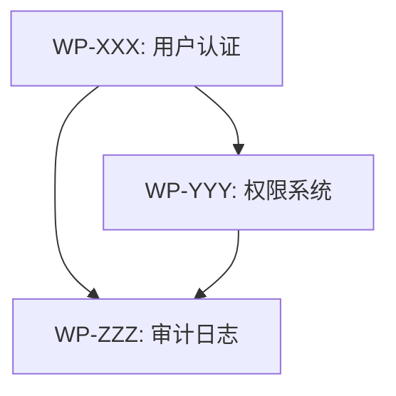
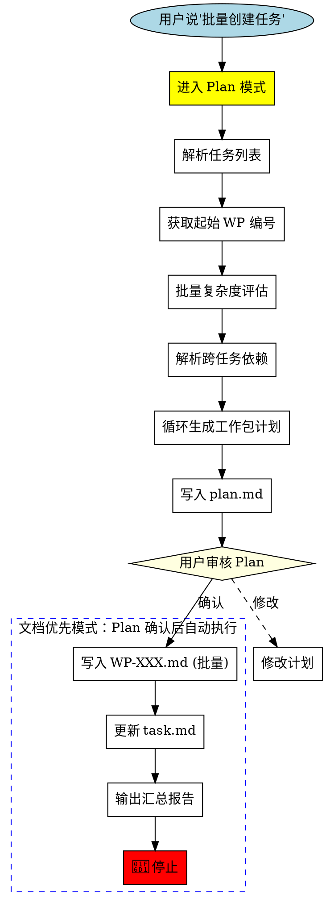
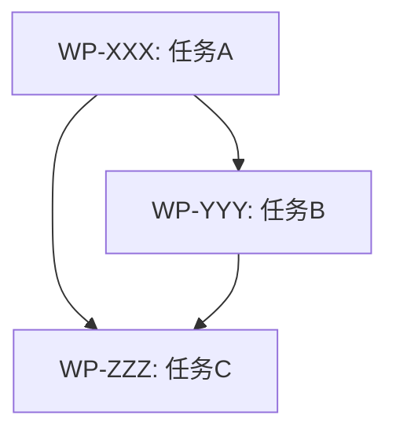

<SUBAGENT-STOP>
If you were dispatched as a subagent to execute a specific task, skip this skill.
</SUBAGENT-STOP>

<STOP>
╔══════════════════════════════════════════════════════════════════════════════╗
║  🛑 MANDATORY STOP POINT - 文档优先模式                                      ║
║                                                                              ║
║  Plan 确认后，自动执行以下步骤：                                              ║
║  Step 6:  写入 docs/wp/WP-XXX.md (批量)                                     ║
║  Step 7:  更新 task.md（追加概览表行）                                       ║
║  Step 8:  输出汇总报告 → 🛑 停止                                             ║
║                                                                              ║
║  ⚠️ 这是自动流程，不需要用户再次确认                                         ║
║  ⚠️ bypassPermission 不影响此流程                                            ║
╚══════════════════════════════════════════════════════════════════════════════╝
</STOP>

<HARD-GATE>
╔══════════════════════════════════════════════════════════════════════════════╗
║  📝 文档优先模式 - Plan 确认后自动执行                                        ║
║                                                                              ║
║  Plan 确认后，你必须**立即**执行以下步骤：                                    ║
║                                                                              ║
║  Step 6:  写入 docs/wp/WP-XXX.md（批量创建工作包文档）                       ║
║  Step 7:  更新 task.md（追加概览表行）                                       ║
║  Step 8:  输出汇总报告 → 🛑 停止                                             ║
║                                                                              ║
║  ⚠️ 这是自动流程，不需要用户再次确认                                         ║
║  ⚠️ bypassPermission 不影响此流程                                            ║
║                                                                              ║
║  DO NOT:                                                                     ║
║  ❌ Write any code files (.gd, .js, etc.)                                   ║
║  ❌ Modify any scene files (.tscn) except documentation                     ║
║  ❌ Call human-checkpoint（Plan 确认已是人介入点）                           ║
╚══════════════════════════════════════════════════════════════════════════════╝
</HARD-GATE>

# Batch Task Creator (批量任务创建器)

批量创建工作包定义 - **仅创建定义，不实现代码**。

## 核心原则

```
┌─────────────────────────────────────────────────────────────────┐
│  "批量创建任务" ≠ "批量执行任务"                                │
│                                                                 │
│  用户说 "批量创建任务" = 只写文档，不写代码                     │
│  用户说 "执行" = 开始写代码实现                                 │
│                                                                 │
│  这是两个完全独立的阶段，中间必须有人工确认！                   │
└─────────────────────────────────────────────────────────────────┘
```

### 批量任务中的简单任务处理

| 任务复杂度 | 处理方式 |
|------------|----------|
| 所有任务都简单 | 仍需为每个任务创建工作包 |
| 部分任务简单 | 简单任务也单独创建工作包 |
| 全部是 5min 任务 | 批量创建，但每个都要有 WP ID |

**核心规则**：批量创建时，不跳过任何任务，无论多简单。执行由 `agent-dispatcher` 负责。

## When to Use

- 用户说 "批量创建任务" / "批量新建任务"
- 用户说 "一次创建多个任务"
- 用户提供任务列表要求拆分

---

## 🎯 快速模式 vs 深度模式

根据用户提示词自动选择模式：

| 用户提示词特征 | 模式 | Plan 阶段行为 |
|----------------|------|---------------|
| 包含"只写文档"、"不要执行"、"不具体执行"、"不要直接执行" | **快速模式** | 只定义任务，不分析代码 |
| 无上述关键词 | **深度模式** | 可自由分析代码、评估复杂度 |

### 快速模式（用户明确说"不要执行"时）

在 Plan 模式中，你只能：
- ✅ 确定工作包编号
- ✅ 写任务标题和目标（1-2句话）
- ✅ 写子任务列表（可选）
- ✅ 写验收标准（可选）

在 Plan 模式中，你**禁止**：
- ❌ 读取代码文件分析实现
- ❌ 检查代码是否存在
- ❌ 运行任何代码审计
- ❌ 做任何"执行阶段"才该做的工作

**规则**: 快速模式下，Plan 阶段只定义"做什么"，不分析"怎么做"或"是否已做"

### 深度模式（默认）

Plan 阶段可以自由进行：
- ✅ 读取代码分析依赖
- ✅ 评估任务复杂度
- ✅ 检查现有实现
- ✅ 设计拆分方案

---

## 🆕 智能批量拆分系统

### 批量复杂度评估

对每个任务独立评估复杂度，然后生成全局执行计划：

```
┌───────────────────────────────────────────────────────────────┐
│                     批量任务处理流程                           │
│                                                               │
│  任务A (简单) ──► WP-XXX (不拆分)                             │
│                                                               │
│  任务B (中等) ──► WP-YYY (父)                                 │
│                  ├── WP-YYY-1-impl                            │
│                  ├── WP-YYY-2-test                            │
│                  ├── WP-YYY-3-verify                          │
│                  └── WP-YYY-4-review                          │
│                                                               │
│  任务C (复杂) ──► WP-ZZZ (父)                                 │
│                  ├── WP-ZZZ-1-impl-a                          │
│                  ├── WP-ZZZ-1-impl-b                          │
│                  ├── WP-ZZZ-2-test-a                          │
│                  ├── WP-ZZZ-2-test-b                          │
│                  ├── WP-ZZZ-3-verify                          │
│                  └── WP-ZZZ-4-review                          │
│                                                               │
└───────────────────────────────────────────────────────────────┘
```

### 跨任务依赖声明

支持在批量创建时声明任务间的依赖关系：

**语法**：
```
1. 实现用户认证 (无依赖)
2. 实现权限系统 (依赖: 1)
3. 实现审计日志 (依赖: 1, 2)
```

**解析后**：
- WP-XXX: 实现用户认证 (无依赖)
- WP-YYY: 实现权限系统 (依赖: WP-XXX)
- WP-ZZZ: 实现审计日志 (依赖: WP-XXX, WP-YYY)

### 全局依赖图生成

批量创建完成后，生成全局依赖图：



### 拆分模式继承

| 任务复杂度 | 拆分模式 | 子工作包数量 |
|------------|----------|--------------|
| ≤6 分 | simple | 1 (不拆分) |
| 7-12 分 | standard | 4 (impl+test+verify+review) |
| >12 分 | fine-grained | 6+ (按模块细分) |

## Forbidden Thoughts

| Thought | Reality |
|---------|---------|
| "批量创建后可以直接执行" | ❌ 创建≠执行，必须等待 |
| "Plan 确认后可以继续执行" | ❌ Plan 确认只允许文档更新，然后必须停止 |
| "用户想让我立即执行" | ❌ 不要假设，必须确认 |
| "用户选择了 bypassPermission" | ❌ bypassPermission 不影响停止点 |
| "用户清除了上下文" | ❌ 清除上下文 ≠ 授权执行代码 |
| "Plan 已经确认了" | ❌ Plan 确认只允许文档更新，然后必须停止 |
| "用户选了 bypass，可以跳过文档更新" | ❌ bypass 只跳过权限确认，不跳过文档更新步骤 |
| "这些任务都很简单，不用创建工作包" | ❌ 任何任务都要创建工作包 |
| "这个任务只有一行代码，跳过" | ❌ 一行代码也要创建工作包 |
| "批量创建太慢，直接做" | ❌ 必须先创建工作包 |
| "简单任务不需要工作包" | ❌ 简单任务也要创建工作包 |

---

## 上下文窗口管理

仅在深度模式下生效。快速模式不读取文件，无需分块。

### 预读估算协议

1. 查看文件顶部的 `<!-- CONTEXT-CONFIG -->` 获取限制参数
2. 先用 Glob 发现文件，用 Bash `wc -l` 估算行数
3. 估算公式: 每行代码 ≈ 10 tokens，每行文本 ≈ 5 tokens
4. 可用预算 = max_tokens - safety_margin

### 读取策略决策树

| 文件估算行数 | 策略 |
|-------------|------|
| ≤ thresholds.small (200行) | 直接用 Read 工具读取整个文件 |
| thresholds.small ~ thresholds.medium (200-800行) | 分块读取: Read(offset, limit=chunk_lines) |
| > thresholds.medium (800行) | Grep 扫描关键模式 → 定位行范围 → Read 目标段 |
| 多文件合计超预算 | 排序优先级 → 读高优 → 低优用 Grep |

### 分块读取协议

1. **首块**(1 ~ chunk_lines): 建立"结构地图"（类/函数/节标题位置）
2. **后续块**: 根据结构地图判断是否包含相关内容
3. **提前终止**: 已获得足够信息时停止读取，不读完整文件
4. **跨块引用**: 记录依赖但不回读

### 语义边界规则（优先级从高到低）

1. 函数/方法边界 - 不在函数体中间断开
2. 类边界 - 不在类定义中间断开
3. Markdown 节标题 - 在 `##`/`###` 处断开
4. 代码块边界 - 在 `{ }` 之间断开
5. 行边界 - 最后手段

### 部分分析的合并

置信度标注:
- **[HIGH]** 基于完整直接读取
- **[MEDIUM]** 基于部分读取 + 结构推断
- **[LOW]** 仅基于 Grep 结果

在 Plan 中包含"上下文缺口"子节:
```
## 上下文缺口
| 文件 | 未读部分 | 影响 | 建议 |
|------|----------|------|------|
```

### 批量创建专属规则

1. **跨任务去重**: 先列出所有任务引用的文件，去重后再读取
2. **全局预算分配**: 高复杂度任务优先获得读取额度
3. **简单任务跳过**: 简单模式任务(score≤6)跳过文件分析
4. **每任务限额**: 每个任务最多读取 chunk_lines × 2 行
5. **覆盖度报告**: 完成报告增加"上下文覆盖度"列
   ```
   | 任务 | 已分析文件 | 跳过文件 | 覆盖度 |
   |------|-----------|----------|--------|
   ```

---

## 核心流程

**触发**: 用户说 "批量创建任务"

**允许的操作**:
- ✅ 读取项目文件（分析依赖）
- ✅ 写入 `docs/wp/WP-XXX.md`
- ✅ 更新 `task.md`

**禁止的操作**:
- ❌ 创建/修改任何 `.gd` 文件
- ❌ 创建/修改任何 `.tscn` 场景文件
- ❌ 创建/修改任何资源文件 `.tres`
- ❌ 执行任何代码实现
- ❌ 调用 human-checkpoint（Plan 确认已是人介入点）

**结束标志**: 输出完成报告 → 🛑 停止

---

## Flow Diagram



---

## Execution Steps

### Step 0: 进入 Plan 模式（必须首先执行）

**⚠️ 立即调用 `EnterPlanMode` 工具进入 Plan 模式！**

不要跳过这一步。不要直接开始解析。必须先进入 Plan 模式。

### Phase 1: Plan Mode 阶段

1. **解析任务列表** - 识别用户提供的每个任务
2. **获取起始编号** - 读取 `task.md` 获取下一个可用 WP 编号

   > **注意**: 编号无固定位数限制。批量创建时允许三位和四位混合（如 WP-998, WP-999, WP-1000, WP-1001），AI 应使用实际编号，不做位数对齐。
3. **🆕 批量复杂度评估** - 对每个任务独立评估，决定拆分模式
4. **🆕 解析跨任务依赖** - 识别任务间的依赖声明
5. **逐个生成工作包计划** - 根据拆分模式生成父/子工作包
6. **写入 plan.md** - 完整计划 + 全局依赖图

### Step 6.5: 请求用户确认 Plan

**⚠️ 必须使用 `AskUserQuestion` 工具请求用户确认！**

提供以下选项：
- **确认创建** - 批准计划，开始写入文档
- **需要修改** - 计划需要调整（请在备注中说明）
- **自由输入** - 提供额外的反馈或要求

❌ 不要调用 ExitPlanMode 工具（这会触发简化界面，不提供选项）
✅ 用户确认后，继续执行 Step 7-8 文档写入

### Step 2.5: 批量复杂度评估（详细）

对每个任务独立评估，使用与 task-creator 相同的评估矩阵：

| 维度 | 简单 (1分) | 中等 (2分) | 复杂 (3分) |
|------|-----------|-----------|-----------|
| 文件数 | ≤2 | 3-5 | >5 |
| 模块数 | 1 | 2-3 | >3 |
| 接口变更 | 无 | 有 | 新增接口 |
| 测试用例 | ≤5 | 6-15 | >15 |
| 预估AI时间 | ≤5min | 5-30min | >30min |

**批量评估输出示例**：
```
┌────────────────────────────────────────────────────────────┐
│                    批量复杂度评估结果                        │
├────────────────────────────────────────────────────────────┤
│ 任务1: 用户认证                                            │
│   - 文件: 4 (2分)                                          │
│   - 模块: 2 (2分)                                          │
│   - 接口: 新增 (3分)                                       │
│   - 测试: 10 (2分)                                         │
│   - AI时间: 15min (2分)                                         │
│   - 总分: 11 → standard 模式                               │
│                                                            │
│ 任务2: 修复登录Bug                                         │
│   - 文件: 2 (1分)                                          │
│   - 模块: 1 (1分)                                          │
│   - 接口: 无 (1分)                                         │
│   - 测试: 3 (1分)                                          │
│   - AI时间: 3min (1分)                                         │
│   - 总分: 5 → simple 模式                                  │
└────────────────────────────────────────────────────────────┘
```

### Step 3.5: 跨任务依赖解析

**依赖声明语法**：
```
方式1: 行内标注
- 任务A (依赖: 无)
- 任务B (依赖: 任务A)
- 任务C (依赖: 任务A, 任务B)

方式2: 编号引用
1. 任务A
2. 任务B (依赖: 1)
3. 任务C (依赖: 1, 2)

方式3: 自然语言
- 首先实现用户认证
- 然后基于认证实现权限系统
- 最后在权限基础上添加审计日志
```

**解析规则**：
1. 提取任务名称和依赖声明
2. 将任务名称转换为 WP 编号
3. 生成依赖映射表
4. 检测循环依赖

### Phase 2: 文档输出阶段（Plan 确认后，自动执行）

<POST-PLAN-MANDATORY>
╔══════════════════════════════════════════════════════════════════════════════╗
║  📝 文档优先模式 - Plan 确认后自动执行                                        ║
║                                                                              ║
║  Plan 确认后，你必须**立即**执行以下步骤：                                    ║
║                                                                              ║
║  Step 6:  写入 docs/wp/WP-XXX.md（批量创建工作包文档）                       ║
║  Step 7:  更新 task.md（追加概览表行）                                       ║
║  Step 8:  输出汇总报告 → 🛑 停止                                             ║
║                                                                              ║
║  ⚠️ 这是自动流程，不需要用户再次确认                                         ║
║  ⚠️ bypassPermission 不影响此流程                                            ║
╚══════════════════════════════════════════════════════════════════════════════╝
</POST-PLAN-MANDATORY>

**⚠️ 此阶段只允许更新文档！**

6. **写入工作包文档** - 批量创建 `docs/wp/WP-XXX.md`

   > `WP-XXX` 中的编号为实际数字，无固定位数。
7. **更新任务清单** - 在 `task.md` 概览表添加所有新行
8. **输出汇总报告** - 使用下方格式，然后 **🛑 停止**

---

## Input Format

**格式1: 编号列表**
```
1. 实现成就系统
2. 添加排行榜功能
3. 优化加载速度
```

**格式2: 符号列表**
```
- 实现成就系统
- 添加排行榜功能
```

**格式3: 自然语言**
```
批量创建以下任务：成就系统、排行榜、加载优化
```

---

## Completion Report Format

### 简单批量报告（无拆分）

```markdown
✅ 批量任务创建完成

| 工作包ID | 名称 | 优先级 | 子任务 | 测试 | AI时间 | 模式 |
|----------|------|--------|--------|------|--------|------|
| WP-XXX | 名称1 | P1 | 4 | 20 | 30min | simple |
| WP-XXX | 名称2 | P2 | 3 | 15 | 20min | simple |

📊 **总计**: X 个工作包，X 个子任务，X 个测试用例，Xmin

📁 **已更新文档**:
- docs/wp/WP-XXX.md, WP-XXX.md, ...
- task.md

🛑 **任务创建完成，等待您的下一步指示**
```

### 智能拆分批量报告（含子工作包）

```markdown
✅ 批量任务创建完成（含智能拆分）

## 工作包总览

| 父工作包 | 名称 | 复杂度 | 拆分模式 | 子包数 | 依赖 |
|----------|------|--------|----------|--------|------|
| WP-XXX | 任务A | 11分 | standard | 4 | - |
| WP-YYY | 任务B | 5分 | simple | 1 | WP-XXX |
| WP-ZZZ | 任务C | 15分 | fine-grained | 7 | WP-XXX, WP-YYY |

## 子工作包详情

### WP-XXX: 任务A (standard模式)
| ID | 类型 | 职责 | 依赖 |
|----|------|------|------|
| WP-XXX-1-impl | 实现 | 核心代码 | - |
| WP-XXX-2-test | 测试 | 单元测试 | WP-XXX-1-impl |
| WP-XXX-3-verify | 验证 | 测试验证 | WP-XXX-2-test |
| WP-XXX-4-review | 审查 | 代码审查 | WP-XXX-3-verify |

### WP-YYY: 任务B (simple模式)
- 单工作包，无拆分

### WP-ZZZ: 任务C (fine-grained模式)
| ID | 类型 | 职责 | 依赖 |
|----|------|------|------|
| WP-ZZZ-1-impl-a | 实现A | 模块A | WP-XXX-4-review |
| WP-ZZZ-1-impl-b | 实现B | 模块B | WP-ZZZ-1-impl-a |
| ... | ... | ... | ... |

## 全局依赖图



📊 **总计**:
- 父工作包: 3 个
- 子工作包: 12 个
- 总测试用例: 45 个
- 总预估AI时间: 60min

📁 **已更新文档**:
- docs/wp/WP-XXX.md, WP-XXX-1-impl.md, ...
- task.md

🛑 **任务创建完成，等待您的下一步指示**
```

**输出报告后，直接 🛑 停止**

---

## 🛑 MANDATORY STOP BEHAVIOR

**文档优先模式：Plan 确认后自动写文档，然后停止。**

```
╔══════════════════════════════════════════════════════════════════╗
║  📝 文档优先模式                                                  ║
║                                                                  ║
║  Plan 确认后：                                                    ║
║  ✅ 自动写入 docs/wp/WP-XXX.md (批量)                            ║
║  ✅ 自动更新 task.md                                             ║
║  ✅ 输出简洁报告                                                  ║
║  ✅ 🛑 停止等待用户下一步指示                                     ║
║                                                                  ║
║  DO NOT (绝对禁止):                                               ║
║  ❌ 调用 human-checkpoint（Plan 确认已是人介入点）                ║
║  ❌ 自动开始代码实现                                              ║
║  ❌ 开始写任何代码文件                                            ║
╚══════════════════════════════════════════════════════════════════╝
```

---

## 文件路径约定

| 文件类型 | 允许在本 Skill 中修改 |
|----------|----------------------|
| `docs/wp/WP-XXX.md` | ✅ 允许 |
| `task.md` | ✅ 允许 |
| `.claude/plan.md` | ✅ 允许 |
| `scripts/**/*.gd` | ❌ 禁止 |
| `scenes/**/*.tscn` | ❌ 禁止 |
| 其他任何代码文件 | ❌ 禁止 |

---

## Related Skills

- **task-creator**: 单任务创建
- **split-work-package**: 工作包拆分

---

## Example

**输入**:
```
批量创建任务：
1. 实现成就系统
2. 添加排行榜功能
```

**正确执行**:

**Plan 确认后**:
```
AI: [写入 WP-040.md, WP-041.md]
    （如跨 999 边界则为 WP-998.md, WP-999.md, WP-1000.md）
    [更新 task.md]
    [输出报告]
    🛑 停止

✅ 批量任务创建完成
...
🛑 任务创建完成，等待您的下一步指示
```
