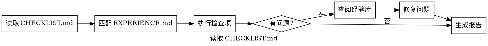

# Checklist

开发完成质量检查技能。

## When to Use
- 用户说 "运行检查" / "执行清单" / "检查清单"
- **每个工作包完成后自动执行**
- 提交代码前的最终检查

- 功能开发后验证质量
- Bug 修复后验证修复效果

## Flow


## Checklist Categories

### 1. 代码质量检查
- [ ] 代码符合 GDScript 规范
- [ ] 无编译错误/警告
- [ ] 公共函数有文档注释
- [ ] 无 ERROR 输出

- [ ] 无重复 WARNING

- [ ] 临时调试代码已移除

### 2. 测试检查
- [ ] 测试用例已编写
- [ ] 测试全部通过
- [ ] 边界情况已覆盖
- [ ] 测试文件语法正确

### 3. 文档检查
- [ ] PROGRESS.md 已更新
- [ ] task.md 状态已更新
- [ ] 工作包清单已更新
- [ ] 新增函数有注释
- [ ] 复杂逻辑有说明

### 4. Git 检查
- [ ] git status 确认变更范围
- [ ] 无误提交文件
- [ ] 提交信息格式正确
- [ ] 包含 Co-Authored-By

### 5. 经验记录
- [ ] 遇到的问题已记录到 EXPERIENCE.md
- [ ] 解决方案已记录
- [ ] 可复用的模式已提取
- [ ] 新发现的坑已添加到 CHECKLIST.md

## Experience Matching Rules

根据工作类型自动匹配相关经验：

| 工作类型 | 匹配标签 |
|----------|----------|
| 修复脚本错误 | [脚本调试], [API兼容] |
| 创建/修改场景 | [场景设计], [UI/UX] |
| 系统重构 | [系统架构], [性能优化] |
| 添加美术资源 | [美术资源] |
| 调试运行问题 | [脚本调试], [工具使用] |

## Report Template
```markdown
## 工作包完成检查报告

**工作包**: WP-XXX
**检查时间**: YYYY-MM-DD HH:mm

### 检查结果
| 类别 | 通过/总数 | 状态 |
|------|----------|------|
| 代码质量 | X/X | ✅/❌ |
| 测试检查 | X/X | ✅/❌ |
| 文档检查 | X/X | ✅/❌ |
| Git 检查 | X/X | ✅/❌ |
| 经验记录 | X/X | ✅/❌ |

### 未通过项
- [ ] 检查项 - 原因

### 建议后续操作
1. ...
```

## Important
- **每个工作包完成后必须执行此检查清单**
- 检查未通过时，应修复后再提交
- 经验记录有助于避免重复踩坑
