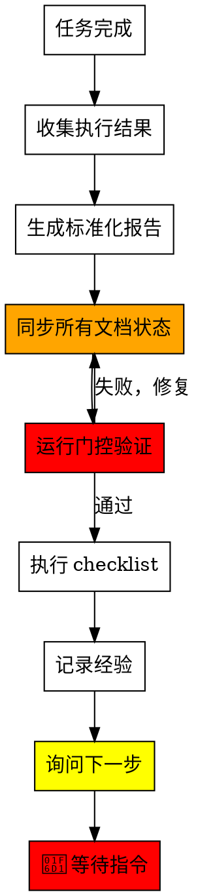
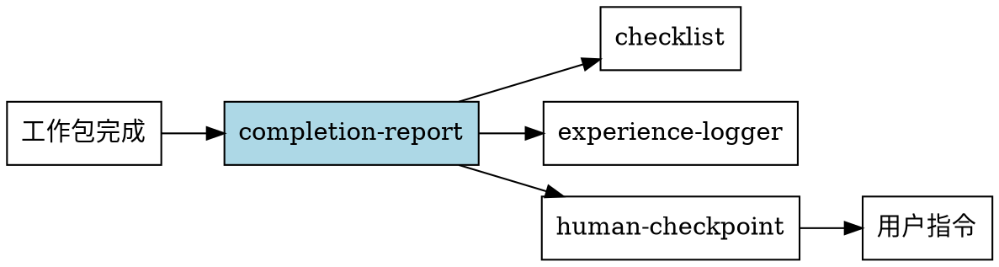

<HARD-GATE>
After generating the completion report, you MUST ask "下一步安排是什么？" and wait for user instruction.
Do NOT assume what the user wants to do next.
This is not negotiable.
</HARD-GATE>

# Completion Report

工作包/批次完成后的标准化汇报与询问机制。

## When to Use

**自动触发场景**:
- 工作包执行完成后
- 批量工作包完成后
- checklist 检查通过后

**手动触发词**:
- "汇报结果" / "完成报告"
- "执行完毕" / "任务完成"
- "总结一下" / "汇报"

## Red Flags - STOP

| Thought | Reality |
|---------|---------|
| "用户应该知道接下来做什么" | 必须明确询问 |
| "直接开始下一个任务" | 需要用户确认 |
| "汇报完就结束" | 必须询问下一步 |
| "结果很好，不用问了" | 任何情况都要问 |

## Flow



## 强制文档同步

**关键步骤** - 生成报告后必须同步更新以下文档状态：

| 文档 | 用途 | 必须同步 |
|------|------|----------|
| `task.md` | 任务清单（主索引） | ✅ |
| `docs/wp/WP-XXX.md` | 工作包详情 | ⚠️ 如存在 |

**同步内容**：
- 更新工作包状态：`📋 待开始` → `✅ 已完成`
- 添加完成日期
- 更新任务列表中的复选框

**同步时机**：在生成报告后、执行 checklist 前必须完成

### 状态同步验证 (不可跳过)

同步完成后，必须执行以下验证：

```bash
# 验证 task.md 状态已更新
grep "WP-XXX" task.md | grep "✅ 完成"
```

| 验证结果 | 处理 |
|----------|------|
| ✅ 找到 | 继续执行 checklist |
| ❌ 未找到 | **停止！** 重新执行状态同步 |

**这是硬性要求，不可跳过。**

## 代码门控验证（必须）

**同步完成后必须运行门控验证**：

```bash
node .claude/validators/skill-gate.js completion-report WP-XXX
```

| 结果 | 处理 |
|------|------|
| ✅ 通过 | 继续执行 checklist |
| ❌ 失败 | 必须修复文档状态，重新验证 |

**这是硬性要求，不可跳过。**

## Report Types

### 1. 单个工作包完成报告

```markdown
帅哥，工作包执行完成！

## 📦 WP-XXX: 工作包名称

### 执行结果
| 任务ID | 任务名称 | 状态 | 说明 |
|--------|----------|------|------|
| XXX-001 | 任务1 | ✅ 完成 | - |
| XXX-002 | 任务2 | ✅ 完成 | - |

### 创建/修改的文件
```
scripts/xxx.gd          # 新增
scenes/xxx.tscn         # 修改
test/unit/test_xxx.gd   # 新增
```

### 验收标准完成情况
- [x] XXX-001-A1: 验收项1
- [x] XXX-001-A2: 验收项2
- [x] XXX-002-A1: 验收项1

### 测试结果
- 单元测试: ✅ 5/5 通过
- 集成测试: ✅ 3/3 通过

### 检查结果
| 类别 | 通过/总数 | 状态 |
|------|----------|------|
| 代码质量 | 5/5 | ✅ |
| 测试检查 | 4/4 | ✅ |
| 文档检查 | 3/3 | ✅ |
| Git 检查 | 2/2 | ✅ |

### 遇到的问题与解决
- **问题**: [问题描述]
- **解决**: [解决方案]

---
🔴 **下一步安排是什么？**
```

### 2. 批量工作包完成报告

```markdown
帅哥，本批次工作包执行完成！

## 📊 执行总览

| 工作包 | 状态 | 子任务 | 测试 | 说明 |
|--------|------|--------|------|------|
| WP-XXX | ✅ 完成 | 3/3 | 9/9 | - |
| WP-YYY | ✅ 完成 | 2/2 | 6/6 | - |
| WP-ZZZ | ❌ 阻塞 | 1/3 | 2/6 | 依赖未满足 |

### 统计
- **总工作包**: 3 个
- **完成**: 2 个
- **阻塞**: 1 个
- **总耗时**: 约 Xh
- **测试通过率**: 17/21 (81%)

## ❌ 未完成项

### WP-ZZZ: 工作包名称
- **阻塞原因**: 依赖 WP-AAA 未完成
- **需要**: [具体依赖内容]
- **建议**: 先完成 WP-AAA

## 📁 文件变更汇总
```
新增文件:
  scripts/aaa.gd
  scripts/bbb.gd
  test/unit/test_aaa.gd

修改文件:
  scenes/main.tscn
  scripts/manager.gd
```

## 💡 经验总结
- [经验1]: 描述
- [经验2]: 描述

## 📋 下一步建议

**优先级排序**:
1. 完成 WP-AAA（解除 WP-ZZZ 阻塞）
2. 继续执行 WP-ZZZ
3. 开始新的工作包 WP-BBB

---
🔴 **下一步安排是什么？**
```

### 3. 简化完成报告（单任务快速汇报）

```markdown
帅哥，任务完成！

## ✅ 完成内容
- [具体完成的内容1]
- [具体完成的内容2]

## 📁 变更文件
- `scripts/xxx.gd` - 修改
- `test/unit/test_xxx.gd` - 新增

## ✅ 测试状态
- 全部通过 (X/X)

---
🔴 **下一步安排是什么？**
```

## Required Elements

每个完成报告必须包含：

| 元素 | 说明 | 必需 |
|------|------|------|
| 执行结果表 | 任务完成状态 | ✅ |
| 文件变更 | 创建/修改的文件 | ✅ |
| 测试状态 | 测试通过情况 | ✅ |
| 检查结果 | checklist 结果 | ✅ |
| 文档同步 | PROGRESS.md + task.md | ✅ **必须** |
| 未完成项 | 阻塞/失败原因 | ⚠️ 如有 |
| 下一步建议 | 建议的后续操作 | ⚠️ 可选 |
| 询问下一步 | "下一步安排是什么？" | ✅ 必须 |

## 清理状态验证（批量执行后必须）

**如果本次执行使用了 agent-dispatcher（批量执行）**，报告必须包含清理状态：

```markdown
## 🧹 清理状态

- TeamDelete: ✅ 已执行 / ❌ 未执行
- 团队名称: {team_name}
- 清理时间: {cleanup_time}
```

**如果 TeamDelete 未执行**，报告必须包含警告：

```markdown
⚠️ **警告**: TeamDelete 未执行，存在资源泄漏风险！
建议手动执行清理命令："清理团队"
```

### 清理验证方法

```bash
# 验证团队目录已删除
ls ~/.claude/teams/{team_name}/ 2>/dev/null
# 应该返回 "No such file or directory"
```

| 验证结果 | 处理 |
|----------|------|
| ✅ 目录不存在 | 清理成功，继续报告 |
| ❌ 目录存在 | 在报告中标注警告，建议手动清理 |

## Question Templates

必须使用以下询问模板之一：

- 🔴 **下一步安排是什么？**
- 🔴 **请问接下来要做什么？**
- 🔴 **您希望我继续做什么？**

## Response Handling

### 继续执行类
- "继续执行 WP-XXX" → 开始执行指定工作包
- "按你的建议来" → 执行建议的下一步

### 新任务类
- "创建任务..." → 调用 task-creator
- "先处理 XXX" → 切换到新任务

### 暂停类
- "先停一下" / "等等" → 保持等待状态
- "今天到这里" → 记录进度，结束会话

### 修改类
- "XXX 需要改一下" → 处理修改意见

## Integration with Other Skills



## Forbidden Actions

- ❌ 不要在报告后直接开始新任务
- ❌ 不要假设用户想要什么
- ❌ 不要省略询问下一步
- ❌ 不要忽略未完成项
