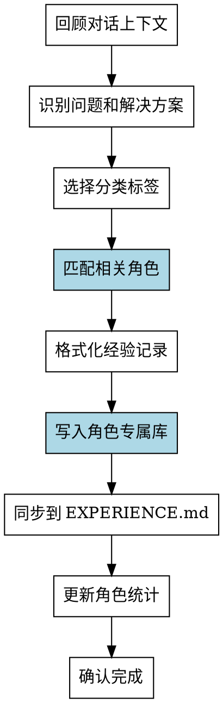

# Experience Logger (增强版)

将开发过程中的经验教训分类记录，**支持角色专属经验库**，实现角色进化。

## When to Use
- 用户说 "总结经验" / "记录经验" / "这次学到了"
- 解决了一个重要问题后
- 发现了一个值得记录的坑
- **每个工作包完成后应该执行**
- **子代理执行完成后自动调用**

## Flow (增强版)


---

## 角色进化机制

### 标签到角色映射

#### 核心角色映射（通用框架）

| 标签 | 关联角色 |
|------|----------|
| `[架构设计]` | `architect` |
| `[系统设计]` | `architect` |
| `[模块划分]` | `architect` |
| `[代码实现]` | `implementer` |
| `[功能开发]` | `implementer` |
| `[Bug修复]` | `implementer` |
| `[重构]` | `implementer` |
| `[调试]` | `implementer` |
| `[测试验证]` | `tester` |
| `[单元测试]` | `tester` |
| `[集成测试]` | `tester` |
| `[测试框架]` | `tester` |
| `[文档编写]` | `documenter` |
| `[API文档]` | `documenter` |
| `[用户指南]` | `documenter` |
| `[性能优化]` | `architect`, `implementer` |
| `[项目管理]` | `coordinator` |

#### 领域角色映射（由项目模板扩展）

| 标签 | 关联角色 |
|------|----------|
| `[UI/UX]` | `frontend-dev` (web模板) |
| `[前端开发]` | `frontend-dev` (web模板) |
| `[API设计]` | `backend-dev` (web模板) |
| `[数据库]` | `backend-dev` (web模板) |
| `[部署]` | `devops` (devops模板) |
| `[CI/CD]` | `devops` (devops模板) |
| `[场景设计]` | `godot-scene-expert` (godot模板) |
| `[脚本调试]` | `godot-script-expert` (godot模板) |

### 双重写入策略

1. **写入角色专属库** (`.claude/agents/memories/{role_id}.md`)
   - 精准匹配角色
   - 作为子代理记忆注入源

2. **同步到 EXPERIENCE.md**
   - 全局知识库
   - 作为回退经验源

---

## Tags Reference

### 分类标签

| 标签 | 适用场景 | 关联角色 |
|------|----------|----------|
| `[脚本调试]` | GDScript 语法、逻辑错误、运行时问题 | godot-script-expert |
| `[场景设计]` | 节点组织、场景结构、预制体设计 | godot-scene-expert |
| `[系统架构]` | 模块划分、设计模式、代码组织 | combat-ai-expert |
| `[UI/UX]` | 用户界面、交互设计、反馈系统 | godot-scene-expert |
| `[美术资源]` | 精灵、动画、材质、音效 | effect-expert |
| `[性能优化]` | 帧率、内存、加载时间 | godot-script-expert |
| `[API兼容]` | Godot 版本差异、API 变更 | godot-script-expert |
| `[工具使用]` | MCP 工具、编辑器技巧、命令行 | test-reviewer |
| `[项目管理]` | Git、版本控制、工作流程 | test-reviewer |

---

## Execution Instructions

### 1. 识别经验

从对话上下文中提取：
- 遇到的主要问题是什么？
- 错误信息是什么？（如有）
- 解决方案是什么？
- 是否有可复用的价值？

### 2. 选择标签

根据问题类型选择合适的分类标签。

### 3. 匹配角色

根据标签查找关联的角色（参考上方映射表）。

### 4. 格式化记录

```markdown
### [标签名称] 经验标题

**错误信息**: (如有)
```
错误内容
```

**问题描述**: 简要描述问题

**解决方案**: 具体的解决方案（含代码示例）

**适用场景**: (可选) 在什么情况下适用

**来源工作包**: WP-XXX
**记录日期**: YYYY-MM-DD
```

### 5. 写入角色专属库

路径：`.claude/agents/memories/{role_id}.md`

追加到 `## 经验列表` 部分的末尾。

### 6. 同步到 EXPERIENCE.md

路径: `docs/EXPERIENCE.md`

追加到对应标签分类下，并更新经验索引表。

### 7. 更新角色统计

更新角色专属库头部的统计信息：
```markdown
## 统计
- 总经验数: X
- 最后更新: YYYY-MM-DD
- 累计执行任务: X 次
```

---

## Experience Format Template

```markdown
### [标签名称] 经验标题

**错误信息**:
```
原始错误信息
```

**问题描述**: 简要描述问题

**原因分析**: (可选) 深入分析原因

**解决方案**:
```gdscript
# 代码示例
```

**适用场景**:
- 场景1
- 场景2

**来源工作包**: WP-XXX
**记录日期**: YYYY-MM-DD
```

---

## 自动经验提取规则

| 触发条件 | 动作 | 标签 |
|----------|------|------|
| 报告包含 "错误信息/Error:" | 自动提取 | [脚本调试] |
| 报告包含 "解决方案/修复方法" | 自动提取 | 对应标签 |
| 任务部分完成/失败 | 强制记录失败原因 | 对应标签 |
| 涉及场景/节点操作 | 自动关联 | [场景设计] |
| 涉及 API 版本差异 | 自动关联 | [API兼容] |

---

## Important

- **只记录有价值的经验**，避免泛泛而谈
- **使用正确的标签分类**，便于后续检索
- **必须写入角色专属库**，实现角色进化
- **同步到 EXPERIENCE.md**，保持全局知识库
- **每条经验控制在可快速阅读的长度**
- **及时记录**，问题解决后立即记录
- **定期整理**，相似经验合并，过时经验更新

---

## 角色进化收益

| 角色使用次数 | 能力提升 |
|--------------|----------|
| 1-5 次 | 基础能力 |
| 6-15 次 | 积累专属经验，减少踩坑 |
| 16+ 次 | 领域专家，快速解决同类问题 |
