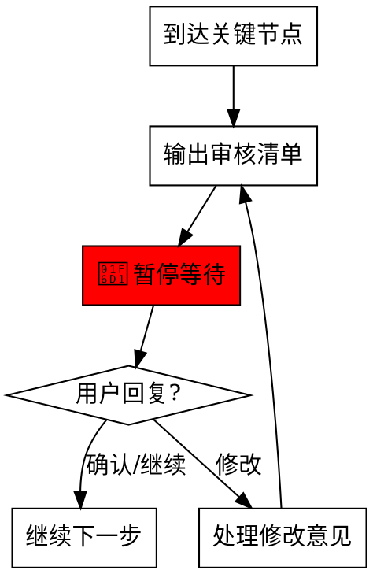

<HARD-GATE>
You MUST stop and wait for user confirmation at this checkpoint.
Do NOT proceed to the next phase until user explicitly says "继续", "确认", "执行", or similar approval.
This is not negotiable.
</HARD-GATE>

# Human Checkpoint

工作流关键节点的人介入审核机制。

## When to Use

**自动触发场景**:
- 完成需求/架构/设计文档编写后
- 工作包创建完成，准备执行前
- 批量执行计划制定后
- 重大技术决策确定前

**手动触发词**:
- "等待审核" / "暂停确认"
- "人介入" / "需要确认"
- "checkpoint" / "暂停"

## Red Flags - STOP

| Thought | Reality |
|---------|---------|
| "用户应该想让我继续" | 必须等待明确指令 |
| "文档看起来没问题" | 用户审核才算数 |
| "这个很简单，不用等" | 任何决策点都要暂停 |
| "我已经问了，没回复就继续" | 必须收到回复才能继续 |

## Flow



## Checkpoint Types

### 1. 文档审核检查点

触发时机: 完成文档编写后

```markdown
帅哥，文档已准备好，请审核：

📋 文档清单:
- [ ] docs/XX_需求分析.md - 需求概述
- [ ] docs/XX_架构设计.md - 技术方案
- [ ] docs/XX_开发计划.md - 实施步骤

🔍 重点关注:
- 需求范围是否正确？
- 技术方案是否合理？
- 预估工时是否准确？

🔴 确认后回复"继续"，修改则指出需要调整的内容。
```

### 2. 工作包审核检查点

触发时机: 工作包创建完成后

```markdown
帅哥，工作包已创建，请审核：

📦 工作包概览:
| 工作包ID | 名称 | 优先级 | 预估工时 | 子任务数 |
|----------|------|--------|----------|----------|
| WP-XXX | ... | P1 | Xh | X |

🔗 依赖关系:
- WP-XXX → WP-YYY (前置依赖)

🔍 重点关注:
- 任务拆分是否合理？
- 优先级是否正确？
- 依赖关系是否准确？

🔴 确认后回复"执行"开始实现，或提出修改意见。
```

### 3. 批量执行检查点

触发时机: 批量执行计划制定后

```markdown
帅哥，批量执行计划已制定，请确认：

📊 执行计划:
| 阶段 | 工作包 | 执行方式 | 预估时间 |
|------|--------|----------|----------|
| 1 | WP-XXX, WP-YYY | 并行 | Xh |
| 2 | WP-ZZZ | 串行 | Xh |

⚠️ 注意事项:
- [注意事项1]
- [注意事项2]

🔍 确认要点:
- 执行顺序是否正确？
- 是否有遗漏的工作包？

🔴 确认后回复"开始执行"，或调整执行计划。
```

### 4. 结果确认检查点

触发时机: 批次工作包完成后

```markdown
帅哥，本批次工作包执行完成！

## 执行结果
| 工作包 | 状态 | 说明 |
|--------|------|------|
| WP-XXX | ✅ 完成 | ... |
| WP-YYY | ✅ 完成 | ... |

## 未完成项
- (如有)

## 下一步建议
1. [建议1]
2. [建议2]

🔴 下一步安排是什么？
```

## User Response Handling

### 确认类回复 → 继续执行
- "继续" / "确认" / "OK" / "好的"
- "执行" / "开始" / "做吧"
- "没问题" / "可以"

### 修改类回复 → 处理修改
- "修改一下..." / "调整..."
- "XXX 不对" / "YYY 需要改"
- 处理完成后 → 重新输出审核清单 → 再次暂停

### 等待类回复 → 保持暂停
- "等等" / "我看看" / "稍等"
- 保持暂停状态，不执行任何操作

## Forbidden Actions at Checkpoint

- ❌ 不要假设用户会同意而提前执行
- ❌ 不要在用户未回复时自动继续
- ❌ 不要跳过审核清单直接开始工作
- ❌ 不要忽略用户的修改意见

## Integration with Other Skills

| Skill | 集成点 |
|-------|--------|
| `task-creator` | 工作包创建后触发检查点 |
| `split-work-package` | 拆分完成后触发检查点 |
| `completion-report` | 完成后触发结果确认检查点 |
| `agent-dispatcher` | 批量执行前触发检查点 |

## Report Format

```
帅哥，[检查点类型]已准备好，请审核：

[审核内容]

🔴 确认后回复"[确认词]"，修改则指出需要调整的内容。

🛑 等待您的指令...
```
