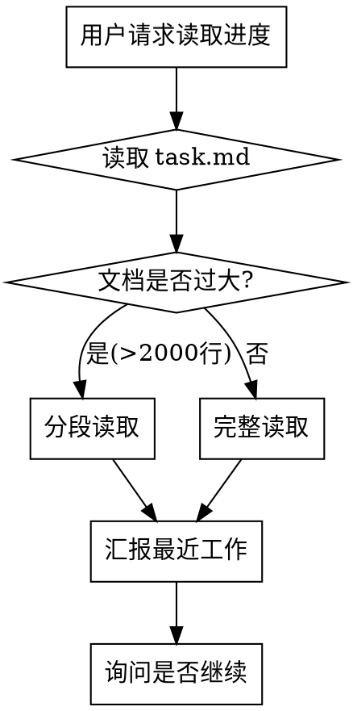

# Progress Tracker

项目进度追踪与记录的统一技能，合并了进度读取（原 progress-manager）和进度记录（原 record-progress）功能。

## When to Use

- 用户说 "记录进度" / "保存进度"
- 用户说 "读取进度" / "查看进度"
- 需要恢复上次工作上下文
- 用户说 "增加授权"
- 完成重要功能开发后
- 会话结束前需要保存工作上下文

## Quick Reference

| 触发词 | 动作 |
|--------|------|
| 记录进度 / 保存进度 | 执行记录进度流程 |
| 读取进度 / 查看进度 | 执行读取进度流程 |
| 拆分工作包 / 创建工作包 | 调用 `split-work-package` skill |
| 增加授权 | 执行授权流程 |

---

## Part 1: 读取进度 (Read Progress)

### Read Progress Flow



### 分段读取规则

当文档超过 **2000 行** 时，使用以下分段策略：

| 文件 | 分段策略 | 优先读取 |
|------|----------|----------|
| `task.md` | 先读前 500 行概览，再按需读取 | 工作包概览表 |
| `docs/wp/WP-XXX.md` | 按需读取具体工作包详情 | 单个工作包信息 |

> ⚠️ `docs/core/12_工作包清单.md` 已废弃 (2026-03-17)，请使用 `task.md` 作为主索引

### 分段读取实现

使用 Read 工具的 `offset` 和 `limit` 参数：

```
# 读取大文件尾部（最近内容）
Read(file_path="...", offset=总行数-2000, limit=2000)

# 分批读取大文件
Read(file_path="...", offset=1, limit=1000)    # 第1批
Read(file_path="...", offset=1001, limit=1000) # 第2批
```

---

## Part 2: 记录进度 (Record Progress)

### Checklist

1. **识别记录类型** - 工作包完成 vs 轻量级活动
2. **更新文档状态** - 更新 task.md 对应区域 **及** docs/wp/WP-XXX.md 状态字段和子任务状态
3. **检查归档触发** - 是否需要归档
4. **确认完成** - 向用户报告 "进度已记录"

### 记录类型

| 类型 | 更新区域 | 示例 |
|------|----------|------|
| **工作包完成** | `✅ 最近完成` + 工作包状态 | WP-109 / WP-1009 架构问题分析文档完成 |
| **轻量级活动** | `📝 最近活动` | 讨论文档记录机制优化方案 |

### task.md 更新逻辑

#### 工作包完成时

1. **更新 `🔥 待办工作包`** - 移除已完成的工作包
2. **更新 `✅ 最近完成`** - 在表格顶部添加新行
3. **更新 `📊 快速概览`** - 进度统计 +1

```markdown
## ✅ 最近完成（最新10个）

| 完成日期 | 工作包ID | 模块名称 | 说明 |
|----------|----------|----------|------|
| 2026-03-18 | WP-109 | 架构问题分析文档 | 17个单例分析、依赖关系图 |
| 2026-03-15 | WP-1015 | 测试覆盖率提升 | 单元测试新增 32 个用例 |
| ... | ... | ... | ... |
```

#### 轻量级活动时

1. **更新 `📝 最近活动`** - 在表格顶部添加新行

```markdown
## 📝 最近活动（非工作包）

| 日期 | 活动描述 |
|------|----------|
| 2026-03-18 | 讨论文档记录机制优化方案（Plan模式）|
| ... | ... | ... |
```

### 归档触发检查

| 条件 | 阈值 | 操作 |
|------|------|------|
| 最近完成 > 10 个 | > 10 | 将最旧的移入 `docs/archive/completed_*.md` |
| 最近活动 > 20 条 | > 20 | 将最旧的移入 `docs/archive/activity_log_archive.md` |

### 工作包完成记录模板

完成工作包后，更新以下位置：

#### 0. docs/wp/WP-XXX.md 状态字段（如存在）

**Format A**（`基本信息` 表 + `子工作包列表` 表，如 WP-029~035、WP-1029~1035）：

```markdown
# 基本信息表 — 状态行
| **状态** | 📋 待执行 |  →  | **状态** | ✅ 完成 |

# 子工作包列表表 — 所有子任务的状态列（替换任何 📋 变体）
| ... | 📋 |  →  | ... | ✅ |
| ... | 📋 待开始 |  →  | ... | ✅ |
```

**Format B**（`### 状态` 独立节，如 WP-001~028）：

```markdown
### 状态
- **代码状态**: 📋 → ✅ 完成
- **测试状态**: 📋 → ✅ 通过
- **完成日期**: 2026-04-22
```

**任务列表表**（如存在）— 更新已完成任务的 `状态` 列：

```markdown
| ... | 📋 待开始 |  →  | ... | ✅ 完成 |
```

**验收标准 checkbox**（如存在）— 全部勾选：

```markdown
- [ ]  →  - [x]
```

#### 1. task.md `✅ 最近完成` 区域
```markdown
| 2026-03-18 | WP-XXX | 模块名称 | 简要说明 |
```

#### 2. task.md `📊 快速概览` 区域
```markdown
- **进度**: 74/117 (63.2%)  # +1 完成
```

#### 3. docs/wp/WP-XXX.md（如存在）
```markdown
## 完成记录

- **完成日期**: 2026-03-18
- **实际工时**: Xh
- **经验教训**: ...
```

### 轻量级活动记录模板

```markdown
| 2026-03-18 | 活动描述 |
```

---

## Part 3: 增加授权 (Add Permission)

### Add Permission Flow

1. **识别待授权命令** - 回顾本次会话中需要授权的命令
2. **读取配置** - 读取 `.claude/settings.local.json`
3. **添加授权** - 将命令添加到 `permissions.allow` 数组
4. **保存配置** - 写入更新后的配置文件
5. **确认完成** - 向用户报告已添加的授权命令列表

---

## Files

| 文件 | 用途 | 状态 |
|------|------|------|
| `task.md` | 任务清单（主索引） | ✅ 主要 |
| `docs/wp/WP-XXX.md` | 工作包详情（可选更新） | ✅ 活跃 |
| `docs/archive/*.md` | 历史归档 | 📦 归档 |
| `.claude/settings.local.json` | 权限配置 | ✅ 活跃 |

## Related Skills

- **split-work-package**: 拆分工作包（独立 skill）

## Notes

- 记录足够详细以便下次会话快速恢复上下文
- 优先更新 task.md 作为主索引
- 定期检查归档触发条件
