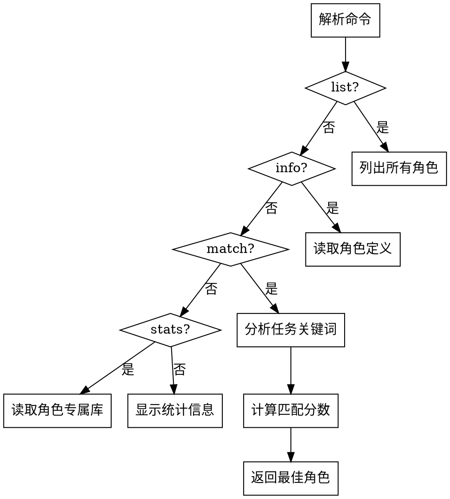

# Role Manager

角色赋能系统管理技能，用于查看、匹配和管理专业角色。

## When to Use

**触发词**:
- "查看角色" / "列出角色"
- "匹配角色" / "哪个角色适合"
- "角色管理" / "角色信息"
- "使用 xxx 角色执行"

## Quick Reference

| 命令 | 功能 |
|------|------|
| `list` | 列出所有角色 |
| `info <角色ID>` | 查看角色详情 |
| `match <任务描述>` | 匹配最适合的角色 |
| `stats` | 查看角色统计 |

## 中文别名映射

用户可以用友好的中文名称召唤角色，系统内部会自动转换为英文 ID。

### 核心角色（通用框架）

| 中文别名 | 英文 ID | 角色名称 |
|----------|--------|------|
| 协调者 | coordinator | 协调者 |
| 调度者 | coordinator | 协调者 |
| 执行者 | executor | 执行者 |
| 审查者 | reviewer | 审查者 |
| 架构师 | architect | 架构师 |
| 设计师 | architect | 架构师 |
| 实现者 | implementer | 实现者 |
| 开发者 | implementer | 实现者 |
| 编码者 | implementer | 实现者 |
| 测试者 | tester | 测试者 |
| 测试员 | tester | 测试者 |
| 文档 | documenter | 文档编写者 |

### 领域角色（由项目模板扩展）

| 中文别名 | 英文 ID | 角色名称 |
|----------|--------|------|
| 前端 | frontend-dev | 前端开发专家 |
| 后端 | backend-dev | 后端开发专家 |
| 运维 | devops | 运维专家 |
| UI专家 | godot-scene-expert | Godot 场景+UI专家 |
| 场景专家 | godot-scene-expert | Godot 场景+UI专家 |

## Flow



---

## Commands

### 1. 列出所有角色 (list)

**触发**: "查看角色" / "列出角色"

**输出示例**:
```markdown
帅哥，当前系统中有 8 个专业角色：

### 核心角色（通用框架）

| 中文别名 | 角色ID | 名称 | 专业领域 | 经验数 |
|----------|--------|------|----------|--------|
| 协调者 | coordinator | 协调者 | 任务分解、依赖分析、进度跟踪 | 0 |
| 执行者 | executor | 执行者 | 通用编码、问题解决、文件操作 | 0 |
| 审查者 | reviewer | 审查者 | 代码审查、测试验证、质量检查 | 0 |
| 架构师 | architect | 架构师 | 系统设计、架构模式、技术选型 | 0 |
| 实现者 | implementer | 实现者 | 代码实现、功能开发、Bug 修复 | 0 |
| 测试者 | tester | 测试者 | 单元测试、集成测试、测试框架 | 0 |
| 文档 | documenter | 文档编写者 | 技术文档、API 文档、用户指南 | 0 |

### 领域角色（由项目模板扩展）

| 中文别名 | 角色ID | 名称 | 专业领域 | 经验数 |
|----------|--------|------|----------|--------|
| 前端 | frontend-dev | 前端开发专家 | HTML/CSS/JavaScript、UI 组件 | 0 |
| 后端 | backend-dev | 后端开发专家 | API 设计、数据库、服务端开发 | 0 |
| 运维 | devops | 运维专家 | CI/CD、Docker、Kubernetes | 0 |

使用 "查看角色 <角色ID或中文别名>" 了解详情。
```

### 2. 查看角色详情 (info)

**触发**: "查看角色 godot-scene-expert" 或 "查看角色 UI专家"

**执行步骤**:
1. 读取 `.claude/agents/roles/{role_id}.yaml`
2. 读取 `.claude/agents/memories/{role_id}.md`
3. 格式化输出角色信息

**输出示例**:
```markdown
## Godot 场景+UI专家

### 基本信息
- **角色ID**: godot-scene-expert
- **版本**: 1.0.0
- **子代理类型**: general-purpose
- **中文别名**: UI专家、场景专家

### 专业领域
- 场景层级结构设计
- 节点类型选择和配置
- 信号连接模式
- 场景继承和实例化
- UI 布局和响应式设计

### 匹配关键词
场景、节点、tscn、预制体、信号连接、UI、界面、Control、布局

### 任务类型
feature, refactor, bug_fix

### 专属经验库
- 总经验数: 2
- 最近更新: 2026-03-13

#### 经验列表
1. [场景设计] z_index 不影响事件传播
2. [场景设计] 预加载文件不存在
```

### 3. 匹配角色 (match)

**触发**: "匹配角色 修复场景点击事件问题"

**执行步骤**:
1. 分析任务描述中的关键词
2. 读取 `role-registry.yaml`
3. 计算每个角色的匹配分数
4. 返回最佳匹配

**匹配算法**:
```
分数 = 关键词匹配数 * 0.5 + 任务类型匹配 * 0.3 + 模块标签匹配 * 0.2
```

**输出示例**:
```markdown
帅哥，根据任务描述分析，最佳角色匹配：

## 🎯 推荐角色: **godot-scene-expert** (UI专家)

**匹配分数**: 0.85

**匹配原因**:
- 关键词匹配: "场景" (+0.5)
- 任务类型: bug_fix (+0.3)
- 模块标签: scenes (+0.05)

**角色能力**:
- 场景层级结构设计
- 节点类型选择和配置
- 信号连接模式
- 场景继承和实例化
- UI 布局和响应式设计

**相关经验**:
- [场景设计] z_index 不影响事件传播
- [场景设计] 预加载文件不存在

使用 "使用 UI专家 执行" 来指定此角色。
```

### 4. 查看统计 (stats)

**触发**: "角色统计"

**输出示例**:
```markdown
帅哥，角色系统统计：

## 📊 角色系统概览

| 中文别名 | 角色 | 经验数 | 执行次数 | 最后更新 |
|----------|------|--------|----------|----------|
| UI专家 | godot-scene-expert | 2 | 0 | 2026-03-13 |
| 开发专家 | godot-script-expert | 6 | 0 | 2026-03-13 |
| 战斗专家 | combat-ai-expert | 0 | 0 | - |
| 效果专家 | effect-expert | 0 | 0 | - |
| 测试专家 | test-reviewer | 1 | 0 | 2026-03-13 |

**总计**:
- 角色数: 5
- 总经验数: 9
- 累计执行: 0 次
```

---

## Integration

| Skill | 集成点 |
|-------|--------|
| `agent-dispatcher` | 自动角色匹配和记忆注入 |
| `experience-logger` | 经验写入角色专属库 |
| `human-checkpoint` | 确认角色选择 |

---

## Important

1. **角色匹配是建议性的** - 用户可以手动指定角色
2. **经验库持续增长** - 每次任务都可能添加新经验
3. **定期维护** - 清理过时经验，合并相似经验
4. **角色可扩展** - 可以添加新的专业角色
5. **中文别名优先** - 用户可以用友好的中文名称召唤角色
6. **系统内部使用英文 ID** - 子代理调度时使用英文 ID 确保唯一性
