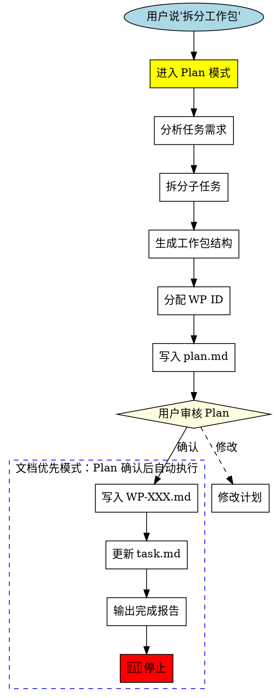

<SUBAGENT-STOP>
If you were dispatched as a subagent to execute a specific task, skip this skill.
</SUBAGENT-STOP>

<STOP>
╔══════════════════════════════════════════════════════════════════════════════╗
║  🛑 MANDATORY STOP POINT - 文档优先模式                                      ║
║                                                                              ║
║  Plan 确认后，自动执行以下步骤：                                              ║
║  Step 7:  写入 docs/wp/WP-XXX.md                                            ║
║  Step 8:  更新 task.md                                                       ║
║  Step 9:  输出简洁报告 → 🛑 停止                                             ║
║                                                                              ║
║  ⚠️ 这是自动流程，不需要用户再次确认                                         ║
║  ⚠️ bypassPermission 不影响此流程                                            ║
╚══════════════════════════════════════════════════════════════════════════════╝
</STOP>

<HARD-GATE>
╔══════════════════════════════════════════════════════════════════════════════╗
║  📝 文档优先模式 - Plan 确认后自动执行                                        ║
║                                                                              ║
║  Plan 确认后，你必须**立即**执行以下步骤：                                    ║
║                                                                              ║
║  Step 7:  写入 docs/wp/WP-XXX.md（完整工作包文档）                           ║
║  Step 8:  更新 task.md（追加概览表行）                                       ║
║  Step 9:  输出简洁报告 → 🛑 停止                                             ║
║                                                                              ║
║  ⚠️ 这是自动流程，不需要用户再次确认                                         ║
║  ⚠️ bypassPermission 不影响此流程                                            ║
║                                                                              ║
║  DO NOT:                                                                     ║
║  ❌ Write any code files (.gd, .js, etc.)                                   ║
║  ❌ Modify any scene files (.tscn) except documentation                     ║
║  ❌ Call human-checkpoint（Plan 确认已是人介入点）                           ║
╚══════════════════════════════════════════════════════════════════════════════╝
</HARD-GATE>

# Split Work Package (工作包拆分器)

将任务拆分成结构化工作包 - **仅创建定义，不实现代码**。

## 核心原则

```
┌─────────────────────────────────────────────────────────────────┐
│  "拆分工作包" ≠ "执行工作包"                                   │
│                                                                 │
│  用户说 "拆分工作包" = 只写文档，不写代码                       │
│  用户说 "执行" = 开始写代码实现                                 │
│                                                                 │
│  这是两个完全独立的阶段，中间必须有人工确认！                   │
└─────────────────────────────────────────────────────────────────┘
```

## When to Use

- 用户说 "拆分工作包" / "创建工作包"
- 需要将大任务分解成可执行子任务

---

## 🎯 快速模式 vs 深度模式

根据用户提示词自动选择模式：

| 用户提示词特征 | 模式 | Plan 阶段行为 |
|----------------|------|---------------|
| 包含"只写文档"、"不要执行"、"不具体执行"、"不要直接执行" | **快速模式** | 只定义任务，不分析代码 |
| 无上述关键词 | **深度模式** | 可自由分析代码、评估复杂度 |

### 快速模式（用户明确说"不要执行"时）

在 Plan 模式中，你只能：
- ✅ 确定工作包编号
- ✅ 写任务标题和目标（1-2句话）
- ✅ 写子任务列表（可选）
- ✅ 写验收标准（可选）

在 Plan 模式中，你**禁止**：
- ❌ 读取代码文件分析实现
- ❌ 检查代码是否存在
- ❌ 运行任何代码审计
- ❌ 做任何"执行阶段"才该做的工作

**规则**: 快速模式下，Plan 阶段只定义"做什么"，不分析"怎么做"或"是否已做"

### 深度模式（默认）

Plan 阶段可以自由进行：
- ✅ 读取代码分析依赖
- ✅ 评估任务复杂度
- ✅ 检查现有实现
- ✅ 设计拆分方案

---

## Forbidden Thoughts

| Thought | Reality |
|---------|---------|
| "拆分后可以直接开始执行" | ❌ 拆分≠执行，必须等待 |
| "Plan 确认后可以继续执行" | ❌ Plan 确认只允许文档更新，然后必须停止 |
| "工作包太简单，不需要验证" | ❌ 任何工作包都必须验证 |
| "用户想让我立即执行" | ❌ 不要假设，必须确认 |
| "用户选择了 bypassPermission" | ❌ bypassPermission 不影响停止点 |
| "用户清除了上下文" | ❌ 清除上下文 ≠ 授权执行代码 |
| "Plan 已经确认了" | ❌ Plan 确认只允许文档更新，然后必须停止 |
| "用户选了 bypass，可以跳过文档更新" | ❌ bypass 只跳过权限确认，不跳过文档更新步骤 |
| "调用 ExitPlanMode 工具" | ❌ 不要调用 ExitPlanMode，让用户在 Plan 界面确认即可 |

---

## 上下文窗口管理

仅在深度模式下生效。快速模式不读取文件，无需分块。

### 预读估算协议

1. 查看文件顶部的 `<!-- CONTEXT-CONFIG -->` 获取限制参数
2. 先用 Glob 发现文件，用 Bash `wc -l` 估算行数
3. 估算公式: 每行代码 ≈ 10 tokens，每行文本 ≈ 5 tokens
4. 可用预算 = max_tokens - safety_margin

### 读取策略决策树

| 文件估算行数 | 策略 |
|-------------|------|
| ≤ thresholds.small (200行) | 直接用 Read 工具读取整个文件 |
| thresholds.small ~ thresholds.medium (200-800行) | 分块读取: Read(offset, limit=chunk_lines) |
| > thresholds.medium (800行) | Grep 扫描关键模式 → 定位行范围 → Read 目标段 |
| 多文件合计超预算 | 排序优先级 → 读高优 → 低优用 Grep |

### 分块读取协议

1. **首块**(1 ~ chunk_lines): 建立"结构地图"（类/函数/节标题位置）
2. **后续块**: 根据结构地图判断是否包含相关内容
3. **提前终止**: 已获得足够信息时停止读取，不读完整文件
4. **跨块引用**: 记录依赖但不回读

### 语义边界规则（优先级从高到低）

1. 函数/方法边界 - 不在函数体中间断开
2. 类边界 - 不在类定义中间断开
3. Markdown 节标题 - 在 `##`/`###` 处断开
4. 代码块边界 - 在 `{ }` 之间断开
5. 行边界 - 最后手段

### 部分分析的合并

置信度标注:
- **[HIGH]** 基于完整直接读取
- **[MEDIUM]** 基于部分读取 + 结构推断
- **[LOW]** 仅基于 Grep 结果

在 Plan 中包含"上下文缺口"子节:
```
## 上下文缺口
| 文件 | 未读部分 | 影响 | 建议 |
|------|----------|------|------|
```

### 工作包拆分专属规则

1. **范围优先**: 先用 Glob 映射完整文件范围
2. **依赖扫描**: 用 Grep 扫描跨文件依赖(import/require)而非全文读取
3. **定向读取**: 只 Read 需要直接修改的主文件
4. **接口提取**: 依赖文件用 Grep 提取接口签名
5. **粗粒度偏好**: 分析不完整时，偏向更大粒度的拆分，避免基于不完整信息的细粒度拆分
6. **重分析标记**: 在工作包中标记"需要实现阶段重新分析"的文件

---

## Two-Phase Architecture

### Phase 1: CREATE WORK PACKAGE (本 Skill 的职责)

**触发**: 用户说 "拆分工作包"

**允许的操作**:
- ✅ 读取项目文件（分析依赖）
- ✅ 写入 `docs/wp/WP-XXX.md`
- ✅ 更新 `task.md`

**禁止的操作**:
- ❌ 创建/修改任何 `.gd` 文件
- ❌ 创建/修改任何 `.tscn` 场景文件
- ❌ 创建/修改任何资源文件 `.tres`
- ❌ 执行任何代码实现
- ❌ 调用 human-checkpoint（Plan 确认已是人介入点）

**结束标志**: 输出完成报告 → 🛑 停止

### Phase 2: IMPLEMENT WORK PACKAGE (需要用户明确触发)

**触发**: 用户明确说 "执行" / "开始"

**允许的操作**:
- ✅ 所有代码实现操作
- ✅ 创建/修改场景文件
- ✅ 写测试代码

**如何进入**: 只有当用户在 Phase 1 完成后，**在新的一轮对话中**明确说 "执行" 时才能进入

---

## Flow Diagram



---

## Execution Steps

### Step 0: 进入 Plan 模式（必须首先执行）

**⚠️ 立即调用 `EnterPlanMode` 工具进入 Plan 模式！**

不要跳过这一步。不要直接开始分析。必须先进入 Plan 模式。

### Phase 1: Plan Mode 阶段

在 Plan 模式中完成以下工作：

1. **识别任务** - 确定用户指定的任务
2. **分析范围** - 理解技术要求、依赖关系、涉及文件
3. **生成工作包结构** - 创建唯一 ID、预估AI时间、测试用例
4. **写入 plan.md** - 将完整计划写入 `.claude/plan.md`
5. **等待用户确认** - 在 Plan 界面等待用户审核确认

**⚠️ Plan 完成后，等待用户在 Plan 界面确认，然后自动进入文档输出阶段。不要调用 ExitPlanMode 工具！**

### Phase 2: 文档输出阶段（Plan 确认后，自动执行）

<POST-PLAN-MANDATORY>
╔══════════════════════════════════════════════════════════════════════════════╗
║  📝 文档优先模式 - Plan 确认后自动执行                                        ║
║                                                                              ║
║  Plan 确认后，你必须**立即**执行以下步骤：                                    ║
║                                                                              ║
║  Step 1:  识别任务范围                                                       ║
║  Step 2:  分析依赖关系                                                       ║
║  Step 3:  生成工作包结构                                                     ║
║  Step 4:  写入 docs/wp/WP-XXX.md                                            ║
║  Step 5:  更新 task.md                                                       ║
║  Step 6:  输出简洁报告 → 🛑 停止                                             ║
║                                                                              ║
║  ⚠️ 这是自动流程，不需要用户再次确认                                         ║
║  ⚠️ bypassPermission 不影响此流程                                            ║
╚══════════════════════════════════════════════════════════════════════════════╝
</POST-PLAN-MANDATORY>

**⚠️ 此阶段只允许更新文档！**

1. **识别任务** - 确定用户指定的任务
2. **分析范围** - 理解技术要求、依赖关系、涉及文件
3. **生成工作包** - 创建唯一 ID、预估AI时间、测试用例
4. **写入工作包文档** - 创建 `docs/wp/WP-XXX.md`
5. **同步 task.md** - 在工作包概览表添加新行
6. **输出简洁报告** - 向用户报告新增的 WP ID，然后 **🛑 停止**

---

## Completion Report Format

```markdown
✅ 工作包创建完成

📦 **工作包**: WP-XXX - 工作包名称
📊 **优先级**: P0/P1/P2
⏱️ **预估AI时间**: Xmin
📋 **子任务数**: X 个
🧪 **测试用例**: X 个

📁 **已更新文档**:
- docs/wp/WP-XXX.md
- task.md

🛑 **任务创建完成，等待您的下一步指示**
```

**输出报告后，直接 🛑 停止**

---

## 🛑 MANDATORY STOP BEHAVIOR

**文档优先模式：Plan 确认后自动写文档，然后停止。**

```
╔══════════════════════════════════════════════════════════════════╗
║  📝 文档优先模式                                                  ║
║                                                                  ║
║  Plan 确认后：                                                    ║
║  ✅ 自动写入 docs/wp/WP-XXX.md                                   ║
║  ✅ 自动更新 task.md                                             ║
║  ✅ 输出简洁报告                                                  ║
║  ✅ 🛑 停止等待用户下一步指示                                     ║
║                                                                  ║
║  DO NOT (绝对禁止):                                               ║
║  ❌ 调用 human-checkpoint（Plan 确认已是人介入点）                ║
║  ❌ 自动开始代码实现                                              ║
║  ❌ 开始写任何代码文件                                            ║
╚══════════════════════════════════════════════════════════════════╝
```

---

## Work Package ID Rules

| 规则 | 示例 |
|------|------|
| 工作包 ID | `WP-NNN` (数字编号，无位数限制) |
| 顺序递增 | WP-1 → WP-2 → WP-3 |
| 子任务 ID | `模块前缀-序号` (如 GAZE-1, SHOP-2) |

---

## Work Package Template

```markdown
## WP-XXX: 工作包名称 (优先级) 📋

### 状态
- **代码状态**: 📋 待开始
- **测试状态**: 📋 待开始
- **依赖**: 无 / WP-XXX

### 任务列表
| 任务ID | 任务名称 | 预估 | 测试数 | 状态 |
|--------|----------|------|--------|------|
| XXX-1 | 任务描述 | Xmin | X | 📋 待开始 |

### XXX-1: 任务名称

#### 实现内容
- [ ] 具体实现项1
- [ ] 具体实现项2

#### 涉及文件
```
scripts/path/to/file.gd
```

#### 验收标准
- [ ] XXX-1-A1: 验收项1

#### 测试用例
| 测试ID | 测试内容 | 预期结果 |
|--------|----------|----------|
| XXX-1-T1 | 测试描述 | 预期结果 |
```

---

## 文件路径约定

| 文件类型 | 允许在本 Skill 中修改 |
|----------|----------------------|
| `docs/wp/WP-XXX.md` | ✅ 允许 |
| `task.md` | ✅ 允许 |
| `scripts/**/*.gd` | ❌ 禁止 |
| `scenes/**/*.tscn` | ❌ 禁止 |
| 其他任何代码文件 | ❌ 禁止 |

---

## Split Principles

| 原则 | 说明 |
|------|------|
| 单一聚焦 | 每个工作包聚焦单一模块/功能 |
| 粒度控制 | 子任务 5-30 分钟（AI执行） |
| 测试覆盖 | 每个子任务至少 3 个测试用例 |
| 依赖标注 | 明确标注前置依赖 |

---

## Priority Definition

| 优先级 | 含义 |
|--------|------|
| P0 | 阻塞性问题，必须立即处理 |
| P1 | 重要功能，当前迭代需要 |
| P2 | 优化改进，可延后处理 |

---

## Related Skills

- **task-creator**: 单任务创建（推荐使用）
- **batch-task-creator**: 批量任务创建
