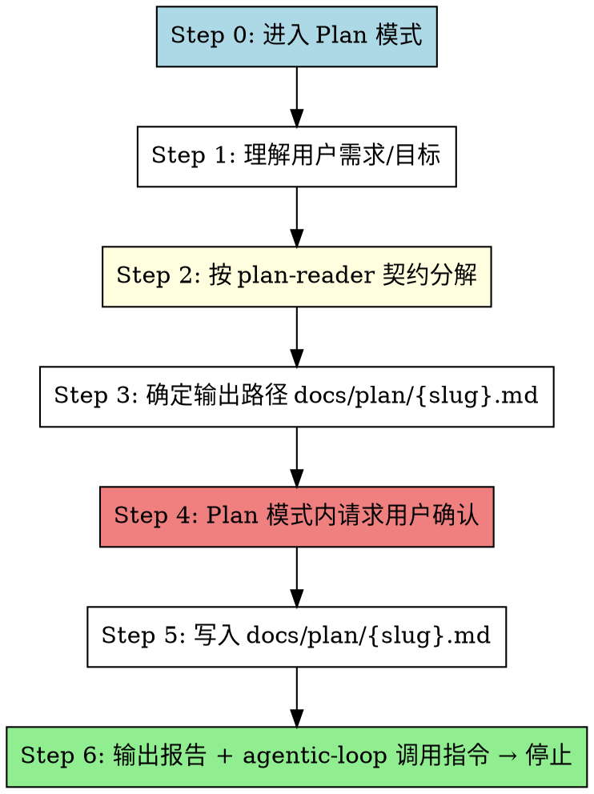

# Tackle Plan (目标驱动计划生成器 · 对接 skill-agentic-loop)

把用户的自然语言需求/目标，在 Plan 模式内分解为**符合 `plan-reader` 解析契约**的结构化计划，输出到 `docs/plan/{slug}.md`，供 `skill-agentic-loop` 读取并拆为 WP 集合自闭环执行。

> 🔴 **本 skill 的两条不可违反红线**：
> 1. **只生成计划，不执行**：本 skill 仅产出 `docs/plan/*.md` 计划文件。**绝不写代码、绝不创建 `docs/wp/` 工作包文档、绝不调用 `skill-agent-dispatcher`**。执行是 `skill-agentic-loop` 的事；拆 WP 文档是 `skill-task-creator` 的事。三者边界见下表。
> 2. **格式必须对齐 plan-reader 契约**：产出计划必须能被 `plan-reader.parsePlanToGoal()` 解析出**非空** `goal.wpIds` 且**无 error**。否则下游 agentic-loop 不启动——这是本 skill 的核心价值，违反即等于没产出。

> **契约基准（红线，逐项对齐）**：`plugins/runtime/plan-reader.js`（`parsePlanToGoal()` 的解析逻辑）
> **下游消费方**：`skill-agentic-loop`（Step 0 路径 A 读计划 → 拆 WP → 自闭环）

---

## 三者边界（避免混淆，必读）

| Skill | 产出物 | 消费方 | 格式 |
|-------|--------|--------|------|
| **`skill-tackle-plan`**（本 skill） | `docs/plan/*.md`（**计划**） | `skill-agentic-loop`（经 plan-reader 解析） | `##` section + `- [ ]` 任务项 + `## 成功标准` |
| `skill-task-creator` | `docs/wp/WP-XXX.md`（**工作包**） | `skill-agent-dispatcher` | 工作包文档格式 |
| `skill-agentic-loop` | 自闭环执行结果 | — | 读计划/工作包，不产出计划 |

> 计划（plan）和工作包文档（WP doc）格式**不可互换**。本 skill 产的是 plan-reader 能读的**计划**，不是工作包文档。

---

## When to Use

**触发词**:
- "生成计划" / "制定计划" / "写计划" / "规划方案"
- "目标分解" / "tackle-plan"
- "generate plan" / "make plan"

**适用场景**（满足任一）:
- 用户给出一个**目标/需求**，希望交给 `skill-agentic-loop` 自闭环执行，但还没有可读的计划文件
- 用户希望把模糊需求结构化为 `##` section + checklist 的形式
- 用户想用 `/skill-agentic-loop docs/plan/xxx.md` 但缺一份符合契约的 `xxx.md`

**不适用**:
- 用户要的是"工作包文档"（给 dispatcher 用）→ 用 `skill-task-creator`
- 用户要的是"直接执行"（已有计划或简单改动）→ 直接 `skill-agent-dispatcher` 或 `skill-agentic-loop`
- 用户要的是"拆分已有大任务为多个工作包文档"→ 用 `skill-split-work-package`

---

## Flow



---

## Step-by-Step Implementation

### Step 0: 进入 Plan 模式 🔴 不可跳过

本 skill 标注 `plan_mode_required: true`，**触发即进 Plan 模式**。在 Plan 模式内完成需求理解、分解与用户确认，**不得在确认前写入文件、不得写代码**。

### Step 1: 理解用户需求/目标

把用户输入理解为**目标**（"做成什么/达成什么"），而非"立即动手的任务清单"。

- 提炼核心目标（一句话能说清的达成状态）
- 识别交付物边界（要做什么、不做什么）
- 识别关键约束（技术栈、性能、兼容性等）
- 若需求模糊，用 `AskUserQuestion` 澄清（最多 1-2 轮），不要替用户臆测

> 目标必须是**可被 checklist 验证**的（如"CLI 能跑、命令可增删查、数据持久化"），而非"做出一个东西"。可量化的目标才能在下游 agentic-loop 经 checklist 评分。

### Step 2: 按 plan-reader 契约分解 🔴 红线步骤

把目标分解为**符合 `plan-reader` 解析契约**的计划结构。分解时**必须逐项对照下方契约**，确保产出能被 `parsePlanToGoal()` 解析出非空 `goal.wpIds`。

#### plan-reader 契约（逐项对齐，违反任一条计划即不可用）

| 契约项 | plan-reader 解析逻辑 | 本 skill 产出要求 |
|--------|---------------------|------------------|
| **section = 工作单元** | `##` / `###` 标题行 → 每个可执行 section 映射为一个 WP（`isSectionHeader`） | 每个独立工作单元用一个 `##` section。**section 内必须含 `- [ ]` 任务项**，否则被判"不可执行"过滤掉（`isExecutableSection` 需任务项或执行性关键词） |
| **任务项 = checklist** | `- [ ]` / `- [x]` 行 → checklist 项（`parseTaskItem`，支持 `[x]`/`[X]`/`[✓]`/`[✔]` 等勾选标记） | 每个可执行 section 内用 `- [ ]` 列出任务项（生成时统一未勾选，执行由 loop 完成） |
| **分类前缀** | 任务项文本首 `[category]` 前缀 → checklist 项的 category（如 `- [ ] [acceptance] ...` → `category='acceptance'`），无则默认 `'check'` | 关键验收项用 `[acceptance]` 前缀，单测用 `[unit]`，集成用 `[integration]`，便于下游 Reflect 评分分类 |
| **显式 WP 编号（可选）** | section 标题含 `WP-NNN` → 沿用该编号（`extractExplicitWpId`）；否则按 task.md 最大编号 +1 派生 | **一般不写显式编号**，让 loop 按运行时 task.md 现状派生（避免与 task.md 已有编号冲突）。仅在用户明确指定编号体系时才写 `## WP-NNN: 标题` |
| **依赖声明** | 文本含「依赖 / depends on / 先完成 / 需要 / requires / after / 前置」+ `WP-NNN` → dependencyGraph 边（`extractDependencyRefs`）。**仅识别已知 wpId 集合内的引用**（避免误把无关文档号当依赖） | 有依赖的工作单元在 section 内写明，如 `依赖 WP-1` 或 `depends on WP-1`。**注意**：由于派生编号在生成时未知，依赖声明建议指向**同计划内已出现的、含显式编号的 section**，或用"先完成前面 XXX 单元"的语义描述（loop 会做白名单过滤，越界依赖被忽略而非报错） |
| **成功标准 section** | `## 成功标准` / `## 验收标准` / `## Success Criteria` / `## Acceptance Criteria` section → `goal.successCriteria`（`extractSuccessCriteria`） | **必须含一个 `## 成功标准`（或 `## 验收标准`）section**，列出达成判定的要点（非任务项的普通要点行 `- xxx` 也会被收集） |
| **循环依赖禁令** | dependencyGraph 检测到环 → 抛 `PLAN_CYCLIC_DEPENDENCY`（`buildDependencyGraph` 的 Kahn 拓扑排序，`hasCycle=true`） | **生成时必须确保依赖关系无环**。A 依赖 B、B 不能再依赖 A；链式 A→B→C 不可 C→A。每写一条依赖，检查不形成环 |

> 🔴 **最常见的两类失败**（必须避免）：
> 1. section 内**只有文字描述、没有 `- [ ]` 任务项** → 被 `isExecutableSection` 过滤 → `goal.wpIds` 为空 → loop 不启动。
> 2. **缺 `## 成功标准` section** → `goal.successCriteria` 为空 → 达成判定无依据。
>
> 这两条是 WP-178-2-test 的正向守门用例，生成后请自查。

### Step 3: 确定输出路径 `docs/plan/{slug}.md`

- 从目标主题生成 slug：kebab-case，取主题关键词 1-3 个（如"做一个待办清单 CLI" → `todo-cli`）
- 路径：`docs/plan/{slug}.md`
- 若 `docs/plan/{slug}.md` 已存在，追加序号（如 `todo-cli-2.md`），不覆盖
- 若 `docs/plan/` 目录不存在，Step 5 写入时创建（首次运行）

### Step 4: Plan 模式内请求用户确认（AskUserQuestion）

用 `AskUserQuestion` 向用户确认分解结果（仍在 Plan 模式内，未落盘）：

- 列出各 `##` section（工作单元）及其 checklist 概要
- 列出依赖关系（如有）
- 列出 `## 成功标准`
- 询问：是否调整 / 是否确认写入 `docs/plan/{slug}.md`

```
# 调用 AskUserQuestion，附：
# - 工作单元清单（每个 ## section 的标题 + checklist 条数）
# - 依赖关系（若无可省略）
# - 成功标准要点
# - 拟写入路径：docs/plan/{slug}.md
# 用户确认 → Step 5；用户要求调整 → 回 Step 2 修订
```

### Step 5: 写入 `docs/plan/{slug}.md`

Plan 模式确认后，写入计划文件。**严格按下方格式模板**（与 plan-reader 契约逐项对齐）：

```markdown
# {计划标题：一句目标}

{可选：1-2 句背景/目标说明，非任务项}

## {工作单元 1：动词开头的可执行标题}
- [ ] 任务项 1（具体到可验证）
- [ ] 任务项 2
- [ ] [acceptance] 验收项（量化标准）

## {工作单元 2}
依赖 {单元1的WP编号或"先完成 {工作单元 1}"}
- [ ] 任务项 1
- [ ] [unit] 单测项

## {工作单元 N}
- [ ] ...

## 成功标准
- 全部工作单元 checklist 通过
- {量化达成标准，如"CLI 能本地运行、命令全部可用、数据持久化到文件"}
- {量化达成标准，如"npm test 全绿"}
```

> 模板要点（与契约逐项对应）：
> - 每个工作单元是 `##` section，标题动词开头（"实现 X" / "创建 Y" / "添加 Z"）
> - section 内必须有 `- [ ]` 任务项（否则不可执行）
> - 验收/单测/集成项用 `[category]` 前缀分类
> - 依赖写在 section body 开头（`依赖 WP-N` / `depends on WP-N` / `先完成 X`）
> - **必须有 `## 成功标准` section**

### Step 6: 输出简洁报告 → 停止

写入完成后，输出简洁报告并**停止**（不进入执行）：

```
✅ 已生成计划：docs/plan/{slug}.md

工作单元：N 个（{单元标题列表}）
依赖关系：{有/无}
成功标准：{概要}

下一步（交给 agentic-loop 自闭环执行）：
  /skill-agentic-loop docs/plan/{slug}.md

或手动执行某个工作单元：
  /skill-agent-dispatcher {对应 WP}
```

> **到此停止**。不执行计划、不拆 WP 文档、不调用 dispatcher。执行是 `skill-agentic-loop` 的职责。

---

## Forbidden（边界，违反即违规）

- ❌ **写代码**：本 skill 只产出计划 markdown，绝不 Write/Edit 代码文件
- ❌ **创建 `docs/wp/` 工作包文档**：那是 `skill-task-creator` 的产出，格式不同（工作包文档 ≠ plan-reader 可读的计划）
- ❌ **调用 `skill-agent-dispatcher`**：执行不是本 skill 的事，让用户自己触发 `/skill-agentic-loop`
- ❌ **跳过 plan-reader 契约**：不按 `##` + `- [ ]` + `## 成功标准` 结构产出，导致下游 loop 无法解析
- ❌ **生成循环依赖**：A→B→A 之类，plan-reader 会抛 `PLAN_CYCLIC_DEPENDENCY`
- ❌ **section 内无任务项**：只有文字描述的 section 会被 plan-reader 判"不可执行"过滤掉
- ❌ **缺 `## 成功标准`**：导致 `goal.successCriteria` 为空，达成判定无依据

---

## 输出路径约定

- 目录：`docs/plan/`（首次运行需创建，见 `docs/plan/README.md`）
- 文件名：`{主题-slug}.md`（kebab-case，1-3 个关键词）
- 同名冲突：追加序号 `{slug}-2.md`，不覆盖
- 不写 git（`docs/` 被 `.gitignore` 排除是预期行为，产物落盘即生效）

---

## Integration with Other Skills

| Skill | 集成点 | 本 skill 中的角色 |
|-------|--------|------------------|
| `plan-reader` | 契约基准 | 本 skill 产出的计划必须能被 `parsePlanToGoal()` 解析出非空 `goal.wpIds` 无 error（Step 2 红线） |
| `skill-agentic-loop` | 下游消费方 | 本 skill 产出的 `docs/plan/{slug}.md` 由其 Step 0 路径 A 读取（路径优先级：参数路径 > `.claude/plan.md` > docs/plan 扫描） |
| `skill-task-creator` | 边界区分 | 它产出 `docs/wp/WP-XXX.md`（工作包文档，给 dispatcher）；本 skill 产出计划（给 agentic-loop）。格式不可互换 |
| `skill-agent-dispatcher` | 不集成 | 本 skill 不调用它；用户在 Step 6 报告里自行决定是否触发执行 |

---

## Important

1. **只生成计划** — 产出 `docs/plan/{slug}.md`，不写代码、不拆 WP 文档、不调 dispatcher。
2. **格式必须对齐 plan-reader 契约** — `##` section（内含 `- [ ]` 任务项）+ 依赖声明 + `## 成功标准`；无循环依赖。这是本 skill 的核心价值，违反即产出不可用。
3. **触发即进 Plan 模式** — `plan_mode_required: true`，确认前不落盘。
4. **与 skill-task-creator 边界清晰** — 计划（plan，给 agentic-loop）≠ 工作包文档（WP doc，给 dispatcher）。
5. **下一步交给用户** — 报告末尾给出 `/skill-agentic-loop docs/plan/{slug}.md` 调用指令，由用户决定是否执行。
