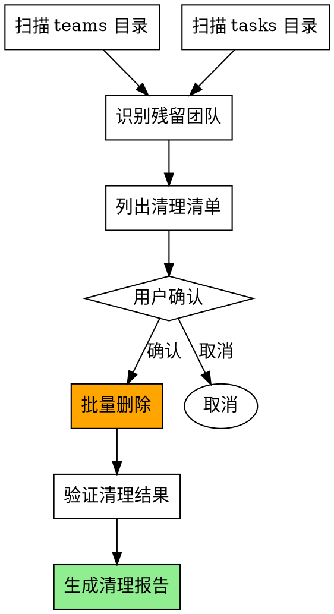

# Team Cleanup

手动清理残留的 Agent Teams 资源的工具。

## When to Use

**触发词**:
- "清理团队" / "清理残留"
- "清理 teams 目录"
- "删除过期团队"
- "清理 agent teams"

## Problem

当 agent-dispatcher 的自动清理失败时，会留下残留的团队目录：
- `~/.claude/teams/{team_name}/` - 团队配置和成员信息
- `~/.claude/tasks/{session_id}/` - 任务列表数据

这些残留会：
- 占用磁盘空间
- 混淆活跃团队和历史团队
- 影响后续批量执行的调试

## Flow



---

## Step-by-Step Implementation

### Step 1: 扫描残留资源

```bash
# 扫描 teams 目录
teams_dir = "~/.claude/teams/"
tasks_dir = "~/.claude/tasks/"

orphaned_teams = []
orphaned_tasks = []

# 扫描 teams 目录
for team in list_directory(teams_dir):
    # 检查是否有活跃会话（通过检查 config.json 中的会话信息）
    config = Read(f"{teams_dir}/{team}/config.json")
    if not is_active_session(config):
        orphaned_teams.append({
            "name": team,
            "path": f"{teams_dir}/{team}",
            "created": config.createdAt,
            "members": len(config.members)
        })

# 扫描 tasks 目录
for task_dir in list_directory(tasks_dir):
    # 检查是否有对应的活跃 teams
    if not has_active_team(task_dir):
        orphaned_tasks.append({
            "name": task_dir,
            "path": f"{tasks_dir}/{task_dir}"
        })
```

### Step 2: 列出清理清单

```markdown
帅哥，发现以下残留团队资源：

## 📁 Teams 目录 ({count} 个)

| 团队名称 | 类型 | 创建时间 | 成员数 |
|----------|------|----------|--------|
| batch-20260314-WP073-075 | 批量执行 | 2026-03-14 | 2 |
| batch-20260315-WP085-087 | 批量执行 | 2026-03-15 | 3 |
| ... | ... | ... | ... |

## 📁 Tasks 目录 ({count} 个)

| 目录名称 | 大小 |
|----------|------|
| 00e3fa6c-9282-... | 12KB |
| 02a9b203-e378-... | 8KB |
| ... | ... | ... |

## 📊 统计
- **Teams 目录总数**: X 个
- **Tasks 目录总数**: Y 个
- **预估释放空间**: Z MB

🔴 是否清理这些资源？（回复 "确认清理" 继续，或指定要保留的团队）
```

### Step 3: 执行清理

```bash
# 用户确认后执行

cleaned_teams = 0
cleaned_tasks = 0
errors = []

# 清理 teams 目录
for team in orphaned_teams:
    try:
        delete_directory(team.path)
        cleaned_teams += 1
        log(f"✅ 已清理团队: {team.name}")
    except Exception as e:
        errors.append(f"❌ 清理失败 {team.name}: {e}")

# 清理 tasks 目录
for task in orphaned_tasks:
    try:
        delete_directory(task.path)
        cleaned_tasks += 1
    except Exception as e:
        errors.append(f"❌ 清理失败 {task.name}: {e}")
```

### Step 4: 生成清理报告

```markdown
## 🧹 清理报告

**清理时间**: YYYY-MM-DD HH:mm
**清理操作**: Teams + Tasks 目录

### Teams 目录
| 团队名称 | 状态 |
|----------|------|
| batch-20260314-WP073-075 | ✅ 已删除 |
| batch-20260315-WP085-087 | ✅ 已删除 |
| ... | ... |

**总计**: {cleaned_teams}/{total_teams} 个已清理

### Tasks 目录
**总计**: {cleaned_tasks}/{total_tasks} 个已清理

### 释放空间
约 {freed_space} MB

### 错误 (如有)
{errors}
```

---

## Safety Checks

### 保留条件

以下团队**不会被清理**：
1. 当前活跃的团队（有正在运行的会话）
2. 用户明确指定保留的团队
3. 创建时间在 1 小时内的团队（可能正在初始化）

### 确认机制

```
⚠️ 清理前必须用户确认！

- 列出所有待清理项
- 显示预估释放空间
- 用户必须输入 "确认清理" 或选择保留项
- 不支持自动清理（防止误删）
```

---

## Integration with Other Skills

| Skill | 集成点 |
|-------|--------|
| `agent-dispatcher` | 自动清理失败时建议使用本 skill |
| `completion-report` | 报告中检测到未清理时建议使用 |

---

## Example Usage

### 场景 1: 常规清理

```
用户: 清理团队

AI:
帅哥，发现以下残留团队资源：
[列出清单]
是否清理？

用户: 确认清理

AI:
[执行清理]
[生成报告]
```

### 场景 2: 选择性保留

```
用户: 清理团队，但保留 batch-20260321-wp145

AI:
[排除 batch-20260321-wp145]
[清理其他]
[生成报告]
```

---

## Important

1. **清理前必须用户确认** - 不支持自动清理
2. **保护活跃团队** - 不清理正在使用的团队
3. **保护新创建团队** - 1 小时内创建的不清理
4. **记录清理日志** - 便于追踪和恢复
5. **错误不中断** - 单个失败不影响其他清理

---

## Diagnostic Commands

检查当前残留情况：

```bash
# 查看 teams 目录数量
ls ~/.claude/teams/ | wc -l

# 查看 tasks 目录数量
ls ~/.claude/tasks/ | wc -l

# 查看最近创建的团队
ls -lt ~/.claude/teams/ | head -5

# 查看磁盘占用
du -sh ~/.claude/teams/
du -sh ~/.claude/tasks/
```
