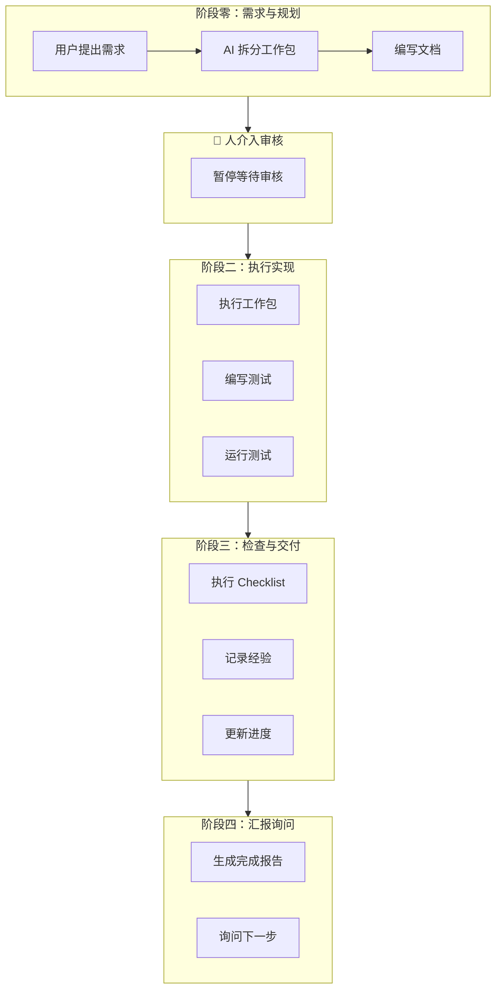
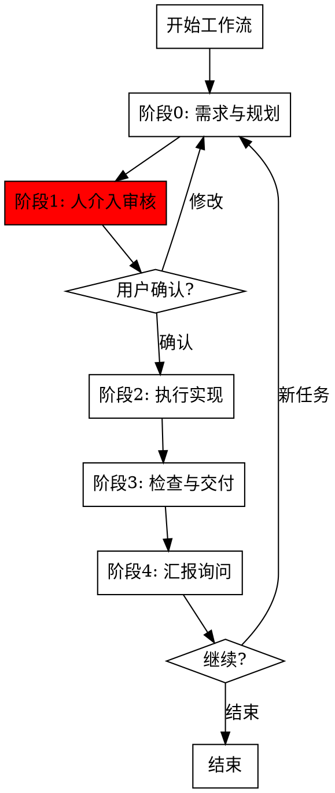

# Workflow Orchestrator

整体工作流编排技能，协调各阶段 skills 按正确顺序执行。

## When to Use

**触发词**:
- "开始工作流" / "执行完整流程"
- "从需求开始" / "完整开发流程"
- "启动工作流" / "运行工作流"

## Workflow Stages



## Stage Details

### 阶段零：需求与规划

**调用的 Skills**:
- `task-creator` / `split-work-package` - 拆分工作包

**输出**:
- 工作包 ID 和详情
- 文档草稿（如需要）

### 阶段一：人介入审核 🔴

**调用的 Skills**:
- `human-checkpoint` - 强制暂停等待审核

**行为**:
- 输出审核清单
- 等待用户确认
- 处理修改意见

### 阶段二：执行实现

**调用的 Skills**:
- `agent-dispatcher` - 批量执行（如适用）
- `gut-testing` - 编写/运行测试

**行为**:
- 按依赖顺序执行工作包
- 每个工作包完成后运行测试
- 收集执行结果

### 阶段三：检查与交付

**调用的 Skills**:
- `checklist` - 质量检查
- `experience-logger` - 记录经验
- `progress-manager` / `record-progress` - 更新进度

**行为**:
- 执行完整检查清单
- 记录遇到的问题和解决方案
- 更新所有进度文档

### 阶段四：汇报询问

**调用的 Skills**:
- `completion-report` - 生成报告

**行为**:
- 生成标准化完成报告
- 明确询问下一步安排
- 等待用户指令

## Flow



## Execution Commands

### 启动完整工作流
```
用户: 开始工作流，实现 XXX 功能
```

执行流程:
1. 调用 `task-creator` 拆分工作包
2. 调用 `human-checkpoint` 等待审核
3. 用户确认后调用 `agent-dispatcher` 执行
4. 调用 `checklist` 检查
5. 调用 `experience-logger` 记录
6. 调用 `completion-report` 汇报

### 从特定阶段开始
```
用户: 从执行阶段开始工作流
用户: 跳过审核直接执行
```

### 仅执行检查阶段
```
用户: 执行检查阶段
```

## Skill Coordination Matrix

| 阶段 | 主 Skill | 协作 Skills | 输出 |
|------|----------|-------------|------|
| 需求与规划 | task-creator | split-work-package | 工作包清单 |
| 人介入审核 | human-checkpoint | - | 用户确认 |
| 执行实现 | agent-dispatcher | gut-testing | 代码+测试 |
| 检查与交付 | checklist | experience-logger, record-progress | 检查报告 |
| 汇报询问 | completion-report | - | 完成报告 |

## Checkpoint Behavior

每个阶段之间的检查点行为：

```markdown
帅哥，[当前阶段]已完成，准备进入[下一阶段]。

📋 当前状态:
- 已完成: [已完成的内容]
- 待执行: [下一阶段内容]

🔴 确认后回复"继续"进入下一阶段，或提出修改意见。
```

## Error Recovery

### 阶段失败处理

| 阶段 | 失败场景 | 恢复策略 |
|------|----------|----------|
| 需求与规划 | 需求不明确 | 回到用户澄清 |
| 人介入审核 | 用户要求修改 | 重新规划后再次审核 |
| 执行实现 | 工作包执行失败 | 记录失败原因，继续其他工作包 |
| 检查与交付 | Checklist 不通过 | 修复问题后重新检查 |
| 汇报询问 | 用户不满意 | 回到执行阶段修正 |

### 工作流中断恢复

```
用户: 恢复工作流
```

执行流程:
1. 读取 `task.md` 确认当前状态
2. 确定中断点
3. 从中断阶段继续执行

## Quick Start Examples

### 示例 1: 完整新功能开发
```
用户: 开始工作流，实现成就系统

AI 执行:
1. [阶段0] 调用 task-creator 拆分成就系统工作包
2. [阶段1] 调用 human-checkpoint 等待审核
3. [用户确认后] 调用 agent-dispatcher 执行工作包
4. [阶段3] 调用 checklist 检查 + experience-logger 记录
5. [阶段4] 调用 completion-report 汇报询问
```

### 示例 2: 快速 Bug 修复
```
用户: 开始工作流，修复卡牌显示Bug

AI 执行:
1. [阶段0] 创建 WP-XXX 修复工作包
2. [阶段1] 简化审核（单工作包）
3. [阶段2] 直接执行修复
4. [阶段3] 检查 + 记录
5. [阶段4] 汇报完成
```

### 示例 3: 批量任务执行
```
用户: 批量执行 WP-037 到 WP-040

AI 执行:
1. [跳过阶段0] 直接读取现有工作包
2. [阶段1] 确认执行计划
3. [阶段2] 调用 agent-dispatcher 并行执行
4. [阶段3] 批量检查 + 记录
5. [阶段4] 批量汇报
```

## Important

1. **阶段顺序不可跳过** - 必须按 P0→P1→P2→P3→P4 顺序执行
2. **人介入必须等待** - P1 阶段必须等待用户确认
3. **检查必须通过** - P3 阶段 checklist 不通过不能进入 P4
4. **汇报必须询问** - P4 阶段必须询问下一步安排
5. **状态必须记录** - 每个阶段完成后更新 task.md
6. **🔴 清理必须执行** - 如果使用了 agent-dispatcher，P2→P3 转换时必须验证 TeamDelete

## 阶段间清理检查

**执行阶段 (P2) 完成后，进入检查阶段 (P3) 前**：

```python
# 如果使用了 agent-dispatcher（批量执行）
if used_agent_teams:
    # 验证 TeamDelete 已执行
    team_dir = f"~/.claude/teams/{team_name}/"
    if directory_exists(team_dir):
        print("⚠️ 警告: TeamDelete 未执行！")
        print("建议手动执行: '清理团队'")
        # 在报告中标注此警告
```

**检查点验证**：
| 检查项 | 通过条件 | 失败处理 |
|--------|----------|----------|
| TeamDelete 已执行 | 团队目录不存在 | 在报告中添加警告，建议手动清理 |
